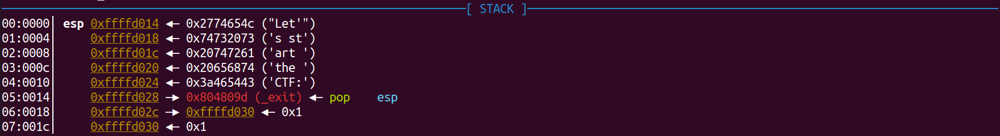
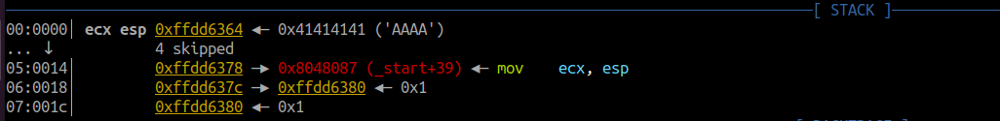
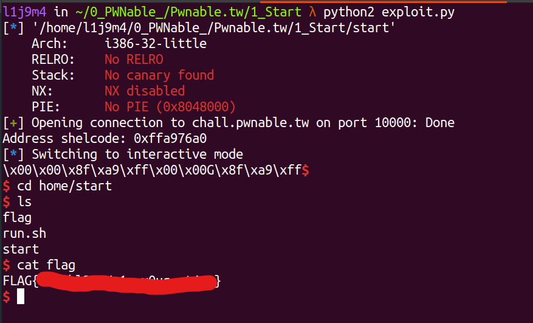

# pwnable.tw - Start

Just a start.

`nc chall.pwnable.tw 10000`

# 1) Analysis and find Bug

Đầu tiên ta kiếm tra các secure flag và xem thông tin cơ bản của file.


Chương trình 32-bit được viết hoàn toàn bằng code nAsm và không bị mất `label` các chức năng của chương trình (not stripped).

```
l1j9m4 in ~/0_PWNable_/Pwnable.tw/1_Start λ gdb -q ./start  
pwndbg: loaded 198 commands. Type pwndbg [filter] for a list.
pwndbg: created $rebase, $ida gdb functions (can be used with print/break)
Reading symbols from ./start...
(No debugging symbols found in ./start)
pwndbg> info func
All defined functions:

Non-debugging symbols:
0x08048060  _start
0x0804809d  _exit
0x080490a3  __bss_start
0x080490a3  _edata
0x080490a4  _end
pwndbg> 
```

Vì vậy ta tiến hành phân tích và tìm lỗi từ mã nguồn của chương trình bằng gdb.

```asm
   0x8048060 <_start>:    push   esp
   0x8048061 <_start+1>:  push   0x804809d
   0x8048066 <_start+6>:  xor    eax,eax
   0x8048068 <_start+8>:  xor    ebx,ebx
   0x804806a <_start+10>: xor    ecx,ecx
   0x804806c <_start+12>: xor    edx,edx
```

Bắt đầu từ hàm `_start`, chương trình `"push esp"` - đẩy giá trị esp vào stack, sau đó `"push 0x804809d"` - đẩy địa chỉ hàm `_exit` vào stack để kết thúc chương trình khi gọi return và khởi tạo giá trị cho các thanh ghi = 0 (xor eax, eax nghĩa là eax = 0).

```asm
   0x804806e <_start+14>: push   0x3a465443   ; CTF:
   0x8048073 <_start+19>: push   0x20656874   ; the
   0x8048078 <_start+24>: push   0x20747261   ; art 
   0x804807d <_start+29>: push   0x74732073   ; s st
   0x8048082 <_start+34>: push   0x2774654c   ; Let'
   
   0x8048087 <_start+39>: mov    ecx,esp
   0x8048089 <_start+41>: mov    dl,0x14
   0x804808b <_start+43>: mov    bl,0x1
   0x804808d <_start+45>: mov    al,0x4
   0x804808f <_start+47>: int    0x80
```

Tiếp theo là thực hiện đưa dòng chữ `"Let's start the CTF:"` lên stack và chương trình gọi lệnh `sys_write()` dùng ngắt 0x80 đầu tiên để gọi các lệnh hệ thống `Linux Syscall` với các đối số là giá trị yêu cầu trên các thanh ghi eax = 4, để print vào stdout (ebx = 1), 20 kí tự (edx = 0x14) tại địa chỉ esp (ecx = esp), mục đích là in dòng "Let's start the CTF:" ra màn hình.

```asm
   0x8048091 <_start+49>: xor    ebx,ebx
   0x8048093 <_start+51>: mov    dl,0x3c
   0x8048095 <_start+53>: mov    al,0x3
   0x8048097 <_start+55>: int    0x80
```

Lệnh ngắt 0x80 thứ hai, eax = 3, chương trình gọi lệnh `sys_read()` đọc tối đa 60 kí tự (edx = 0x3c) từ stdin (ebx = 0), lưu vào stack tại vị trí esp (ecx = esp).

```asm
   0x8048099 <_start+57>: add    esp,0x14
   0x804809c <_start+60>: ret    
   
   0x804809d <_exit>:   pop    esp
   0x804809e <_exit+1>: xor    eax,eax
   0x80480a0 <_exit+3>: inc    eax
   0x80480a1 <_exit+4>: int    0x80
```

Tăng giá trị esp lên 20 - nơi mà ở đầu hàm `_start` đã lưu trữ địa chỉ của hàm `_exit` trên stack và return vể hàm `_exit` để kết thúc chương trình.

>Ta dễ dàng thấy được chương trình cho đọc vào đến 60 kí tự và lưu chúng trên stack, trong khi sau đó chỉ tăng esp lên 20 và return về giá trị được lưu tại `esp + 20` => Xảy ra lỗi Buffer Overflow. 

# 2) Idea

Thường những bài mà khi check secure flag `NX: NX disabled` và không có hàm giúp lấy shell hay đọc flag thì ý tưởng đầu tiên mình nghĩ tới là ghi shellcode vào chương trình sau đó điều khiển return address trỏ về shellcode. Ta sẽ giải quyết bài này theo ý tưởng đó nhưng có 2 vấn đề cần giải quyết:

- <b> Shellcode: Cái này thì ta có thể dễ dàng tìm thấy trên mạng hoặc tự viết cũng được miễn nó không quá dài vì input cho nhập tối đa 60 kí tự. </b>
      
- <b> Ta cần xác định được chính xác địa chỉ shellcode mà ta đã overwrite vào stack, để điều khiển return address trỏ về đúng vị trí shellcode. </b>

# 3) Exploit

Để giải quyết vấn đề thứ hai, ta để ý đầu hàm `_start` là `push esp` đẩy giá trị esp vào stack rồi mới đến đẩy địa chỉ của hàm `_exit` lên stack. Khi đó bố cục của stack trước khi nhận input sẽ như sau. 



Nếu ta tạo payload điều khiển chương trình return về `0x08048087` - địa chỉ của câu lệnh `mov ecx,esp`, đưa địa chỉ của chuỗi cần in vào ecx để thực hiện `syscall write()` và sau khi return về chương trình sẽ thực hiện `syscall write()` lần thứ hai, in ra 20 bytes trên stack. Vì 4 bytes đầu tiên trên stack lúc này chính là esp nên ta sẽ leak được địa chỉ esp. Chương trình sẽ tiếp tục với một lệnh `syscall read()` thứ hai, ta sẽ gửi payload thứ hai bao gồm "A"*0x14 + (giá trị leak được chính là nơi ta ghi shellcode = esp+20) + shellcode, lúc này chương trình sẽ return về đúng shellcode mà ta cần.



Layout stack sau khi ta ghi đè return address bằng địa chỉ câu lệnh `mov ecx,esp` và chương trình return về địa chỉ đó. Khi thực hiện lệnh `ret` - địa chỉ hàm `_exit` bị đẩy ra khỏi stack và esp tăng lên 4 chỉ vào nơi mà ở đó lưu giá trị của esp (Ô nhớ lưu giá trị là địa chỉ của chính ô nhớ đó). Vì vậy ta sẽ in ra được giá trị chính là địa chỉ của ô nhớ trên stack - là nơi ta lưu shellcode vì dễ dàng return về đúng shellcode do biết được chính xác địa chỉ.


Lần nhập thứ hai ta ghi đè địa chỉ trả về là địa chỉ leak được sau đó chính là shellcode, gửi payload thứ hai: payload = "A"*0x14 + (esp+20) + shellcode, lúc này chương trình sẽ return về đúng shellcode mà ta cần.

# 4) Source code and get Flag

Tiến hành viết file [exploit.py](exploit.py) và khai thác:



------------------------------------------------------
