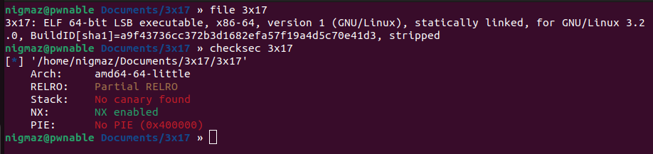
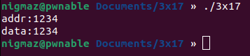
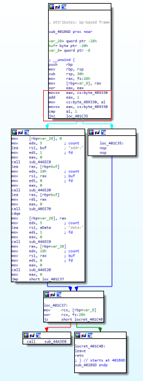
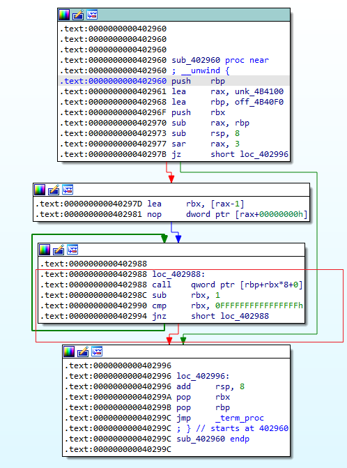
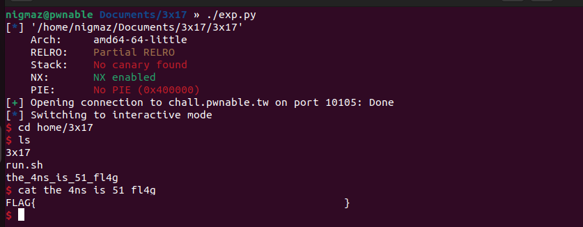

# [pwnable.tw] - 3x17


## A. CHALLENGE 

### [1] Binary Mitigations. 

- Thông tin cơ bản của chương trình.



>Chương trình 64-bit tên các hàm bị xóa, NX enabled => không có phân vùng có cả ghi, thực thi.

## B. OVERVIEW



### [1] Vulnerability Analysis.

- Cơ bản thì chương trình khá đơn giản, khi chạy chương trình đầu tiên cho nhập địa chỉ ta muốn ghi và sau đó là giá trị sẽ ghi vào địa chỉ đã nhập trước đó rồi thoát.

- Biên dịch tĩnh và còn xóa hết các tên hàm làm cho khi reverse trong IDA khá linh tinh, bắt đầu tìm theo hướng dùng `strings view` tìm các chuỗi `addr:`, `data:` rồi nhảy đến hàm gọi là hàm main (nên đọc code assemble của bài này vì f5 ra code C hơi @@).



- Đầu chương trình có kiểm tra một biến global check (bằng 1 thì mới nhảy được vào điều kiện cho phép ghi - tác dụng là để tránh rip bị ghi đè quay lại hàm main).

> Có thể ghi tùy ý nhưng vấn đề của bài này nằm ở việc phải ghi vào đâu vì một lần ghi tùy ý vào 1 vị trí duy nhất này là không đủ để có được shell.

### [2] Idea Exploit.

- Có một kỹ thuật là overwrite `.fini_array`, section `.fini_array` là một cấu trúc gồm các con trỏ hàm __deconstructor__ cần thiết cho quá trình kết thúc chương trình sau khi hàm main() return. Ngược với section `.init_array` là vùng cung cấp các hàm __constructor__ cần thiết cho quá trình khởi tạo trước khi hàm main() được gọi.

```bash
public _start
_start proc near
; __unwind {
xor     ebp, ebp
mov     r9, rdx                      ; rtld_fini
pop     rsi                          ; argc
mov     rdx, rsp                     ; ubp_av
and     rsp, 0FFFFFFFFFFFFFFF0h
push    rax
push    rsp                          ; stack_end
mov     r8, offset __libc_csu_fini   ; fini
mov     rcx, offset __libc_csu_init  ; init
mov     rdi, offset main             ; main
call    cs:__libc_start_main_ptr
hlt                                  
; } // starts at 4010E0
_start endp
```

- Vì bài này xóa hết tên các hàm nên lấy VD sẽ khó cho người mới có thể nhìn nên mình lấy VD của 1 chương trình tương tự 64-bit khác. Lý thuyết là gọi hàm `__libc_start_main_ptr` với các đối số  là các hàm lần lượt được thực thi `__libc_csu_init` (hàm này call các hàm trong `.init_array`) => `main` => `__libc_csu_fini` (hàm này call các hàm trong `.fini_array`).

- Section `.fini_array` gồm 2 entry:
    * `_do_global_dtors_aux` - .fini_array[0]: gọi các destructors khi .fini_array ko được xác định (Hiểu đơn giản thì là hàm `__libc_csu_fini` sẽ gọi `foo_destructor` trước bình thường thì hàm hủy đó sẽ dẫn đến thoát chương trình nhưng nếu bị ghi đè bởi giá trị khác hoặc lỗi do định nghĩa dẫn đến ko thoát chương trình bình thưởng thì sẽ gọi tới tất cả các destructor đươc định nghĩa khác).
    * `foo_destructor` - .fini_array[1]: địa chỉ của hàm `destructor()`.



- Code assemble của hàm `__libc_csu_fini()` ở dòng `call    qword ptr [rbp+rbx*8+0]` thì với rbp sẽ mang giá trị của .fini_array (ở bài này là 0x4b40f0) và rbx sẽ nhận giá trị 1 trước (gọi .fini_array[1] trước không thoát thì gọi .fini_array[0]).

>[THAM KHẢO](https://blog.k3170makan.com/2018/10/introduction-to-elf-format-part-v.html) .

- Tóm lại .fini_array nằm ở địa chỉ 0x4b40f0, hàm gọi .fini_array - `__libc_csu_fini()` nằm ở địa chỉ 0x402960 và địa chỉ hàm main là 0x401b6d.

- Ý tưởng khái thác:
    * Ta sẽ ghi đè vào vị trí của .fini_array như sau `payload = p64(0x402960) + p64(0x401b6d)` tương ứng .fini_array[0] = `__libc_csu_fini()`, .fini_array[1] = `main`.
    => Khi chương trình kết thúc **main() =>  __libc_csu_fini(){call main() => call __libc_csu_fini(){call main{} => call ...}}** sinh ra vòng lặp vô tận.
    * Còn 1 vấn đề nữa là đầu mỗi hàm main() được gọi lại thì có 1 so sánh với 1 biến global check = 1 và cộng thêm vào đó 1 nhưng theo code asm thì cmp 1 byte nên khi có vòng lặp vô tận giá trị khi add thêm 0x1 sẽ tăng dần đến 0x101 và khi cmp 1 byte thì byte cmp là 0x01 => hợp lệ. Cứ như vậy 0x201, 0x301 0x401,... cũng hợp lệ và mỗi lần hợp lệ ta sẽ được ghi tùy ý vào địa chỉ bất kỳ.       


## C. EXPLOITATION

### [1] Stage 1: Infinite loop => Write ROP get shell.

- Giờ có khả năng overwrite nhiều địa chỉ trên bộ nhớ, chúng ta sẽ dùng kĩ thuật ROP để gọi sys_execve(“/bin/sh”).

- Sử dụng tool ROPgadget thu được các gadget cần thiết:

```bash
syscall   = 0x4022b4
pop_rdi   = 0x401696
pop_rsi   = 0x406c30
pop_rdx   = 0x446e35
pop_rax   = 0x41e4af
leave_ret = 0x401c4b
```

- Thiết kế payload như sau (Chọn luôn vùng .fini_array+8 để ghi ROP là thuận tiện nhất vì sao thì tí nói =[] ).

|    ADDRESS           |                 OFFSET                        |
| :-------------:      | :-------------------------------------------: | 
|.fini_array           | __libc_csu_fini() - [.fini_array caller]      |   
|.fini_array+8*1       | main_adđress                                  | 
|.fini_array+8*2       | pop rdi; ret                                  | 
|.fini_array+8*3       | "/bin/sh\x00" address - [.fini_array+8*11]    |
|.fini_array+8*4       | pop rsi; ret                                  |
|.fini_array+8*5       | 0                                             | 
|.fini_array+8*6       | pop rdx; ret                                  | 
|.fini_array+8*7       | 0                                             |
|.fini_array+8*8       | pop rax; ret                                  |
|.fini_array+8*9       | 0x3b                                          | 
|.fini_array+8*10      | syscall                                       |  
|.fini_array+8*11      | string "/bin/sh\x00"                          |  
|.fini_array           | gadget leave; ret                             |

- Ta có thể ghi mọi thứ vào bất cứ đâu ta muốn nhưng làm sao để RSP chỉ đến đầu chuối ROP đã viết (hay là fake stack đến .fini_array+8*2). Ở phần diễn giải `__libc_csu_fini()` mình có nói giá trị của rbp khi đó là `.fini_array` (các bạn có thể thử debug để xem) và sẽ trở nên dễ dàng khi stack pivot sử dụng gadgets `leave; ret` để  set giá trị `.fini_array` cho rsp (leave = mov rsp, rbp; pop rbp).

```bash
mov rsp, rbp
pop rbp         ; (value gadget leave; ret - .fini_array)
ret             ; (main - .fini_array+8*1)
```

- Thực thi main trên fake stack mới xong thì rsp sẽ thực thi đoạn ROP mà ta đã viết.


## D. FLAG

- Tiến hành viết file [exp.py](./exp.py) và khai thác:


