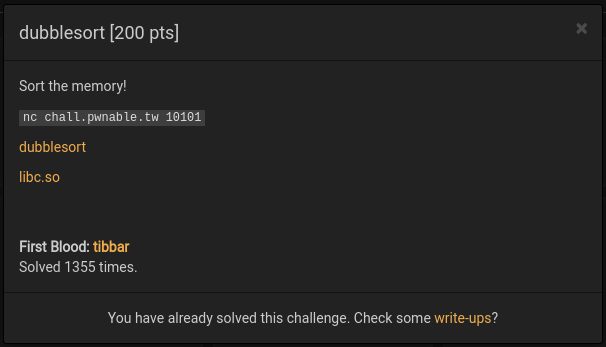
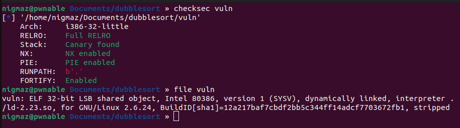
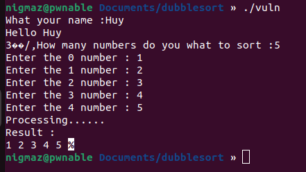
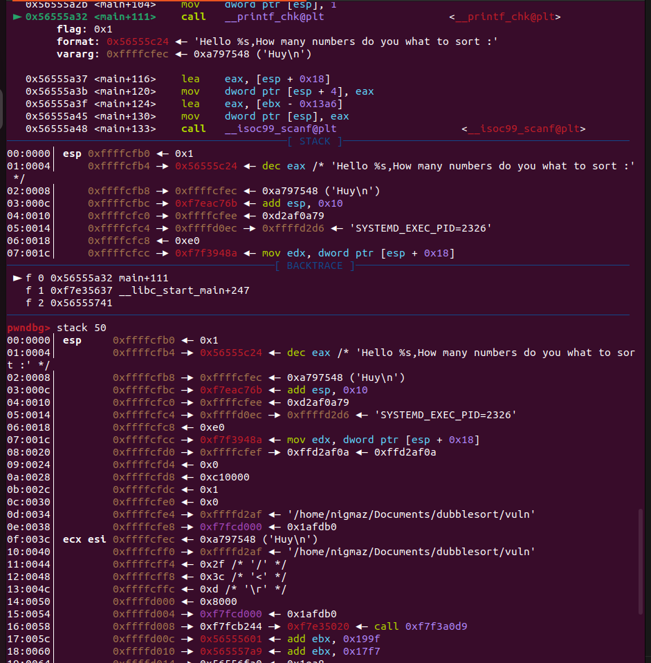
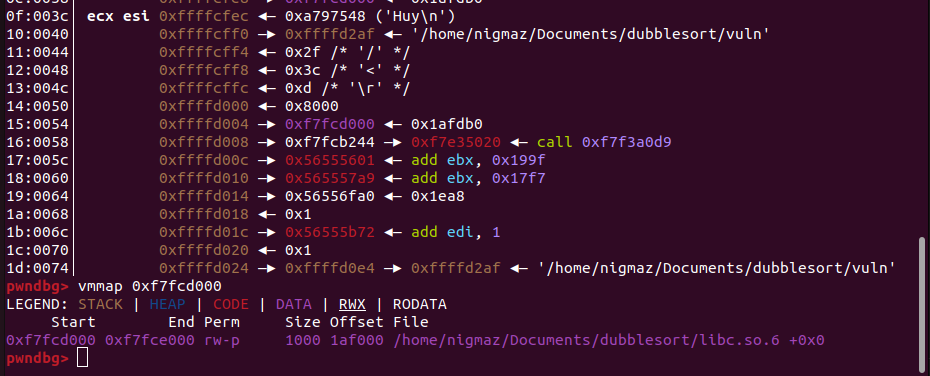
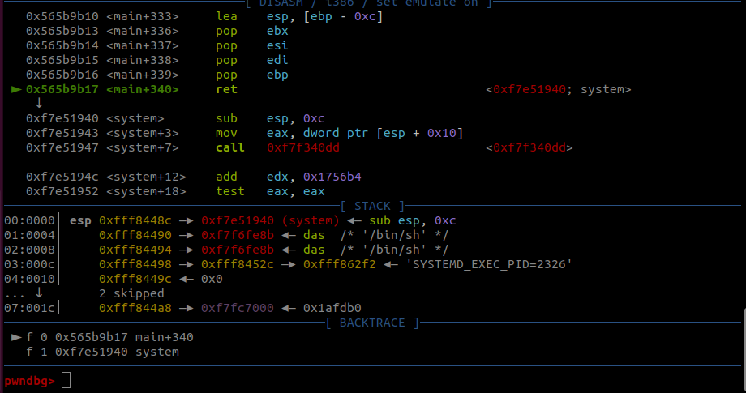
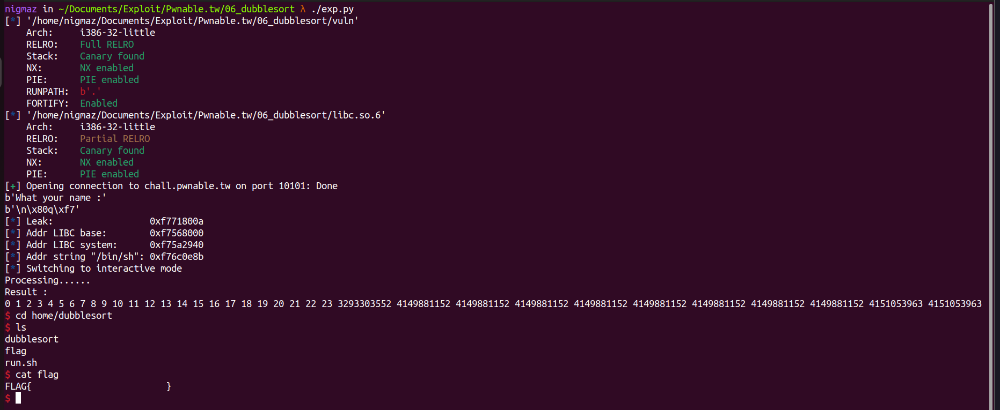

# [pwnable.tw] - 3x17



## A. CHALLENGE 

### [1] Binary Mitigations. 

- Bài cho file thực thi và thư viện => pwninit patch thư viện vào file, kiểm tra thông tin cơ bản của file.



>Chương trình 32-bit tên các hàm bị xóa và tất cả các biện pháp bảo vệ đều được bật (Tuy là khi kiểm tra thì file stripped nhưng khi debug bằng gdb rồi info func để xem tên các hàm thì vẫn còn tên hàm `main`).

## B. OVERVIEW



- Chương trình yêu cầu người dùng nhập tên, sau đó nhập vào một dãy số, tiến hành sắp xếp dãy số theo thứ tự tăng dần và in kết quả ra màn hình.

### [1] Vulnerability Analysis.

#### [+] BUG 1.

- Khi nhập `name` chương trình cho nhập tối đã 0x40 byte sử dụng hàm read (đọc input đến khi gặp newline và không thay newline = NULL hay thêm NULL vào cuối) mà khi in biến `name` sử dụng chuỗi định dạng `%s` thì lại in chuỗi đến khi nào gặp `NULL` => in ra một số ký tự junk gì đó trên stack.

```c
 char name[64]; // [esp+3Ch] [ebp-50h] BYREF
  unsigned int v11; // [esp+7Ch] [ebp-10h]

  v11 = __readgsdword(0x14u);
  init_8B5();
  __printf_chk(1, "What your name :");
  read(0, name, 0x40u);
  __printf_chk(1, "Hello %s,How many numbers do you what to sort :");
```

- Có thể dùng bug này để leak giá trị trên stack (libc, stack address,...).

#### [+] BUG 2.

- Tiếp đến là tiến hành nhập số lượng ký tự của mảng và giá trị các phần tử mảng cần sắp xếp, dễ dàng nhận ra mảng `numbers[]` chỉ được khai báo tối đa 8 phần tử, chương trình lại không kiểm tra giá trị `n` do người dùng nhập vào => nhập nhiều hơn 8 phần tử vào mảng numbers sẽ xảy ra `Buffer Overflow`.

```c
  unsigned int v3; // eax
  _BYTE *ptr; // edi
  unsigned int i; // esi
  unsigned int j; // esi
  int result; // eax
  unsigned int n; // [esp+18h] [ebp-74h] BYREF
  _BYTE numbers[32]; // [esp+1Ch] [ebp-70h] BYREF
...
  __printf_chk(1, "Hello %s,How many numbers do you what to sort :");
  __isoc99_scanf("%u", &n);
  v3 = n;
  if ( n )
  {
    ptr = numbers;
    for ( i = 0; i < n; ++i )
    {
      __printf_chk(1, "Enter the %d number : ");
      fflush(stdout);
      __isoc99_scanf("%u", ptr);
      v3 = n;
      ptr += 4;
    }
  }
  sort_931(numbers, v3);
```

- Bug trên có thể dùng để ghi đè các giá trị quan trọng như eip để tạo ROP hoặc là ret2libc.

### [2] Idea Exploit.

- NX enable nên không thể ghi shellcode rồi return về nên chúng ta sẽ tiến hành ret2libc:
    * BUG-1 sử dụng để leak giá trị thuộc `libc.so.6` từ đó tính toán offset tìm địa chỉ hàm system và chuỗi "/bin/sh\x00" .
    * BUG-2 ghi đè eip bằng địa chỉ system và setup đối số trên stack để thực hiện ret2libc. 

## C. EXPLOITATION

### [1] Stage 1: Leak LIBC address.

- Chương trình in biến `name` đến khi gặp byte NULL, ta xem trong khoảng giá trị 0x40 bắt đầu từ biến `name` có những giá trị nào ?



- Kiểm tra gía trị `0xf7fcd000` là địa chỉ thuộc libc (= libc.address + 0x1b0000) và offset trên stack cách biến `name` 24 byte.



- Tiến hành nhập 24 ký tự và ký tự thứ 25 là newline ghi đè byte cuối của địa chỉ libc leak được => `libc.address = leak - 0xa`  .

### [2] Stage 2: Ret2libc.

- Khi ghi đè rip sử dụng buffer overflow có một nơi ta cần lưu ý là stack canary (phần tử thứ 25 khi tiến hành nhập sử dụng mảng `numbers[]`), có một trick khi chương trình sử dụng nhập với format là `%u hoặc %ul` khi nhập __“+”__ vào vị trí của canary thì sẽ không làm thay đổi giá trị của canary.

- Một vấn đề nữa là chương trình tiến hành sort các giá trị của mảng `numbers[]` dẫn đến payload lộn xộn và không thể getshell nên khi setup payload thứ tự các số truyền vào dãy cũng phải đảm bảo theo thứ tự tăng dần. Ta có addr_binsh > addr_system (địa chỉ "/bin/sh" luôn nằm sau hàm system() trong libc) và addr_system > canary trong đa số trường hợp.



## D. FLAG

- Tiến hành viết file [exp.py](./exp.py) và khai thác:


