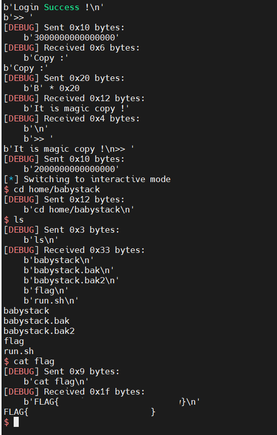

# [pwnable.tw] - BabyStack


## A. CHALLENGE 

### [1] Binary Mitigations. 

- Bài cho file thực thi và thư viện => pwninit patch thư viện vào file, kiểm tra thông tin cơ bản của file.


> Chương trình 64-bit tên các hàm bị xóa, các mitigation được bật FULL. Kiểm tra version của thư viện được cung cấp là libc-2.23 .

## B. OVERVIEW

- Chương trình có 3 option tường ứng như sau:
    * `1.` Đặng nhập nhập vào với mật khẩu được so sánh với mật khẩu sinh ngẫu nhiên khi khởi chạy chương trình. Nếu đúng thì đăng nhập thành công và với 1 lần đăng nhập thành công thì sau đó khi chọn lại option 1 sẽ tương ứng với logout.
    * `2.` Thoát khỏi vòng lặp và chương trình thoát.
    * `3.` Nếu đăng nhập thành công thì cho phép người dùng nhập vào 1 đoạn dữ liệu  và thực hiện copy.

### [1] Vulnerability Analysis.

- BUG bài này khá khó tận dụng nhưng có thể dễ dàng thấy được, nó ở hàm đăng nhập khi chương trình sử dụng hàm `strncmp()` của LIBC để so sánh mật khẩu.

- Hàm `strncmp()` chỉ so sánh cho đến khi gặp ký tự NULL => nếu nhập vào kỳ tự NULL thì sẽ không so sánh gì hết và đăng nhập thành công.

## C. EXPLOITATION

- Chương trình chạy trong 1 vòng lặp và trước khi vào vòng lặp mật khẩu đươc sinh random và lưu tại 1 vùng nhớ được cấp phát bởi mmap.

- Giá trị được lưu tại vùng nhớ mmap được sử dụng như canary khi cuối hàm main nếu ta thoát chương trình thì nó sẽ so sánh giá trị global tại mmap với mật khẩu lúc được sinh ra lưu ở stack.


### [1] Leak LIBC.

- Dễ thấy là chương trình chạy các option trong 1 vòng lặp `while(true)` và hàm `login()` sử dụng strncmp so sánh mật khẩu đến khi gặp ký tự NULL => Bruteforce từng byte của mật khẩu để lấy mật khẩu được sinh ngẫu nhiên của chương trình.

```c
// *a1 = __int64 random_password[2]; // [rsp+40h] [rbp-20h] BYREF
int __fastcall login_DEF(const char *a1)
{
  size_t len_user; // rax
  char user_password[128]; // [rsp+10h] [rbp-80h] BYREF

  printf("Your passowrd :");
  readSTR_CA0((unsigned __int8 *)user_password, 127u);
  len_user = strlen(user_password);
  if ( strncmp(user_password, a1, len_user) )
    return puts("Failed !");
  isLoggedIn_202014 = 1;
  return puts("Login Success !");
}
```

- 1 lỗi nữa là độ dài mật khẩu là 16 byte nhưng mật khẩu ta nhập vào có thể lên đến 127 byte => ta sẽ leak được nhiều thứ đằng sau mật khẩu lưu trên stack.

- Lỗi có thể được tận dụng khi sử dụng thêm hàm copy_data_user()

```c
// *a1 =   char user_data[64]; // [rsp+0h] [rbp-60h] BYREF
int __fastcall copy_user_data_E76(char *a1)
{
  char src[128]; // [rsp+10h] [rbp-80h] BYREF

  printf("Copy :");
  readSTR_CA0((unsigned __int8 *)src, 63u);
  strcpy(a1, src);
  return puts("It is magic copy !");
}
```

- Hàm readSTR đọc dữ liệu và sẽ thay thế ký tự newline = NULL nhưng thực chất của hàm thì là dùng read để đọc dữ liệu => không cần ký tự newline vẫn đọc được chuỗi đến khi kết thúc => không sinh ký tự NULL.

- Hàm strcpy() copy đến khi gặp ký tự NULL => fill hết ký tự null trên stack khi đọc dữ liệu biến src và khi copy vào a1 sẽ gây ra tràn.


- Dữ liệu copy gây tràn


- Khi tràn giá trị của `0x7f858f275439 (__GI__IO_file_setbuf+9)` sẽ ghi đè lên 6 byte sau của password và khi đó bruteforce để lấy địa chỉ LIBC.


### [2] Code Execute.

- Tuy là có thể tràn trong copy_user_data nhưng dữ liệu kiểm soát được là 63 byte, vì vậy dù là có thể tràn đến được rip của main nhờ copy nhưng lại không kiểm soát được gái trị có thể ghi đè.

- Chúng ta không chỉ kiểm soát 63 byte mà chúng ta có thể kiểm soát tới 127 byte, bởi vì trước khi gọi hàm copy_user_data, chúng ta có thể gọi hàm login cho phép bạn ghi giá trị lên tới 127 byte, chúng ta có thể nhập và thiết lập stack tương ứng bằng bất kỳ thứ gì. Dữ liệu chúng tôi muốn vẫn lưu tại stack và sau đó chương trình tái sử dụng lại ngăn xếp đó bằng cách gọi hàm copy_user_data ngay sau đó để sao chép hơn 63 byte dữ liệu.

```c
int __fastcall copy_user_data_E76(char *a1){
    char src[128]; // [rsp+10h] [rbp-80h] BYREF 
}

int __fastcall login_DEF(const char *a1){
    char user_password[128]; // [rsp+10h] [rbp-80h] BYREF
}
```

- __Hai hàm đều được gọi từ main nên rbp giống nhau và vị trí hai biến đều là [rbp-0x80] nên kiểm soát stack với 127 byte thông qua login và copy gây tràn với copy_user_data.__

- Một điều cần lưu ý là cần setup ghi đè đồng thời với việc khôi phục lại pass_random trên stack của chương trình để bypass canary_check.

- Setup stack 127 byte sử dụng login.


- Stack trước khi copy


## D. FLAG

- Tiến hành viết file [exp.py](./exp.py) và khai thác:

- Vấn đề khi khai thác remote là bruteforce nhiều nên rất lâu => thuê VPS cùng với máy chủ của challenge (Linode Japan).


