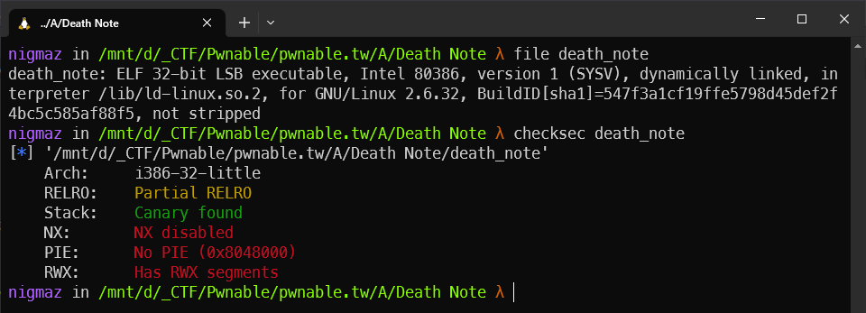
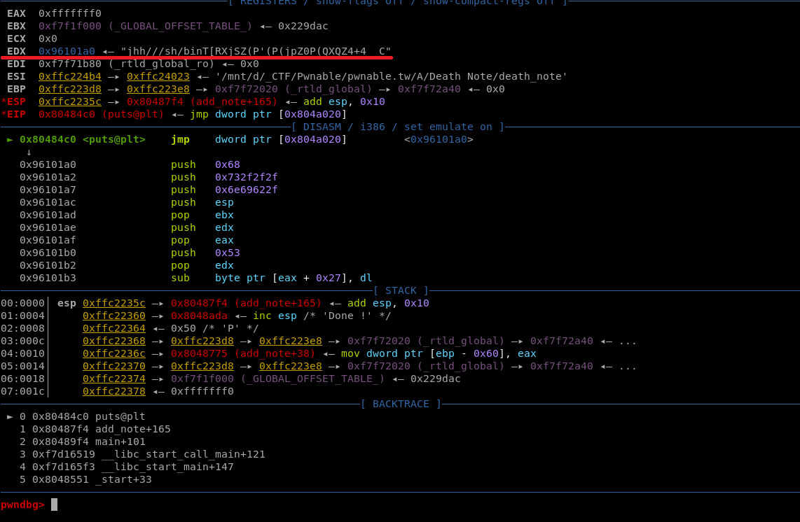

# [pwnable.tw] - Death Note


## A. CHALLENGE 

### [1] Binary Mitigations. 

- Kiểm tra thông tin cơ bản của file.



> Chương trình 32-bit và ta thấy có phân vùng full quyền nên ý tưởng đầu tiên nảy ra là tiến hành ghi shellcode.

## B. OVERVIEW


- Chương trình cung cấp các hàm thao tác với bộ nhớ heap như các challenge heap khác như phân bổ, thêm và giải phóng đối tượng ở đây là các note.

### [1] Vulnerability Analysis.

- Ta có thể thấy lỗi ở hàm `add_note()` khi mà chương trình kiểm tra idx, nó cho phép ta phân bổ một khối malloc với con trỏ được lưu trên biến global `&note`, nếu idx âm sẽ xảy ra `Out-of-bound` và ghi đè vào các GOT của các hàm LIBC.

```c
unsigned int add_note()
{
  int idx; // [esp+8h] [ebp-60h]
  char s[80]; // [esp+Ch] [ebp-5Ch] BYREF
  unsigned int v3; // [esp+5Ch] [ebp-Ch]

  v3 = __readgsdword(0x14u);
  printf("Index :");
  idx = read_int();
  if ( idx > 10 )                               // idx can value negative
  {
    puts("Out of bound !!");
    exit(0);
  }
  printf("Name :");
  read_input(s, 0x50u);
  if ( !is_printable(s) )
  {
    puts("It must be a printable name !");
    exit(-1);
  }
  *(&note + idx) = strdup(s);                   // out of bound when idx negative
  puts("Done !");
  return __readgsdword(0x14u) ^ v3;
}
```

### [2] Idea Exploit.

- Chương trình lọc các byte <= 0x1F và == 0x7F.

```c
int __cdecl is_printable(char *s)
{
  size_t i; // [esp+Ch] [ebp-Ch]

  for ( i = 0; strlen(s) > i; ++i )
  {
    if ( s[i] <= 0x1F || s[i] == 0x7F )
      return 0;
  }
  return 1;
}
```
- Vì vậy không thể sử dụng các instruction sau:
  * mov a, b
  * int 0x80

- Với câu lệnh đầu tiên ta sử dụng push b, pop a để thay thế.
- Đặc biệt với `int 0x80` == `"\xcd\x80"` ta sẽ thay thế bằng cách đặt 2 byte cuối = `"\x20\x43"` sau đó sử dụng chính shellcode để trừ hai byte cho 0x53 rồi xor byte cuối cùng với 0x70 để có được lại byte đúng int 0x80 sau khi filter.
## C. EXPLOITATION

- Tiến hành ghi đè vào `GOT của puts` - __(offset -16)__ để ngay sau khi ghi đè câu lệnh `puts("Done !");` sẽ nhảy đến shellcode.

- Thực hiện bypass __int 0x80__ bằng chính shellcode.

```asm
    push edx
    pop eax
    push 0x53
    pop edx
    sub byte ptr [eax+39],dl
    sub byte ptr [eax+40],dl
    push 0x70
    pop edx
    xor byte ptr [eax+40],dl
```

- Do trước khi PLT nhảy đến GOT thì giá trị của EDX là shellcode được `strdup()` trên heap.



- Sử dụng trực tiếp EDX để tiến hành xử lý hai byte cuối thành "\xcd\x80"

## D. FLAG

- Khai thác thành công remote nhưng local thì không (không rõ tại sao remote lại được) do strdup() phân bổ trên heap mà ở vùng nhớ heap không có quyền executre giống trên stack.

- Tiến hành viết file [exp.py](./exp.py) và khai thác:


