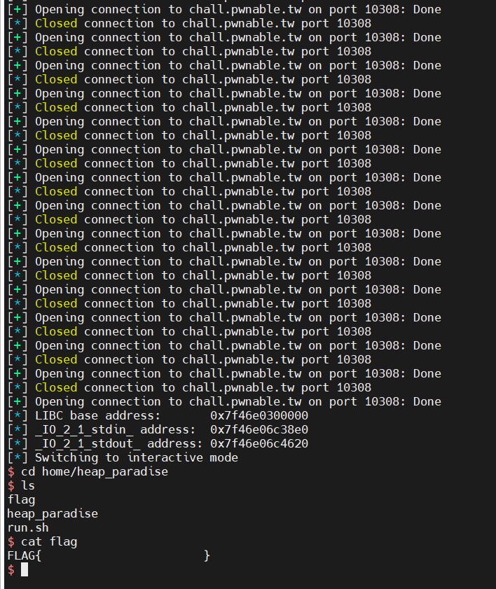

# [pwnable.tw] - Heap Paradise


## A. CHALLENGE 

### [1] Binary Mitigations. 

- Bài cho file thực thi và thư viện => pwninit patch thư viện vào file, kiểm tra thông tin cơ bản của file.


> Chương trình 64-bit tên các hàm bị xóa, các mitigation được bật FULL. Kiểm tra version của thư viện được cung cấp là libc-2.23 .

## B. OVERVIEW

- Chương trình có option cơ bản giống các challenge heap khác nhưng điều đặc biệt ở đây là không có tùy chọn nào in ra nội dung các chunk được cấp phát.


### [1] Vulnerability Analysis.

- Chương trình cấp phát các chunk tại option 1 và gọi hàm `Allocate()`, chỉ cấp phát được tối đa 15 chunk và kích thước giới hạn mỗi chunk là <= 0x78 (không có t-cache do libc-2.23 và chỉ cấp phát được fastbins do giới hạn kích thước được cấp phát của chương trình) và nhập nội dung cho chunk không xảy ra off-by-one hay heap buffer overflow.

```c
int Allocate_C8D()
{
  unsigned __int64 sz; // rax
  int i; // [rsp+4h] [rbp-Ch]
  unsigned int size; // [rsp+8h] [rbp-8h]

  for ( i = 0; ; ++i )
  {
    if ( i > 15 )
    {
      LODWORD(sz) = puts("You can't allocate anymore !");
      return sz;
    }
    if ( !ptrARR_202040[i] )
      break;
  }
  printf("Size :");
  sz = readLL_B49();
  size = sz;
  if ( sz <= 0x78 )
  {
    ptrARR_202040[i] = malloc(sz);
    if ( !ptrARR_202040[i] )
    {
      puts("Error!");
      exit(-1);
    }
    printf("Data :");
    LODWORD(sz) = readSTR_BAA(ptrARR_202040[i], size);
  }
  return sz;
}
```

- Option2 gọi hàm `Free()` có 1 bug rõ ràng khi không đặt ptr được free về 0 => `Use-after-free`

```c
void Free_D8D()
{
  __int64 index; // [rsp+8h] [rbp-8h]

  printf("Index :");
  index = readLL_B49();
  if ( index <= 15 )
    free((void *)ptrARR_202040[index]);         // BUG UAF
}
```
> Sử dụng Use-after-free để khai thác nhưng không có option nào in ra nội dung và cũng không thể cấp phát chunk size unsorted bins nên khó leak được địa chỉ libc.
## C. EXPLOITATION

### [1] Leak LIBC.

- Ta có thể fake 1 chunk unsorted bins bằng cách thay đổi size (thỏa mãn ĐK check của allocate heap manager là bit P của chunk sau = 1).
    * Sử dụng UAF để sửa fd của khối bị Double free (+0x20) khi đó sẽ tạo ra các `chunk heap overlap` và khi allocate sẽ có thể ghi đè lên size của chunk đằng sau.
    * Khi chunk bị sửa thành size của unsorted bins và tiến hành free thì fd và bk = main_arena+88.
    * Đặt chunk trên đồng thời trong fastbins(free chunk target trước khi sửa size thành unsorted bins), sau khi fd = main_arena+88 thì resize lại size fastbins sau đó allocate và sửa 2 byte cuối của main_arena+88 => Địa chỉ gần `_IO_2_1_stdout` thỏa mãn size 0x7f để ghi đè được struct `_IO_2_1_stdout` __(Tìm hiểu thêm về kỹ thuật angelboy)__.

- Sửa 2 biến của struct _IO_2_1_stdout:
    * __flag__ = 0xFBAD1800
    *  __char* _IO_write_base; /* Start of put area. */__ sửa byte cuối thành 0x80 (Phải sửa thành byte nhỏ hơn giá trị gốc): đây là nơi chứa _IO_2_1_stdin trong libc.

> Khi đó thì sẽ in ra _IO_2_1_stdin và leak được libc.

- __NOTE DEBUG:__ 
    * Khi ghi đè main_arena+88 => _IO_2_1_stderr do 2 byte cuối dạng 0xabcd thì chỉ bcd là offset không đổi còn 4 bit là a thì không khớp nên cần chạy thử liên tục nhiều lần và sẽ có 1 lần địa chỉ thử đúng (bruteforce).
    * set {long}(address fd unsorted bins)=fake chunk target in _IO_2_1_stderr (true condition size 0x7f)


### [2] Code Execute.

- Mục tiêu đơn giản là ghi đè __malloc_hook và sử dụng one_gadget thỏa mãn điều kiện: 0xEF6C4.

- __Reference:__
  * https://nightrainy.github.io/2019/08/07/play-withe-file-structure-%E6%90%AC%E8%BF%90/#Exploitation-of-FILE-structure
  * https://vigneshsrao.github.io/posts/babytcache/
  * https://maheshhari.github.io/blog/babytcache/
  * https://hackmd.io/@y198/HkR3Bz1-s


## D. FLAG

- Tiến hành viết file [exp.py](./exp.py) và khai thác:

- Vấn đề khi khai thác remote là do việc thử 4 bit và phản hồi chậm nên đợi khá lâu => thuê VPS cùng với máy chủ của challenge (Linode Japan).


