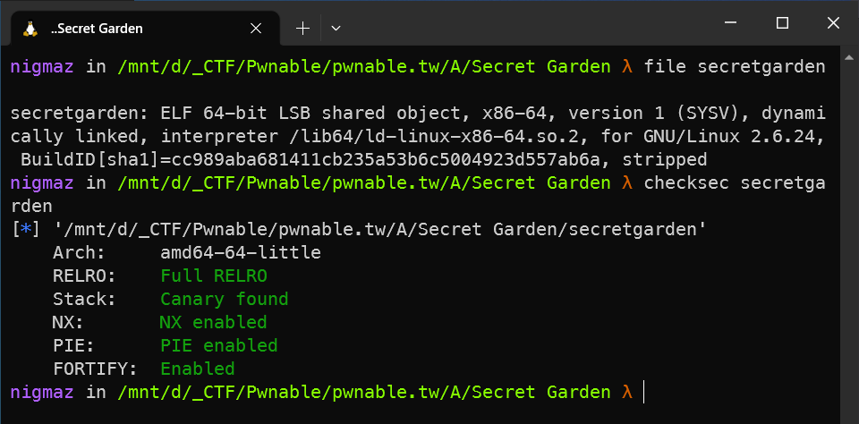
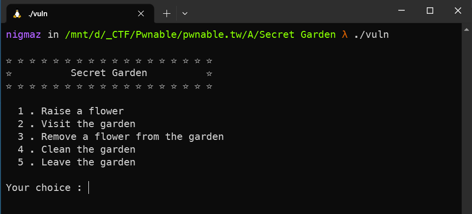
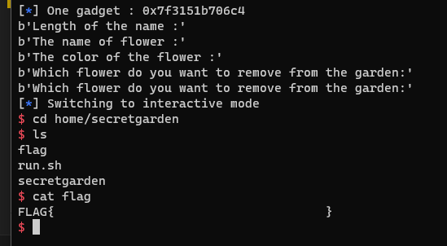

# [pwnable.tw] - Secret Garden


## A. CHALLENGE 

### [1] Binary Mitigations. 

- Bài cho file thực thi và thư viện => pwninit patch thư viện vào file, kiểm tra thông tin cơ bản của file.



> Chương trình 64-bit tên các hàm bị xóa và bật full các mitigation. Kiểm tra version của thư viện được cung cấp là `libc-2.23` .

## B. OVERVIEW



- Chương trình cho tạo đối tượng hoa là một phần của khu vườn. Một đối tượng hoa có thể được gỡ bỏ khỏi khu vườn bằng cách trước tiên sử dụng tùy chọn đánh dấu bông hoa là đã sẵn sàng để xóa sau đó sử dụng tùy chọn xóa tất cả các bông hoa được đánh dấu là sẵn sàng khỏi khu vườn và bạn có thể giải phóng tất cả các đối tượng hoa bạn muốn xóa. Đối tượng hoa là struct như sau:

```c
struct flower {
  long is_used;   // is the object currently been used
  char *name;     // stores *ptr the name of the flower, memory is allocated using malloc
  char color[24]; // color of flower
}
```

### [1] Vulnerability Analysis.

- Phân tích các hàm tùy chọn:
    * `1.` __Raise a flower:__ Kiểm tra số lượng bông hoa không lớn hơn 99, sau đó cấp phát chunk heap 0x28 để tạo struct của các bông hoa bao gồm các field: is_used, ptr *name và color[24]. Con trỏ *name được cấp phát một chunk heap theo size do người dùng cung cấp để lưu trữ tên bông hoa sau đó là nhập color của bông hoa và đặt bông hoa là đang được trồng (đặt is_used = 1) sau đó thì lưu pointer của struct lên một mảng global arrFlower để quản lý.
    * `2.` __Visit the garden:__ In ra tên và màu của những bông hoa đang được đánh dấu là đang được trồng (đặt is_used = 1) trên vườn hoa.
    * `3.` __Remove a flower from the garden:__ Đánh dấu bông hoa là sẵn sàng để xóa khỏi vườn hoa (đặt is_used = 0) và kèm với đó là free chunk được cấp phát để lưu tên bông hoa.
    * `4.` __Clean the garden:__ Duyệt từ đầu mảng arrFlower để xóa tất cả các bông hoa được đánh dấu là sẵn sàng để xóa (đặt is_used = 0) và sau đó đặt giá trị tương ứng của con trỏ tong mảng = 0. 
    * `5.` __Leave the garden:__ Thoát chương trình.

#### [+] BUG.

- Lỗi xuất hiện trong tùy chọn __Remove a flower from the garden:__ khi mà free __[ chunk được cấp phát để lưu trữ tên bông hoa ]__, chương trình chỉ set biến `is_used = 0` còn lại cả hai con trỏ là ptr struct lưu trong arrFlower[] và biến thành viên của nó là ptr *name đều không đặt bằng 0 dẫn đến điều kiện kiểm tra trước đó `(_DWORD *)arrFlower_202040[idx]) != 0LL` không có tác dụng và như vậy ta vẫn có thể free 1 đối tượng hoa hai lần => Double Free.

- Phiên bản thư viện được cung cấp là libc-2.23 nên không có t-cache và dữ liệu trên chunk khi được freed không bị xóa nên ta có thể leak dữ liệu.

## C. EXPLOITATION

#### [+] Leak LIBC base:

- Do không xóa dữ liệu của chunk được giải phóng nên ta sẽ sử dụng unsorted bins để leak main_arena+88 thuộc libc để tính toán các hàm trong libc.

- Cấp phát chunk 0x100 sau đó freed, rồi cấp phát lại đúng size đó và chỉ ghi đè 8 byte đầu (fd), do printf sử dụng "%s" nên sẽ in đến khi nào gặp byte NULL => sử dụng option thứ 2 để in ra nội dụng chunk mới cấp phát bao gồm (nội dung của chunk mới + bk unsorted bins).

#### [+] Code Execute:

- Sử dụng Double Free ghi đè `__malloc_hook` thành one_gadget (gần __malloc_hook mới có 0x7f để bypass check size lúc allocate của fastbins).

- Nhưng khi sử dụng `__malloc_hook` lại không đáp ứng được điều kiện nào của các one_gadget khi sử dụng option thứ 1 để gọi malloc(). 

__NOTE__: Khi double free một chunk liên tục thì luồng thực thi báo lỗi `Double Free` của libc sẽ gọi đến malloc() và ở luồng thực thi đó sẽ đáp ứng đủ điều kiện của one_gadget => get shell. [Reference](https://blog.osiris.cyber.nyu.edu/2017/09/30/csaw-ctf-2017-auir/) .

## D. FLAG

- Tiến hành viết file [exp.py](./exp.py) và khai thác:


