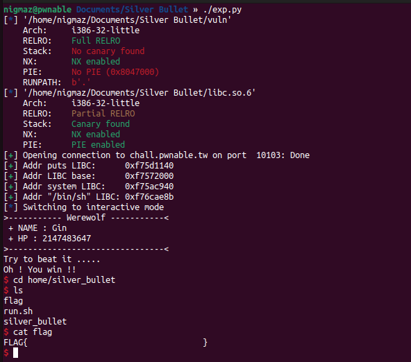

# [pwnable.tw] - Silver Bullet


## A. CHALLENGE 

### [1] Binary Mitigations. 

- Bài cho file thực thi và thư viện => pwninit patch thư viện vào file, kiểm tra thông tin cơ bản của file.


> Chương trình 32-bit có NX được bật (không có vùng nhớ vừa ghi vừa thực thi) và Full RELRO => khi khai thác không thể ghi đè GOT thay đổi hướng thực thi chương trình. Kiểm tra version của libc được cung cấp là 2.23 .

## B. OVERVIEW

- Chương trình đơn giản là một trò chơi, người chơi attack ma sói với HP được tạo sẵn => `HP ma sói < 0` => người chơi thắng, ngược lại người chơi tiếp tục và ngừoi chơi có 1 option tăng sức mạnh.


- Chương trình bắt đầu bằng việc khởi tạo một ma sói WEREWOLF *werewolf có tên là `werewolf.name` = "GIN" và máu là `werewolf.HP` = 0x7fffffff. Trò chơi cho người chơi tạo 1 viên đạn BULLET *bullet và đi bắn ma sói. Bắn đến khi sói hết máu thì chiến thắng (`werewolf.HP` < 0).

```c
int __cdecl main(int argc, const char **argv, const char **envp)
{
  int choice; // eax
  int wolf_HP; // [esp+0h] [ebp-3Ch] BYREF
  const char *wolf_name; // [esp+4h] [ebp-38h]
  char bullet[48]; // [esp+8h] [ebp-34h] BYREF
  int bullet_power; // [esp+38h] [ebp-4h]

  init_proc();
  bullet_power = 0;
  memset(bullet, 0, sizeof(bullet));
  wolf_HP = 0x7FFFFFFF;
  wolf_name = "Gin";
  ...
  menu();
  while(1)
  {
    // 1 => create_bullet()
    // 2 => power_up()
    // 3 => beat()
    // 4 => exit(0)
  }
}  
```

- Hiểu đơn giản khai báo trong hàm main dưới dạng cấu trúc như sau:

```c
struct BULLET{
    char name[0x30];
    int power;
};

struct WOREWOLF{
    int HP;
    char *name;
};
```

- Chương trình gồm 3 chức năng chính tương ứng với 3 hàm:

    * `1.` create_bullet(): tạo một viên đạn BULLET *bullet có tên là `bullet.name` dài tối đa 0x30 kí tự do người dùng nhập vào, khi đó power của bullet là `bullet.power` = len(`bullet.name`).
    * `2.` power_up(): ta có thể tăng sức mạnh cho bullet bằng cách nối dài thêm name, bullet.power sẽ được cập nhật lại là chiều dài của tên mới. Chiều dài tối đa của `bullet.name` vẫn là 0x30.
    * `3.` beat(): tiến hành bắn sói, HP của sói sẽ giảm đúng bằng `bullet.power` => Nếu sói hết máu thì thông báo chiến thắng.

### [1] Vulnerability Analysis.

- BUG bài này khá nhỏ ở trong hàm `power_up()`.

```c
// char bullet[48]
int __cdecl power_up(char *dest)
{
  char tmp[48]; // [esp+0h] [ebp-34h] BYREF
  size_t size; // [esp+30h] [ebp-4h]

  size = 0;
  memset(tmp, 0, sizeof(tmp));
  if ( !*dest )                                 // check not register
    return puts("You need create the bullet first !");
  if ( *((_DWORD *)dest + 12) > 47u )           // bullet_power = size(bullet[]) => check size(bullet[])
    return puts("You can't power up any more !");
  printf("Give me your another description of bullet :");
  read_input(tmp, 48 - *((_DWORD *)dest + 12));
  strncat(dest, tmp, 48 - *((_DWORD *)dest + 12));
  size = strlen(tmp) + *((_DWORD *)dest + 12);
  printf("Your new power is : %u\n", size);
  *((_DWORD *)dest + 12) = size;                // (_DWORD *) =>> bullet[48] = size = bullet_power
  return puts("Enjoy it !");
}
```
- Nó nằm ở câu lệnh `strncat(dest, tmp, 48 - *((_DWORD *)dest + 12));` hay theo cấu trúc được định nghĩa lại thì sẽ hiểu là `strncat(bullet.name, tmp, 0x30-bullet.power)` .

- Hàm `strncat` là một hàm nối chuỗi và mình dẫn nguyên định nghĩa từ man của linux.

```c
char *strncat(char *dest, const char *src, size_t n);

DESCRIPTION
       The strcat() function appends the src string to the dest string, overwriting the terminat‐
       ing null byte ('\0') at the end of dest, and then  adds  a  terminating  null  byte.   The
       strings  may  not  overlap, and the dest string must have enough space for the result.  If
       dest is not large enough, program behavior is unpredictable; buffer  overruns  are  a  fa‐
       vorite avenue for attacking secure programs.

       The strncat() function is similar, except that
       *  it will use at most n bytes from src; and
       *  src does not need to be null-terminated if it contains n or more bytes.

       As with strcat(), the resulting string in dest is always null-terminated.
       If  src  contains n or more bytes, strncat() writes n+1 bytes to dest (n from src plus the
       terminating null byte).  Therefore, the size of dest must be at least strlen(dest)+n+1.

       A simple implementation of strncat() might be:
           char *
           strncat(char *dest, const char *src, size_t n)
           {
               size_t dest_len = strlen(dest);
               size_t i;

               for (i = 0 ; i < n && src[i] != '\0' ; i++)
                   dest[dest_len + i] = src[i];
               dest[dest_len + i] = '\0';

               return dest;
           }
```

- Nhìn vào đoạn mã mô tả, sau khi nối `*src` vào cuối `*dest` thì hàm đặt `dest[dest_len + i] = '\0';` ứng với code của challenge thì là `bullet[48] = NULL = bullet.power` => Xảy ra __OFF_BY_ONE__.

### [2] Idea Exploit.

- Từ câu lệnh `strncat(dest, tmp, 48 - *((_DWORD *)dest + 12));` - mục đích là nối chuỗi `tmp` mà người dùng mới nhập vào dest là chuỗi `bullet.name`, số ký tự được copy tối đa là `0x30-bullet.power`.

- Giả sử lúc đầu `bullet.name` là một chuỗi gồm 0x2f kí tự "A", `tmp` là chuỗi "B" dài 0x1 kí tự. Sau khi thực hiện strncat() thì `bullet.name` sẽ gồm 0x30 kí tự, cộng thêm 1 kí tự NULL được strncat() tự động thêm vào `bullet.name[48]` = NULL - đó chính là vị trí của `bullet.power`. Khi đó `bullet.power` sẽ được cập nhật lại thành `bullet.power = bullet.power + len(tmp) = 0 + 1 = 1.`

|    ADDRESS                     |                 OFFSET                       |   VALUE           | PAYLOAD                 |
| :-------------:                | :-------------------------------------------:|:---------------:  | :-------------:         | 
|     EBP - 0x3C                 | 0                                            | `werewolf.HP`       |  0x7fffffff             |  
|     EBP - 0x38                 | 1                                            | `werewolf.name`     | "GIN"                   | 
|     EBP - 0x34                 | 2                                            | `bullet.name[0]`    |  "AAAA"                 | 
|     ...                        | ...                                          | ....              |                         |
|     EBP - 0x8                  | 13                                           | `bullet.name[0x2f]` |   "B"                   |
|     EBP - 0x4                  | 14                                           | `bullet.power`      |  \x00\x00\x00\x01       | 
|     EBP                        | 15                                           | save_EBP          |                         | 
|     EBP + 0x4                  | 16                                           | return-address_RIP|                         |

- Bây giờ bullet.name có chiều dài là 0x30 nhưng chiều dài được lưu trong bullet.power chỉ là 0x1, do đó ta có thể power_up() thêm 1 lần nữa với strncat (0x30-1) ký tự, và chuỗi tmp mà ta nhập vào sẽ overwrite từ vị trí của bullet.power, do đó ta có thể overwrite return address.

>Bài được set NX enabled nên không thể thực hiện ret2shellcode, đề bài cho file libc_32.so.6 nên ta sẽ dùng kĩ thuật ret2libc.

- Leak địa chỉ LIBC.
- Ret2LIBC.

## C. EXPLOITATION

### [1] Leak LIBC address.

- Lần 1 ta ghi đè RIP để leak LIBC sử dụng puts in ra địa chỉ LIBC của chính puts trên GOT rồi tính toán LIBC base, sau đó quay lại main lần nữa.

|    ADDRESS                     |                 OFFSET                       |   VALUE             | PAYLOAD                 |
| :-------------:                | :-------------------------------------------:|:---------------:    | :-------------:         | 
|     EBP - 0x3C                 | 0                                            | `werewolf.HP`         |  0x7fffffff             |  
|     EBP - 0x38                 | 1                                            | `werewolf.name`       | "GIN"                   | 
|     EBP - 0x34                 | 2                                            | `bullet.name[0]`      |  "AAAA"                 | 
|     ...                        | ...                                          | ....                |                         |
|     EBP - 0x8                  | 13                                           | `bullet.name[0x2f]`   |   "B"                   |
|     EBP - 0x4                  | 14                                           | `bullet.power`        |  \xff\xff\xff\x01       | 
|     EBP                        | 15                                           | save_EBP            |                         | 
|     EBP + 0x4                  | 16                                           | return-address_main | PLT_puts                |
|     EBP + 0x8                  | 17                                           | return-address_puts | main_address            | 
|     EBP + 0xc                  | 18                                           | argument of puts    | GOT - puts              |

### [2] Ret2libc.

- Ghi đè để setup các đối số  thực thi system("/bin/sh").


|    ADDRESS                     |                 OFFSET                       |   VALUE             | PAYLOAD                 |
| :-------------:                | :-------------------------------------------:|:---------------:    | :-------------:         | 
|     EBP - 0x3C                 | 0                                            | `werewolf.HP`         |  0x7fffffff             |  
|     EBP - 0x38                 | 1                                            | `werewolf.name`       | "GIN"                   | 
|     EBP - 0x34                 | 2                                            | `bullet.name[0]`      |  "AAAA"                 | 
|     ...                        | ...                                          | ....                |                         |
|     EBP - 0x8                  | 13                                           | `bullet.name[0x2f]`   |   "B"                   |
|     EBP - 0x4                  | 14                                           | `bullet.power`        |  \xff\xff\xff\x01       | 
|     EBP                        | 15                                           | save_EBP            |                         | 
|     EBP + 0x4                  | 16                                           | return-address_main | system_address          |
|     EBP + 0x8                  | 17                                           |return-address_system| exit_address            | 
|     EBP + 0xc                  | 18                                           | argument of system  | /bin/sh _address        |


## D. FLAG

- Tiến hành viết file [exp.py](./exp.py) và khai thác:


