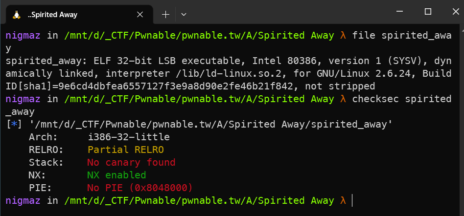
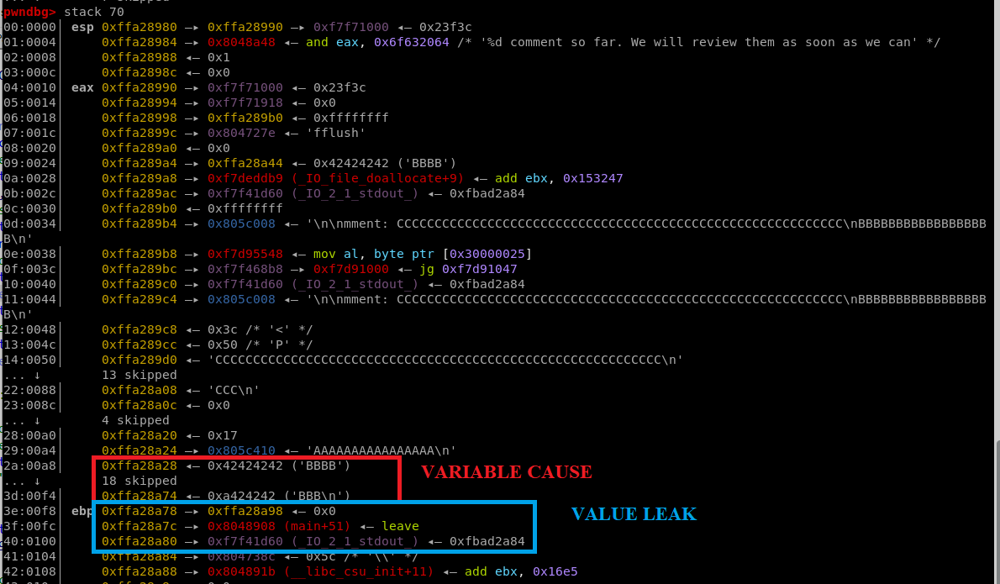
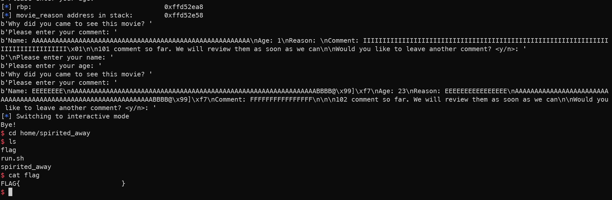

# [pwnable.tw] - Spirited Away


## A. CHALLENGE 

### [1] Binary Mitigations. 

- Bài cho file thực thi và thư viện => pwninit patch thư viện vào file, kiểm tra thông tin cơ bản của file.



> Chương trình 32-bit và NX là được bật. Kiểm tra version của libc được cung cấp là 2.23 .

## B. OVERVIEW

- Chương trình sẽ thu thập đánh giá về bộ phim trong một vòng lặp và bạn có thể nhập tối đa 200 đánh giá, sau đó ứng dụng sẽ thoát khỏi vòng lặp và kết thúc.


### [1] Vulnerability Analysis.

- BUg trong hàm `survey()`:

```c
int survey(){
    char v1[56]; // [esp+10h] [ebp-E8h] BYREF
    size_t nbytes; // [esp+48h] [ebp-B0h]
    size_t v3; // [esp+4Ch] [ebp-ACh]
    char comment[80]; // [esp+50h] [ebp-A8h] BYREF
    int age; // [esp+A0h] [ebp-58h] BYREF
    void *name; // [esp+A4h] [ebp-54h]
    char cause[80]; // [esp+A8h] [ebp-50h] BYREF
    ...
    nbytes = 0x3C;                                // one byte overwrite 0x3c -> character 'n' | 0x6e = 110
    v3 = 80;
    ...
    printf("\nPlease enter your name: ");
    fflush(stdout);
    read(0, name, nbytes);
    ...
    printf("Please enter your comment: ");
    fflush(stdout);
    read(0, comment, nbytes); 
    ...
    sprintf(v1, "%d comment so far. We will review them as soon as we can", cnt);// 54 char | v1[56] => cnt is number 3 digit => overflow 1 byte
    puts(v1);
    ...
}
```

- Hàm `sprintf()` sẽ định dạng biến cnt theo format specifiers "%d" rồi cả chuỗi được coppy vào chuỗi v1[56], không có vấn đề gì nếu cnt là số có 2 chữ số. Nếu cnt là số có 3 chữ số thì vượt quá kích thước của v1 dẫn đến tràn ký tự cuối `b"n"` lên biến nbytes được sử dụng để đọc biến name và comment \
- Biến name có kích thước 60 và `comment[80]` có kích thước 80 mà biến ghi đè nbytes = 110 => Stack bufer overflow.

## C. EXPLOITATION

### [1] Stage 1: Leak LIBC address.

- Biến cause[80] nằm ngay sau `save_ebp` của hàm `survey()`, hàm read đọc chuỗi cho đến khi gặp ký tự "\n" và không thêm ký tự NULL vào cuối chuỗi nhưng hàm printf khi sử dụng specifier "%s" thì lại in chuỗi cho đến khi nào gặp ký tự NULL nên ta có thể leak các địa chỉ đằng sau biến cause[80] bao gồm stack, địa chỉ hàm main + 51 và quan trọng hơn là `_IO_2_1_stdout_` - một giá trị nằm trong libc.



- Sau đó ta tiến hành thực thi chương trình tăng biến `cnt` đến 3 chữ số để trigger được lỗi.

### [2] Stage 2: Code Execution.

- Mặc dù chúng ta có thể ghi đè địa chỉ trả về nhưng kích thước bộ đệm không đủ để chứa dữ liệu chuỗi ROP (có thể ghi đè hai biến là `comment` và `name` nhưng chỉ có biến comment là trên stack thì lại không đủ để viết ROP).

- Ý tưởng là fake chunk lên trên biến `movie_reason` sau đó dùng biến `comment` ghi đè con trỏ tại `*name` thành địa chỉ `movie_reason + 8` để khi free thì chunk fake được đẩy vào fastbins.

- Khi đó chỉ cần cấp phát lại thì biến `*name` nhận giá trị tại biến `movie_reason` trên stack và có thể setup ROP ghi đè RIP rồi thực thi system("/bin/sh").

## D. FLAG

- Tiến hành viết file [exp.py](./exp.py) và khai thác:


