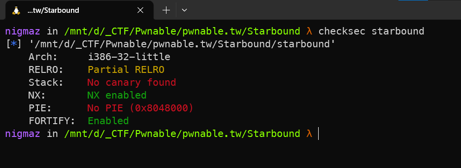
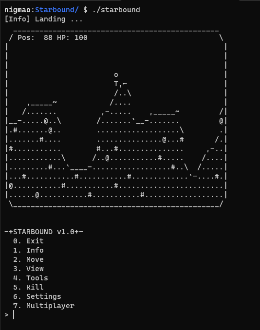
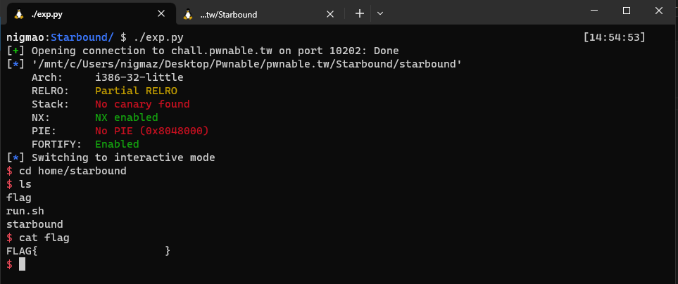

# [pwnable.tw] - Starbound


## A. CHALLENGE 

### [1] Binary Mitigations. 

- Chương trình 32-bit chỉ có NX enable và bài không cung cấp `libc.so` .



- __NOTE:__ Các challenge của pwnable.tw được build trên ubuntu 16.04 hoặc ubuntu 18.04. Bài này yêu cầu thư viện `libssl1.0.0:i386` của ubuntu 16.04.
   * `0.` Nếu sử dụng ubuntu 20.04 để khai thác cần tải thêm thư viện `libssl1.0.0:i386` từ package của ubuntu 16.04 (Từ ubuntu 22.04 trở đi không còn sử dụng cách dưới để bổ sung thư viện yêu cầu được nữa).
   * `1.` Thêm repository của ubuntu 16.04 (This command adds the Xenial (16.04) security repository to your system).
   ```bash 
   sudo add-apt-repository "deb http://security.ubuntu.com/ubuntu xenial-security main"
   ```
   * `2.` Update the package list by running the following command:
   ```bash
   sudo apt-get update
   ```
   * `3.` Install the `libssl1.0.0:i386` package by running the following command:
   ```bash 
   sudo apt-get install libssl1.0.0:i386
   ```
   * `4.` Bây giờ đã có thể chạy được challenge, nhưng nên xóa repository của ubuntu 16.04.
   ```bash 
   sudo add-apt-repository --remove "deb http://security.ubuntu.com/ubuntu xenial-security main"
   ```

## B. OVERVIEW

- Chương trình in ra menu chính sử dụng con trỏ hàm `ptr_menu_805817C()` và ứng với mỗi option sử dụng mảng các con trỏ hàm để lưu trữ giá trị của các hàm ứng với mỗi option của menu.



- 8 DWORD bắt đầu từ `dword_8058154` lưu trữ địa chỉ các hàm tương ứng với các option của menu chính và khi gọi tới một option VD như option 6 thì chương trình sẽ gán lại ptr_func `ptr_menu_805817C()` và con trỏ hàm option với menu phụ của riêng option 6 và các hàm tương ứng của option 6.

### [1] Vulnerability Analysis.

- Code chương trình khá dài để reverse nhưng lỗi thì nằm ngay trong hàm main.

```c
int __cdecl main(int argc, const char **argv, const char **envp)
{
  int idx; // eax
  char nptr[256]; // [esp+10h] [ebp-104h] BYREF

  init();
  while ( 1 )
  {
    alarm(0x3Cu);
    ptr_menu_805817C();                         // cmd_go_back(); 
                                                // set ptr_menu_805817C = show_main_menu;
    if ( !readn(nptr, 0x100u) )
      break;
    idx = strtol(nptr, 0, 10);                  // BUG | idx is negative => out-of-bound
    if ( !idx )
      break;
    ((void (*)(void))dword_8058154[idx])();     // 54 -> 70 arr option
                                                // option 6 -> 2 -> 1
                                                // => read in variable global name and return main menu
                                                // NAME_80580D0 | idx = -33
  }
  do_bye();
  return 0;
}
```

- Lỗi out-of-bound với idx khi mang giá trị âm sẽ dẫn đến gọi giá trị tại vị trí idx âm đó.

- Trước biến `dword_8058154[]` có rất nhiều vị trí có thể dùng để khai thác như GOT của các hàm libc hoặc là các biến global cũng được sử dụng trong chương trình.

- Tìm thấy biến `char NAME_80580D0[128]` nhận dữ liệu từ người dùng (option 6 => 2 nhập tên người chơi hàm `(int)cmd_set_name;`) và nằm ở idx -33 so với mảng `dword_8058154[]`.

## C. EXPLOITATION

### [1] CONTROL RIP.

- Có thể control được giá trị ta muôn gọi đến nhưng nên gọi đến giá trị nào bây giờ, có một gadget là `0x08048e48 : add esp, 0x1c ; ret` - tăng esp lên 0x1c và giá trị stack ứng với instruction `ret` sẽ có thể kiểm soát thông qua biến đọc option là `nptr` => control RIP - [trigger.py](./trigger.py) .

```bash 
ROPgadget --binary ./starbound | grep ret | grep "add esp, 0x1c"
```

- Challenge không cho libc.so nên ý tưởng ban đầu là leak sau đó search offset leak được khi remote bằng tools https://libc.blukat.me/ nhưng fail sau đó thì thử cách sử dụng module của pwntools DynELF nhưng chỉ chạy được local lên remote thì do leak rồi thử nhiều giá trị nên bị miss recv() - [dyn.py](./dyn.py) .

- Không có libc.so thì còn cách ret2dlresolve để lấy shell.

### [2] RET2DLRESOLVE.

- Mô tả fake STRTAB, SYMTAB và JMPREL trên segment rw-p (FAKE rel_offset, r_info, st_name và string "system").

```
start_fake   +--------+
r_offset     |GOT     |       
r_info       |0x2100  |  
alignment    |AAAAAAAA|  
st_name      |0x120   |  
st_value     |0x0     |
st_size      |0x0     |
others       |0x12    |
sym_string   |"syst   |  
             |em\x00" |
alignment    |AAAAAAAA| 
binsh_string |"/bin/sh|  
             |\x00"   |
             +--------+```
```

- Ghi đè rip bằng read_plt để gọi handle ghi `struct fake` lên segment rw-p rồi return về call _dl_runtime_resolve với argv2 là rel_offset tương ứng với `struct fake` vừa ghi (rel_offset = start_fake - JMPREL).

## D. FLAG

- Tiến hành viết file [exp.py](./exp.py) và khai thác:


