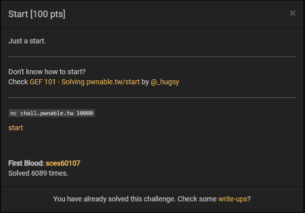
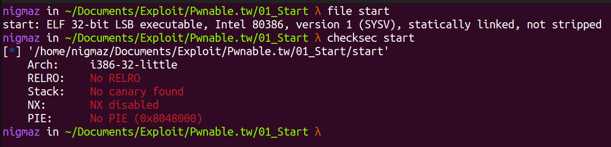
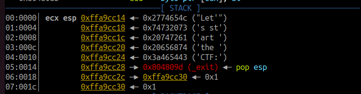
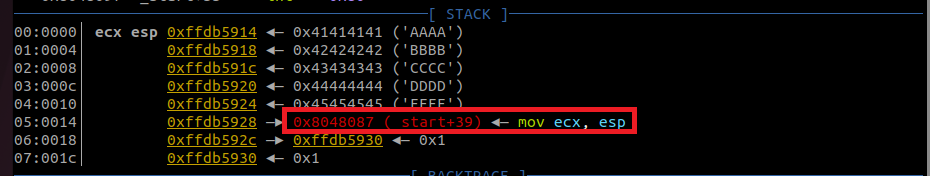
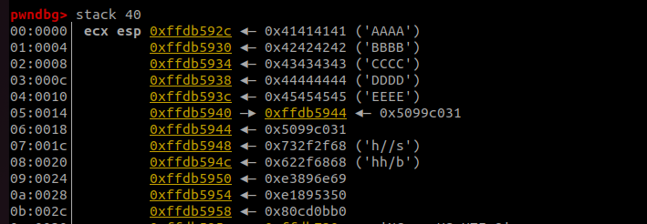
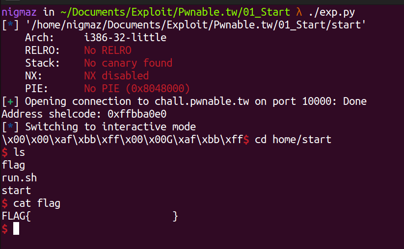

# [pwnable.tw] - Start



## A. CHALLENGE 

### [1] Binary Mitigations. 

- Tắt tất cả các biện pháp bảo vệ.



>Chương trình 32-bit được viết bằng code nasm, biên dịch tĩnh và không bị mất `label` các chức năng của chương trình (not stripped).

## B. OVERVIEW

### [1] Vulnerability Analysis.

Tiến hành phân tích chương trình bằng gdb, ta thấy chương trình gồm hai hàm `_start` và `_exit`.

```asm
   0x8048060 <_start>:		push   esp
   0x8048061 <_start+1>:	push   0x804809d
   0x8048066 <_start+6>:	xor    eax,eax
   0x8048068 <_start+8>:	xor    ebx,ebx
   0x804806a <_start+10>:	xor    ecx,ecx
   0x804806c <_start+12>:	xor    edx,edx

   0x804806e <_start+14>:	push   0x3a465443
   0x8048073 <_start+19>:	push   0x20656874
   0x8048078 <_start+24>:	push   0x20747261
   0x804807d <_start+29>:	push   0x74732073
   0x8048082 <_start+34>:	push   0x2774654c

   0x8048087 <_start+39>:	mov    ecx,esp
   0x8048089 <_start+41>:	mov    dl,0x14
   0x804808b <_start+43>:	mov    bl,0x1
   0x804808d <_start+45>:	mov    al,0x4
   0x804808f <_start+47>:	int    0x80

   0x8048091 <_start+49>:	xor    ebx,ebx
   0x8048093 <_start+51>:	mov    dl,0x3c
   0x8048095 <_start+53>:	mov    al,0x3
   0x8048097 <_start+55>:	int    0x80

   0x8048099 <_start+57>:	add    esp,0x14
   0x804809c <_start+60>:	ret    

   0x804809d <_exit>:		pop    esp
   0x804809e <_exit+1>:		xor    eax,eax
   0x80480a0 <_exit+3>:		inc    eax
   0x80480a1 <_exit+4>:		int    0x80
```

- Chương trình bắt đầu thực thi từ hàm `_start`.
- **(_start: 0 -> 12)** chương trình `"push esp"` - đẩy giá trị esp vào stack, sau đó `"push 0x804809d"` - đẩy địa chỉ hàm `_exit` vào stack để return về khi muốn kết thúc chương trình và khởi tạo giá trị cho các thanh ghi = 0 (xor eax, eax nghĩa là eax = 0).
- **(_start: 14 -> 47)** Tiếp theo là thực hiện đưa dòng chữ `"Let's start the CTF:"` lên stack và chương trình gọi lệnh `sys_write()` dùng ngắt 0x80 đầu tiên để gọi các lệnh hệ thống `Linux Syscall` với các đối số là giá trị yêu cầu trên các thanh ghi eax = 4, để print vào stdout (ebx = 1), số lượng kí tự in 20 kí tự (edx = 0x14) tại địa chỉ esp (ecx = esp), mục đích là in dòng "Let's start the CTF:" ra màn hình.
- **(_start: 49 -> 55)** Lệnh ngắt 0x80 thứ hai, eax = 3, chương trình gọi lệnh `sys_read()` đọc tối đa 60 kí tự (edx = 0x3c) từ stdin (ebx = 0), lưu vào stack tại vị trí esp (ecx = esp).
- **(_start: 57 -> 60)** Tăng giá trị esp lên 20 - nơi lưu địa chỉ hàm `_exit` (thực hiện lưu ở đầu hàm `_start`, địa chỉ của hàm `_exit` lưu trên stack và return vể hàm `_exit` để kết thúc chương trình).
- **(_exit: 0 -> 4)** Thực hiện `sys_exit` kết thúc chương trình.

> Ta dễ dàng thấy được chương trình cho đọc vào đến 60 kí tự và lưu chúng trên stack(ghi đề lên dòng chữ "Let's start the CTF:"), trong khi sau đó chỉ tăng esp lên 20 và return về giá trị được lưu tại `esp + 20` => Xảy ra lỗi Stack Buffer Overflow dẫn đến ghi đè địa chỉ trả về.

### [2] Idea Exploit.

Thường những bài mà khi check Binary Mitigations `NX: NX disabled` và không có hàm giúp lấy shell hay đọc flag thì ý tưởng đầu tiên mình nghĩ tới là ghi shellcode vào chương trình sau đó điều khiển return address trỏ về shellcode. Ta sẽ giải quyết bài này theo ý tưởng đó nhưng có 2 vấn đề cần giải quyết:

- Shellcode: Cái này thì ta có thể dễ dàng tìm thấy trên mạng hoặc tự viết cũng được miễn nó không quá dài vì input cho nhập tối đa 60 kí tự.
      
- Ta cần xác định được chính xác nơi đặt shellcode và địa chỉ đó, ở đây ta viết shellcode vào stack (do có cả 3 quyền **rwx**) và điều khiển return address trỏ về đúng vị trí shellcode được đặt => cần có địa chỉ stack.

## C. EXPLOITATION

### [1] Stage 1: Leak Stack Address.

- Để giải quyết vấn đề thứ hai, ta để ý đầu hàm `_start` là `push esp` đẩy giá trị esp vào stack rồi mới đến đẩy địa chỉ của hàm `_exit` (return address) lên stack. Khi đó bố cục của stack trước khi nhận input sẽ như sau. 



- Nếu ta tạo payload điều khiển chương trình return về `0x08048087` - địa chỉ của câu lệnh `mov ecx, esp`, đưa địa chỉ của chuỗi cần in (ở đầu stack) vào ecx và thực hiện `syscall write()`, sau khi return về chương trình sẽ thực hiện `syscall write()` lần thứ hai, in ra 20 bytes trên stack. Vì 4 bytes đầu tiên trên stack hiện tại là một giá trị stack => **leak stack address**. 



> Lưu ý khi viết script exploit, payload lần thứ nhất để leak stack address nếu dùng sendline sẽ tự thêm '\x0a' vào cuối payload dẫn đến ghi đề byte cuối thành '\x0a' **[ở trong ảnh minh họa là byte \x30 => \x0a]**. Giá trị khi đó vẫn là một stack address nhưng dẫn tới sai offset tính toán địa chỉ shellcode mà ta viết trên stack.

### [2] Stage 2: Shellcode

- Chương trình sẽ tiếp tục với một lệnh `syscall read()` thứ hai, ta sẽ gửi payload thứ hai bao gồm "A"*0x14 + (giá trị leak được chính là nơi ta ghi shellcode = esp+20) + shellcode, lúc này chương trình sẽ return về địa chỉ bắt đầu của shellcode **syscall execve**.



## D. FLAG

- Tiến hành viết file [exp.py](./exp.py) và khai thác:

