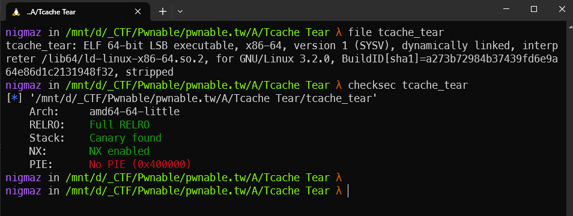

# [pwnable.tw] - Tcache Tear


## A. CHALLENGE 

### [1] Binary Mitigations. 

- Bài cho file thực thi và thư viện => pwninit patch thư viện vào file, kiểm tra thông tin cơ bản của file.



> File 64-bit và PIE tắt.

## B. OVERVIEW


- Ba chức năng cơ bản cấp phát, giải phóng bộ nhớ HEAP và in nội dung (bài này thì hàm in nội dung chỉ in tên người chơi).
### [1] Vulnerability Analysis.

- Lỗi cơ bản nằm trong hàm main khi thực hiện option giải phóng bộ nhớ, con trỏ sau khi giải phóng không được đặt bằng NULL => Use After Free.

```c
      if ( choice != 2 )
        break;
      if ( countFree <= 7 )                     // only free 8 times
      {
        free(ptr);                              // free not set ptr = 0
        ++countFree;
      }
    }
```

- Còn một lỗi nữa trong hàm malloc, nếu cấp phát size < 16 thì khi nhập chuỗi với size = size - 16 => size âm mà biểu diễn khi ép kiểu dương sẽ là một số rất lớn => integer overflow => Ghi tràn bộ đệm.

```c
int Malloc_400B14()
{
  unsigned __int64 size_1; // rax
  int size; // [rsp+8h] [rbp-8h]

  printf("Size:");
  size_1 = readLL_4009C4();
  size = size_1;
  if ( size_1 <= 0xFF )
  {
    ptr = malloc(size_1);
    printf("Data:");
    readStr_400A25((__int64)ptr, size - 16);    // size < 16 => size - 16 is negative => integer overflow
    LODWORD(size_1) = puts("Done !");
  }
  return size_1;
}
```

- Một số lưu ý:

    * Các khối giới hạn kích thước nhỏ hơn 0xFF => sau khi free thì chunk nhận đưuọc chỉ gồm các t-cache bins.
    * Ta chỉ có thể thao tác rất ít với các chunk và các chunk được cấp phát thông qua 1 ptr duy nhất, hàm in là hàm in tên người chơi.

### [2]  BUG.
- Use after free.
- Integer Overflow => bufer overflow.

## C. EXPLOITATION

- Libc cung cấp là 2.27 => có thể free một t-cache liên tục => Double Free.
- Lerak LIBC: đầu tiên tạo DB để fake chunk lên biến name(do PIE tắt nên phân đoạn này không đổi địa chỉ) nhưng chunk giả này lại có kích thước 0x500 để khi free nằm trong unsorted bins với fd, bk được set rồi sử dụng chính chức năng `INFO` để leak rồi tính toán libc.
- Trước khi tạo fakle chunk 0x500 lên biến name tạo fake chunk tại name + 0x500 để bypass check size khi free unsorted bins.
- Tiếp theo thì thực hiện lại double free để ghi đè __free_hook => system.

## D. FLAG

- Tiến hành viết file [exp.py](./exp.py) và khai thác:


