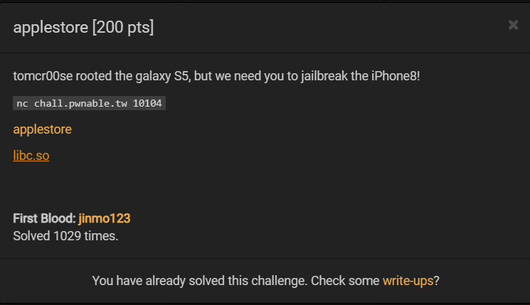

# [pwnable.tw] - applestore



## A. CHALLENGE 

### [1] Binary Mitigations. 

- Bài cho file thực thi và thư viện => pwninit patch thư viện vào file, kiểm tra thông tin cơ bản của file.


> Chương trình 32-bit có CANARY và NX là được bật. Kiểm tra version của libc được cung cấp là 2.23 .

## B. OVERVIEW

- Luồng thực thi của toàn bộ chương trình như sau:

```bash
main() --> handler() {while(1) --> my_read(choice, 21)} | --> list()
                                                        | --> add() (call create() and insert())
                                                        | --> delete()
                                                        | --> cart()
                                                        | --> checkout() (call cart())                                                    
```

- Chương trình mô phỏng 1 cửa hàng bán điện thoại iphone, cho ta các lựa chọn tương ứng với các hàm:
    * `list()`    : liệt kê các mặt hàng trong shop.
    * `add()`     : thêm 1 sản phẩm vào giỏ hàng.
    * `delete()`  : xóa 1 sản phẩm khỏi giỏ hàng.
    * `cart()`    : kiểm tra giỏ hàng hiện tại, in ra cho người dùng, trả về tổng số tiền.
    * `checkout()`: kiểm tra tổng tiền = 7174$ => tặng iphone8 giá 1$.


- Các sản phẩm điện thoại khi được thêm vào giỏ hàng của người mua có thể được định nghĩa bằng cấu trúc sau:

```c
struct PRODUCT
{
	char *name;
	int price;
	PRODUCT *fd;
	PRODUCT *bk;
}
```

### [1] Vulnerability Analysis.

- Các sản phẩm trong giỏ hàng được lưu trên heap dưới dạng 1 double linked list, mỗi node có kiểu là struct PRODUCT. Trong đó: 
    * `PRODUCT.fd` là con trỏ chỉ đến node tiếp theo trong list.
    * `PRODUCT.bk` là con trỏ chỉ đến node phía trước trong list.

- Mỗi khi người dùng thêm sản phẩm mới, hàm `create()` được gọi để tạo 1 node mới và đưa vào hàm `insert()` để chèn node vào cuối danh sách và __tất cả các node lưu trên heap__, đặc biệt với node đầu tiên thì được nối vào 1 biến global &myCart (fd biến &myCart - myCart[2] = địa chỉ của node đầu tiên trên heap).

- Hàm `delete()` thực hiện xóa bỏ 1 node bằng cách thay đổi con trỏ `.fd` và `.bk` của 2 node phía trước và phía sau nó, không có câu lệnh free() nào để giải phóng bộ nhớ cho node trên heap => Không thể khai thác lỗi double free và UAF (use after free).

- Trong hàm `checkout()`, khi kiểm tra điều kiện `total = 7174` thỏa mãn, chương trình tạo 1 node mới để add vào cuối list. 

### [2] BUG Exploit.

- __Lỗi xảy ra với node được khuyến mãi (Iphone 8)__, node này không nằm trong heap mà nằm trên stack, nên dữ liệu của node sẽ bị thay đổi khi gọi tới các hàm khác từ `func handler()` và khi đó gọi bất cứ hàm nào mà yêu cầu từ người dùng tham chiếu đến node đó sẽ dẫn đến lỗi.


- VD như delete node khuyến mãi khỏi giỏ hàng sẽ tiến hành unlink gán giá trị cho các địa chỉ lưu ở fd và gk sẽ dẫn đến ghi bất kỳ đâu, chúng ta sẽ xem có thể kiểm soát được giá trị được ghi đè lên node khuyến mãi không.

## C. EXPLOITATION

- Trước tiên là phải tiến hành mua các mặt hàng để đủ số tiền có được discount (cái này tùy thuộc các bạn tính toán mua bao nhiêu sản phẩm loại A, bao nhiêu sản phẩm loại B).
- Xem xét 2 biến nằm trong hai hàm là biến *ptr[5] lưu node discount - hàm checkout() và biến tmp[22] lưu id người dùng chọn để delete khỏi giỏ hàng (dạng mảng ký tự trước khi được call atoi() để chuyển qua dạng số) - hàm delete();
    * Hàm checkout() | char *ptr[5]; // [esp+18h] [ebp-20h] BYREF 
    * Hàm delete()   | char tmp[22]; // [esp+26h] [ebp-22h] BYREF
- Độ lệch của hai biến này là 2 byte(trong hình tmp[22] - 0xfffaf466 | node - 0xfffaf468), biến lưu node nằm sau tmp 2 byte và ebp của hai hàm này giống nhau do cùng được call từ hàm handler().


> Biến tmp[22] cho phép nhập `my_read(tmp, 21);` => có thể ghi đè node discount bằng giá trị do ta kiểm soát và đồng thời gọi delete node discount sẽ có thể ghi bất kỳ đâu.

### [1] LEAK LIBC and STACK ADDRESS.

- Trong hàm delete(), sau khi đã delete node, có câu lệnh printf() để in P.name:

```c
      printf("Remove %d:%s from your shopping cart.\n", id, *ptr);
```

- Do đó nếu ta ghi đè lên vị trí của P.name bằng địa chỉ GOT của 1 hàm nào đó trong libc, câu lệnh trên sẽ in ra địa chỉ thực của hàm đó. __Ghi đè bằng GOT hàm atoi() => leak libc.__

- Thực hiện như khi leak địa chỉ LIBC nhưng thay bằng là leak giá trị địa chỉ stack qua biến **environ trong LIBC.

    * Biến environ trong LIBC lưu địa chỉ con trỏ trên stack và con trỏ đó chỉ tới mảng lưu chuỗi các biến môi trường được gọi đến bởi các hàm trong LIBC nhưu execve, exit, ...
    * Lưu ý nữa là offset của giá trị stack trên biến environ có offset không đổi so với các giá trị như save ebp, ... trên stack.

- VD trong challenge về biến environ:


### [2] CODE EXECUTE.

- Mục tiêu là ghi đè GOT của hàm atoi() thành địa chỉ hàm system và sẽ get shell khi gọi my_read() trong hàm handler().

- Khi delete() thì tiến hành giống unlink() fd + 0xc = bk và bk + 0x8 = fd, ta lợi dụng fd + 0xc = bk thay đổi `fd = ebp_address - 0xc` và `bk = atoi_GOT + 0x22` Khi đó:
    * (fd - 0xc) + 0xc = ebp_address và thay đổi giá trị của save_ebp dẫn đến cuói hàm delete() có instruction `leave` => fake stack với ebp = atoi_GOT + 0x22.
    *  Hàm handler() đọc option qua biến choice[22] tại [ebp - 0x22] và ebp = atoi_GOT+0x22 => my_read(choice, 21) sẽ ghi đè giá trị atoi_GOT => system.
```c
char choice[22]; // [esp+16h] [ebp-22h] BYREF
my_read(choice, 0x15u);
```

- Hàm handler() gọi atoi(choice) = system(choice) = system(address-system||/bin/sh).

## D. FLAG

- Tiến hành viết file [exp.py](./exp.py) và khai thác:


