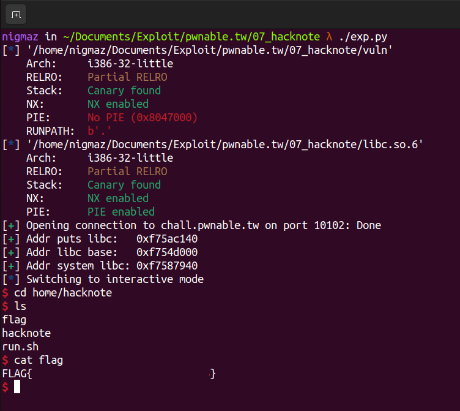

# [pwnable.tw] - 3x17


## A. CHALLENGE 

### [1] Binary Mitigations. 

- Bài cho file thực thi và thư viện => pwninit patch thư viện vào file, kiểm tra thông tin cơ bản của file.


> Chương trình 32-bit tên các hàm bị xóa, có CANARY và NX là được bật. Kiểm tra version của libc được cung cấp là 2.23 .

## B. OVERVIEW


- Chương trình với các chức năng cơ bản của một challenge heap có `Add note`, `Delete note` và `Print note` tương ứng với tạo mới một chunk heap, xóa chunk heap và in nội dung của chunk.

### [1] Vulnerability Analysis.

- Hàm main in option và tiến hành call các hàm để xử lý các option theo yêu cầu của người dùng.

```c
main() {while(1)}   | --> 1 - addNOTE()     // Thêm note mới
                    | --> 2 - deleteNOTE()  // Xóa note theo idx
                    | --> 3 - printNOTE()   // In nội dung được ghi vào note
                    | --> 4 - exit()        // Thoát chương trình
```

- Tổng quan thì chương trình cho phép nguời dùng tạo `note` và các note được quản lý bởi một mảng global `notes_list[]` gồm các pointer heap. Cấu trúc của các chunk trên heap mỗi khi thêm note mới như sau.

```c
typedef strutc note{
	void (*print_note) (struct* note);
	char *note;
}NOTE;
```

- Mỗi khi thêm một note mới, chương trình malloc 1 chunk 8-byte gồm hai con trỏ:
    * 1. Pointer chỉ đến hàm (Hàm `printNOTE()` sẽ gọi con trỏ này với đối số là `struct NOTE` để in nội dung `NOTE`).
    * 2. Một con trỏ heap được malloc ngay sau đó theo size do người dùng cung cấp chứa nội dung của `NOTE`. 

- Một lưu ý nữa là chỉ có tối đa là 5 `NOTE` được tạo.

#### [+] BUG.

- BUG nằm trong hàm `deleteNOTE()`, chương trình có kiểm tra các `notes_list[]` trước khi free() để tránh `use after free` nhưng khi sau free() các con trỏ thì lại không đặt nó = 0 dẫn đến ta vẫn có thể  `use after free` mặc dù có kiểm tra.

```c
  if ( *(&ptr + idx) )
  {
    free(*((void **)*(&ptr + idx) + 1));        // chunk contain content
    free(*(&ptr + idx));                        // chunk = *print + *ptr_content
    puts("Success");                            // BUG not set 0
  }
```

- Một lỗi nữa nằm ở `libc-2.23.so` là sau khi freed chunk thì dữ liệu trên chunk không bị xóa.

### [2] Idea Exploit.

- Toàn bộ follow chương trình như sau:
    * Mỗi note là một struct gồm 2 entry:
        + NOTE.print_note: con trỏ chỉ tới hàm `print_note()` - in nội dung trong NOTE.content.
        + NOTE.content: chứa nội dung của note.
    * Tạo 1 note mới sẽ có 2 câu lệnh malloc() được gọi:
        + notes_list[i] = malloc(8)
        + notes_list[i].content = malloc(size)
    * Xóa 1 note, có 2 câu lệnh free() được gọi:
        + free(notes_list[i].content)
        + free(notes_list[i])

- Giả sử tạo 2 note mới kích thước là 16 bytes, nội dung là "AAAAAAA" và "BBBBBBBB". Cấu trúc heap lúc này như sau:


-  Trên heap lúc này có 4 chunk tương ứng với 2 note:
    * chunk 0: notes_list[0] - __0x804b008__.
        + 4-byte đầu: __0x0804862b__ là địa chỉ hàm print_note(),
        + 4 byte sau: __0x0804b018__ là địa chỉ chunk 1 chứa nội dung notes_list[0].content.
    * chunk 1: notes_list[0].content - __0x804b018__: nội dung notes_list[0]: "AAAAAAAA".
    * chunk 2: notes_list[1] - __0x804b030__.
        + 4-byte đầu: __0x0804862b__ là địa chỉ hàm print_note(),
        + 4 byte sau: __0x0804b040__ là địa chỉ chunk 3 chứa nội dung notes_list[1].
    * chunk 3: notes_list[1].content - __0x804b040__: nội dung notes_list[1]: "BBBBBBBB". 
    * top_chunk: __0x804b050__

- Xóa note 1, sau đó xóa note 2. Khi đó 4 chunk trên sẽ được đẩy vào fastbins.


- Giờ tạo note mới kích thước 8-bytes nội dung "CCCC", vì cấu trúc của fastbins là FILO nên hệ thống sẽ lấy chunk tại 0x804b028 để lưu notes_list[2] và 0x804b000 để lưu notes_list[2].content (các con trỏ trong fastbín là bao gồm cả metadata của chunk).


- Kiểm tra thì notes_list[0] không bị đặt = 0 (BUG của chương trình) và khi cấp phát sử dụng 2 `fastbins(size-0x10)` theo LIFO thì notes_list[0].print_note bị ghi đè thành "CCCC" và gọi printNOTE(0) thì chương trình sẽ nhận "CCCC" thay vì địa chỉ hàm `print_note()` và gọi nó => `SEGMENTFAULT`.

__EXPLOIT:__

- Ý tưởng là thay "CCCC" thành địa chỉ hàm `system()` để get shell.

- Nhưng trước đó cần leak địa chỉ của libc, khi add notes_list[2] ta sẽ add 1 note kích thước 8 bytes nội dung là: `(print_note address) + (puts_GOT)`. 
__=> Khi gọi printNOTE(0) thì chương trình sẽ in địa chỉ hàm puts libc.__

## C. EXPLOITATION

- Bài này khai thác khá là cơ bản quan trọng nằm ở ý tưởng đã trình bày ở trên, có chú ý là hàm `print_note()` được truyền tham số là địa chỉ của chính `note` đó. 

```c
  if ( *(&ptr + idx) )
    (*(void (__cdecl **)(_DWORD))*(&ptr + idx))(*(&ptr + idx));
    // print_note(*(ptr+i))
```

 - Ta sẽ dùng __payload = p32(system_address) + p32("||sh")__ để truyền tham số cho hàm system().
 => Khi đó chương trình gọi system(system_address||sh) - chương trình vẫn bật shell với sh do có "||" (còn 4-byte nên chỉ ghi được "||sh").


__NOTE:__ 
* command1 || command2

Ý nghĩa của toán tử "||" là thực hiện `command1` trước. Nếu `command1` thành công (exit status là 0), thì `command2` sẽ không được thực hiện. Ngược lại, nếu `command1` không thành công (exit status không phải 0), thì `command2` sẽ được thực hiện.

## D. FLAG

- Tiến hành viết file [exp.py](./exp.py) và khai thác:


