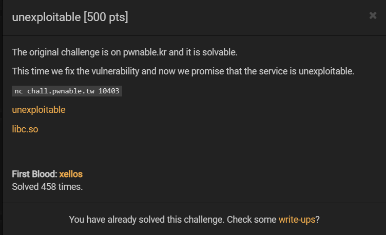
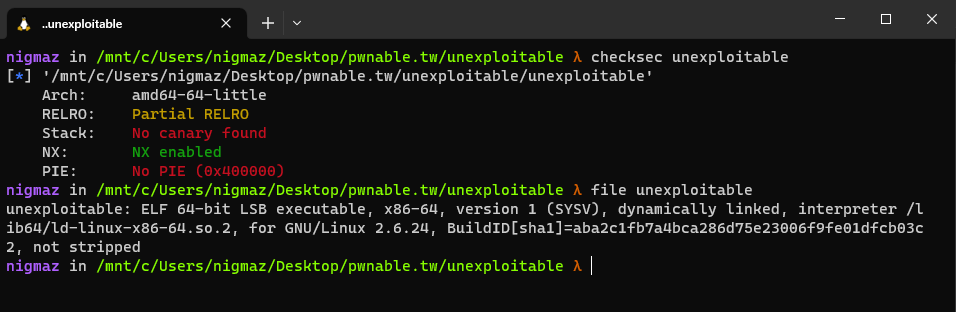
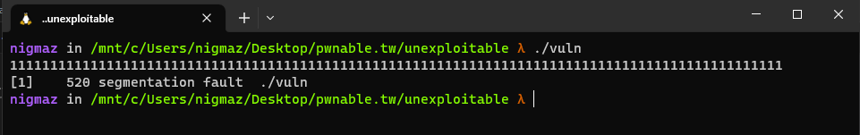
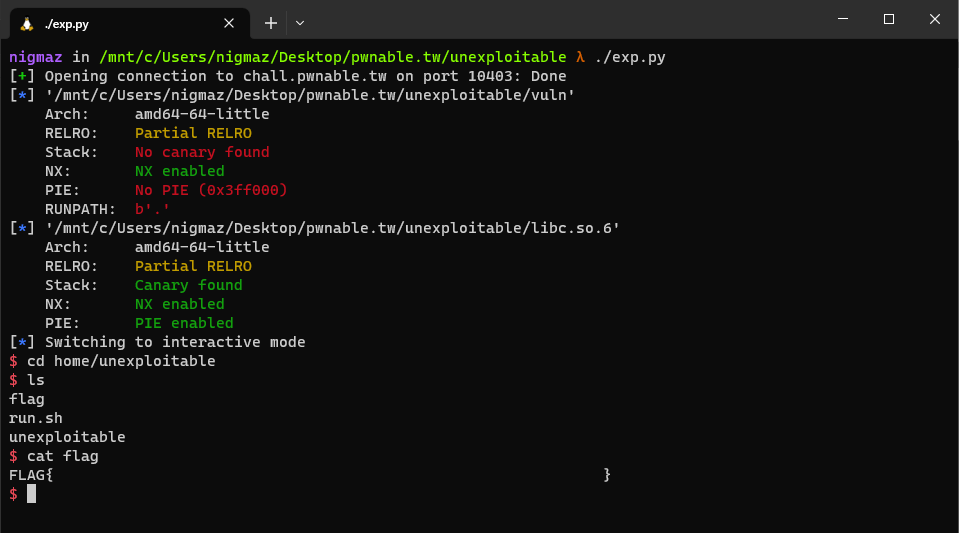

# [pwnable.tw] - unexploitable



## A. CHALLENGE 

### [1] Binary Mitigations. 

- Bài cho file thực thi và thư viện => pwninit patch thư viện vào file, kiểm tra thông tin cơ bản của file.



> Chương trình 64-bit chỉ có NX là được bật. Kiểm tra version của thư viện được cung cấp là `libc-2.23` .

## B. OVERVIEW



- Chương trình khá cơ bản và dễ dàng nhận thấy là có lỗi buffer overflow khi thực thi chương trình.

### [1] Vulnerability Analysis.

- Toàn bộ code của chương trình:

```c
int __cdecl main(int argc, const char **argv, const char **envp)
{
  char buf[16]; // [rsp+0h] [rbp-10h] BYREF

  sleep(3u);
  return read(0, buf, 0x100uLL);                // Buffer Overflow Stack 
}
```

- Lỗi stack buffer overflow và không có bất cứ hàm nào thực hiện in ra cũng như hà có sẵn trong chương trình giúp thực thi lấy shell.

### [2] Idea Exploit.

- Đề bài có gợi ý là nó là phiên bản khó hơn của thử thách cùng tên của `pwnable.kr` sau khi đi đọc wp thì có rất nhiều cách khai thác bài này:
    * Bruteforce 3 byte cuối địa chỉ trả về hàm main (do save return là __libc_start_main nên bruteforce thành one_gadget).
    * Thực hiện ROP với read, ret2csu và syscall trong libc bằng cách ghi đè GOT của sleep => syscall trong LIBC.
    * Thực hiện SROP để đặt các giá trị thanh ghi thực hiện execve("/bin/sh", 0, 0).
    * Thực hiện ret2dlresolve.

> Chọn phương pháp hai là sử dụng ret2csu + read để ghi giá trị bất kỳ tại địa chỉ tùy chọn nhằm tạo ROP để gọi syscall `execve("/bin/sh", 0, 0)`.

## C. EXPLOITATION

- Các version libc cũ có hàm `__libc_csu_init` gồm hai gadget hỗ trợ nhau gồm `gadget1` nhằm thiết lập các giá trị trên các thanh ghi sau đó `gadget2` gọi tới 1 hàm thông qua 1 thanh ghi được thiết lập giá trị ở gadget1.

- Gadget-1 thiết lập giá trị cho các thanh ghi.
```c
#    0x00000000004005e6 <+102>:   mov    rbx,QWORD PTR [rsp+0x8]
#    0x00000000004005eb <+107>:   mov    rbp,QWORD PTR [rsp+0x10]
#    0x00000000004005f0 <+112>:   mov    r12,QWORD PTR [rsp+0x18]
#    0x00000000004005f5 <+117>:   mov    r13,QWORD PTR [rsp+0x20]
#    0x00000000004005fa <+122>:   mov    r14,QWORD PTR [rsp+0x28]
#    0x00000000004005ff <+127>:   mov    r15,QWORD PTR [rsp+0x30]
#    0x0000000000400604 <+132>:   add    rsp,0x38
#    0x0000000000400608 <+136>:   ret
```

- Gadget-2 tạo giá trị cho 3 thanh ghi quan trọng là rdi, rsi và rdx được sử dụng làm đối số khi gọi 1 hàm libc thông qua 3 thanh ghi r13, r14, r15 và sau đó call hàm phụ thuộc 2 thanh ghi r12 và rbx. (r13, r14, r15 và r12, rbx đều bị kiểm soát giá trị thông qua gadget-1)
```c
# 0x00000000004005d0 <+80>:    mov    rdx,r15
# 0x00000000004005d3 <+83>:    mov    rsi,r14
# 0x00000000004005d6 <+86>:    mov    edi,r13d
# 0x00000000004005d9 <+89>:    call   QWORD PTR [r12+rbx*8]
```

>=> Thiết lập r15, r14, r13 là các giá trị đối số của hàm read và r12 = GOT hàm read, rbx = 0 thì có thể tiến hành thực hiện ghi giá trị bất kỳ vào địa chỉ tùy chọn __(ret2csu+read_function_GOT)__ hoặc call hàm bất bỳ với GOT hàm đó có trong chương trình __(ret2csu+libc_function_GOT)__.

### [1] Gadget Syscall.

- OFFSET của hàm sleep() trong libc là 0xCB680 và OFFSET của gadget `syscall` trong LIBC tại 0xCB6DE `=>` chỉ khác nhau byte cuối.

- Thay đổi byte cuối của hàm sleep() tại GOT thành "\xDE" sử dụng __(ret2csu+read_function_GOT)__ `=>` khi gọi GOT sleep() sẽ gọi đến gadget `syscall`. 

### [2] String "/bin/sh" and rax = 0x3b.

- Viết __"/bin/sh\x00"__ vào `segment bss` sử dụng __(ret2csu+read_function_GOT)__.
- Thực hiện ghi payload có độ dài 59 bits và hàm read() sẽ đặt giá trị trả về là độ dài payload vào rax = 0x3b sử dụng __(ret2csu+read_function_GOT)__. 

### [3] Syscall execve("/bin/sh", 0, 0).

- Sắp xếp các giá trị của ba tham số vào rdi, rsi và rdx => hoàn thành lệnh gọi execve("/bin/sh",0,0) thông qua syscall sử dụng  __(ret2csu+sleep_function_GOT)__

## D. FLAG

- [WP-Reference](https://blingblingxuanxuan.github.io/2022/11/06/unexploitable-pwn/#%E5%85%B6%E4%BB%96%E6%9A%B4%E7%A0%B4%E6%80%9D%E8%B7%AF) .

- Tiến hành viết file [exp.py](./exp.py) và khai thác:



